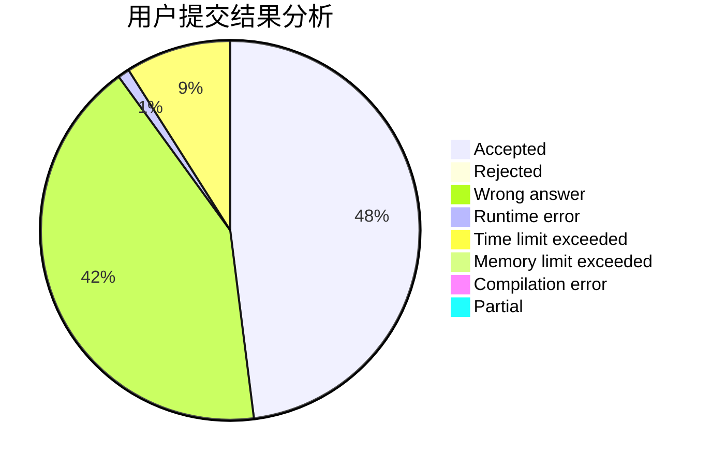
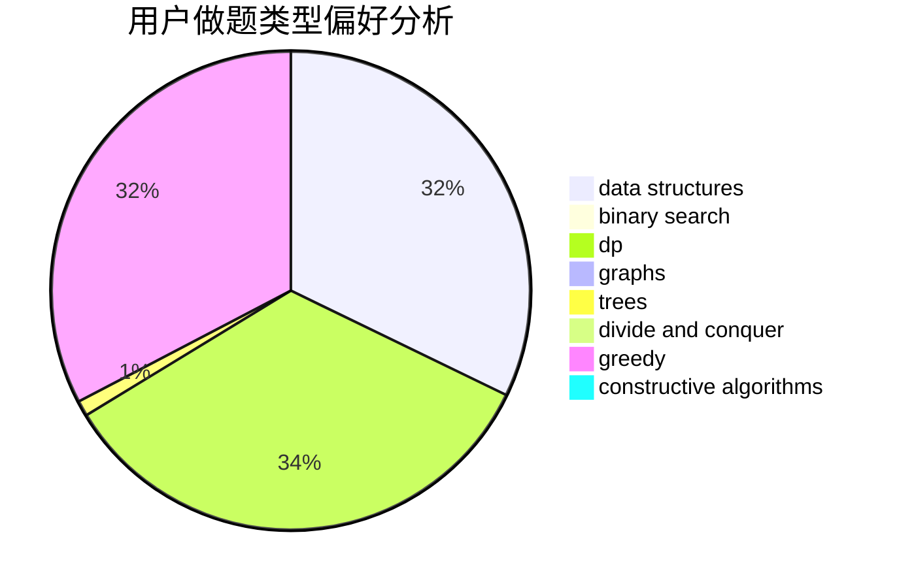
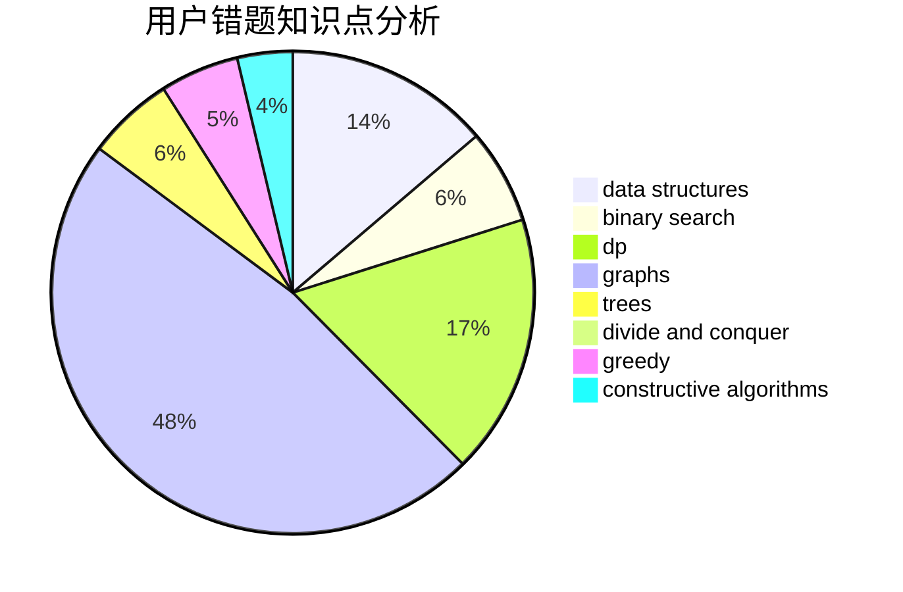

# SrO

<!-- tabs:start -->

#### **用户提交结果分析**

#### **用户做题类型偏好分析**

#### **用户错题知识点分析**

<!-- tabs:end -->
# 推荐题目
[1488B](https://codeforces.com/contest/1488/problem/B)		*special problem,
                        greedy		  
[991E](https://codeforces.com/contest/991/problem/E)		brute force,
                        combinatorics,
                        math		  
[1140D](https://codeforces.com/contest/1140/problem/D)		dp,
                        greedy,
                        math		  
[12471](https://codeforces.com/contest/1247/problem/1)		dsu,graphs,sortings,trees		  
[716B](https://codeforces.com/contest/716/problem/B)		greedy,
                        two pointers		  
[653A](https://codeforces.com/contest/653/problem/A)		brute force,
                        implementation,
                        sortings		  
[294B](https://codeforces.com/contest/294/problem/B)		dp,
                        greedy		  
[908B](https://codeforces.com/contest/908/problem/B)		brute force,
                        implementation		  
[591B](https://codeforces.com/contest/591/problem/B)		implementation,
                        strings		  
[523A](https://codeforces.com/contest/523/problem/A)		*special problem,
                        implementation		  
