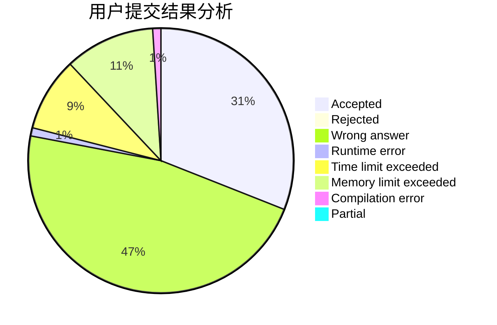
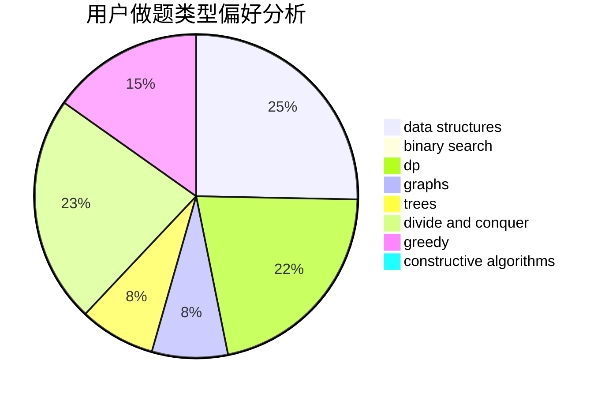
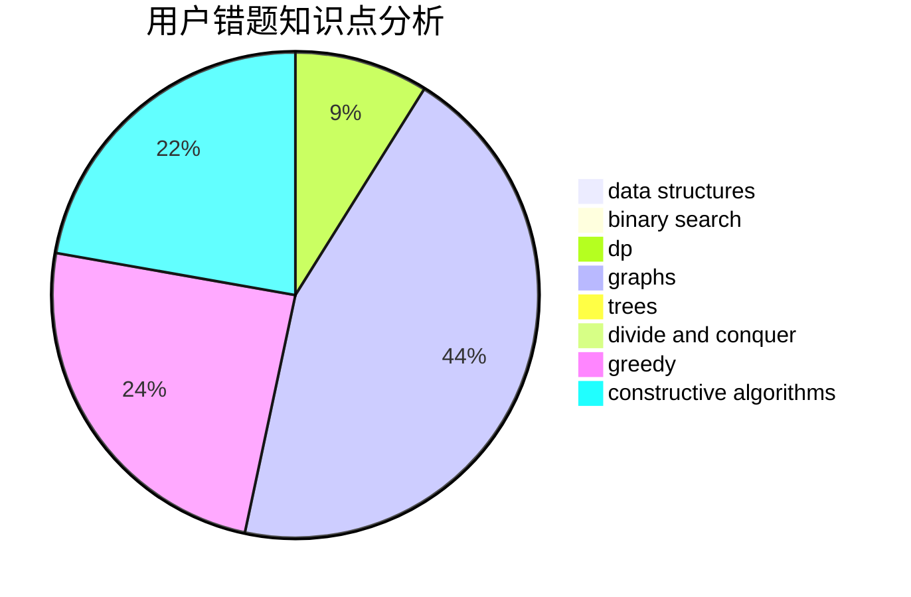

# Ssoul

<!-- tabs:start -->

#### **用户提交结果分析**

#### **用户做题类型偏好分析**

#### **用户错题知识点分析**

<!-- tabs:end -->
# 推荐题目
[746A](https://codeforces.com/contest/746/problem/A)		implementation,
                        math		  
[1227A](https://codeforces.com/contest/1227/problem/A)		math		  
[61E](https://codeforces.com/contest/61/problem/E)		data structures,
                        trees		  
[29E](https://codeforces.com/contest/29/problem/E)		graphs,
                        shortest paths		  
[863E](https://codeforces.com/contest/863/problem/E)		data structures,
                        sortings		  
[782E](https://codeforces.com/contest/782/problem/E)		dsu,graphs,sortings,trees		  
[1108A](https://codeforces.com/contest/1108/problem/A)		implementation		  
[762D](https://codeforces.com/contest/762/problem/D)		dp,
                        greedy,
                        implementation		  
[500F](https://codeforces.com/contest/500/problem/F)		divide and conquer,
                        dp		  
[1482E](https://codeforces.com/contest/1482/problem/E)		data structures,
                        divide and conquer,
                        dp		  
