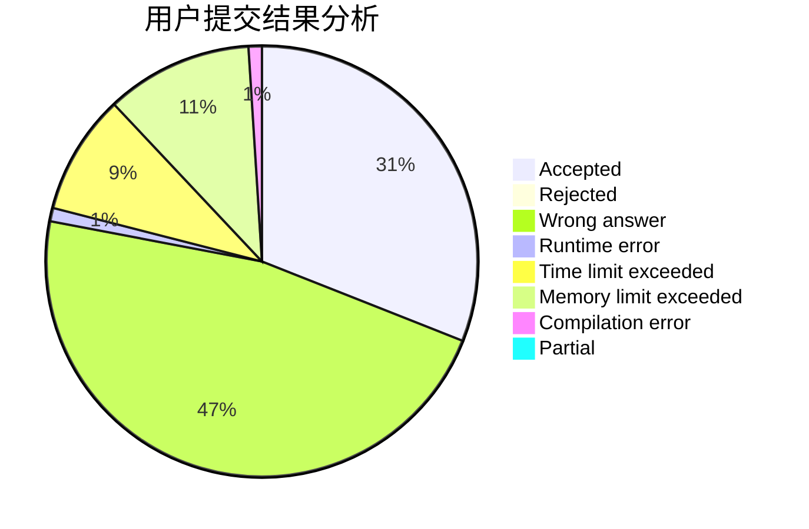
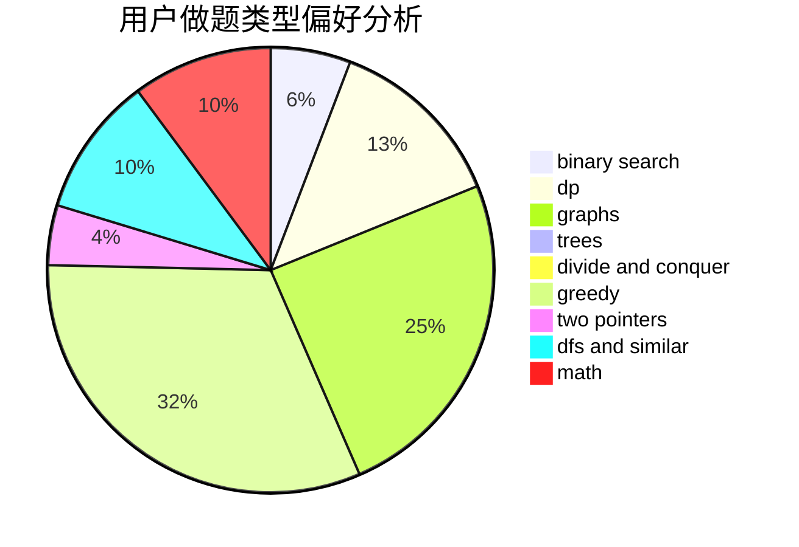

# Ssoul

<!-- tabs:start -->

#### **用户提交结果分析**

#### **用户做题类型偏好分析**

<!-- tabs:end -->
# 推荐题目
[765C](https://codeforces.com/contest/765/problem/C)
[1234E](https://codeforces.com/contest/1234/problem/E)
[641F](https://codeforces.com/contest/641/problem/F)
[317D](https://codeforces.com/contest/317/problem/D)
[883G](https://codeforces.com/contest/883/problem/G)
[800D](https://codeforces.com/contest/800/problem/D)
[1108B](https://codeforces.com/contest/1108/problem/B)
[780H](https://codeforces.com/contest/780/problem/H)
[522C](https://codeforces.com/contest/522/problem/C)
[1490C](https://codeforces.com/contest/1490/problem/C)
