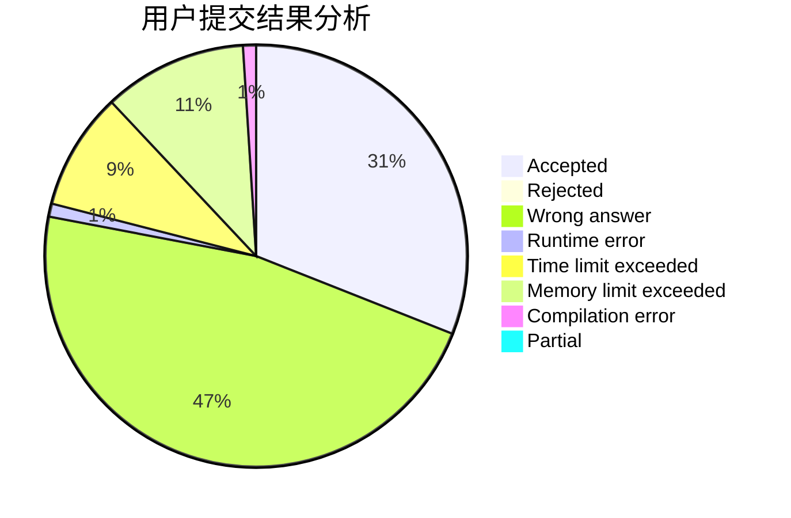
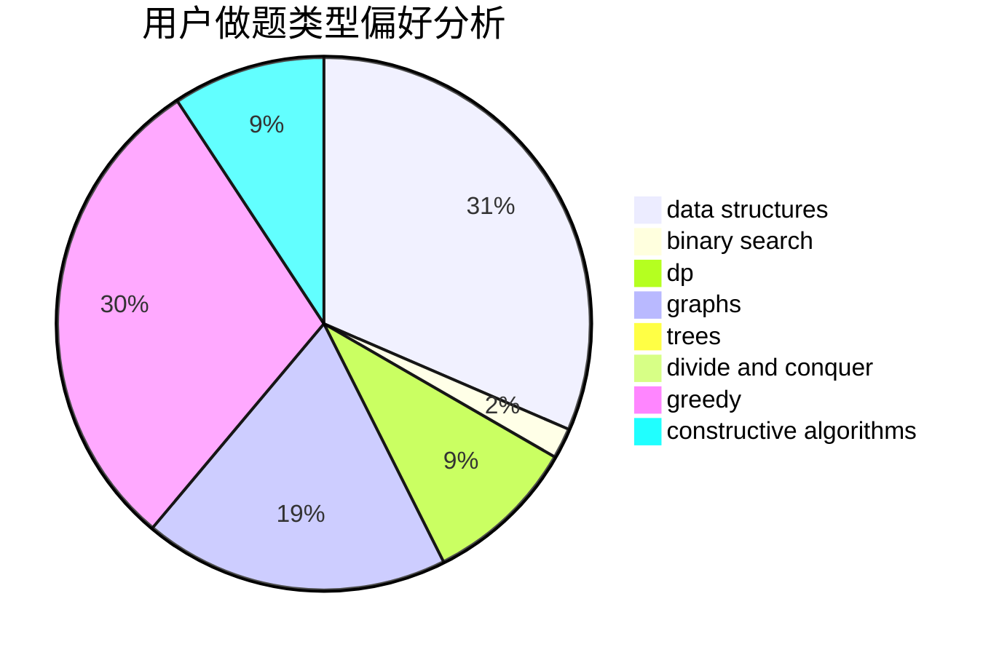
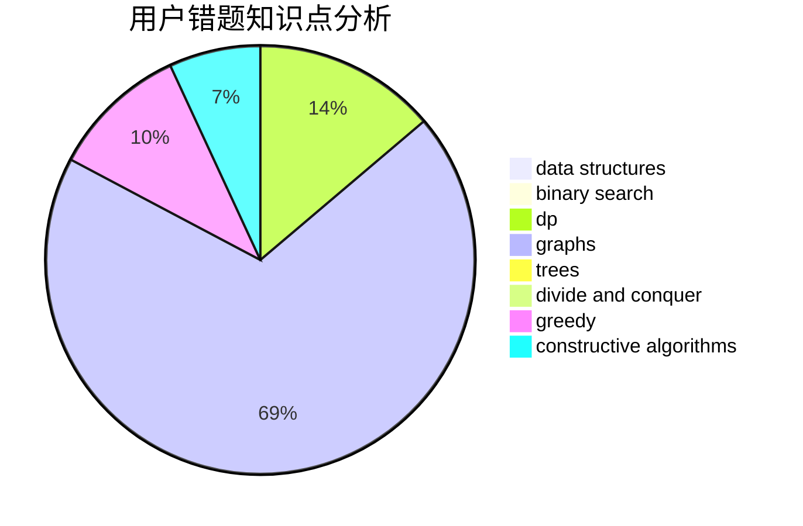

# Ssoul

<!-- tabs:start -->

#### **用户提交结果分析**

#### **用户做题类型偏好分析**

#### **用户错题知识点分析**

<!-- tabs:end -->
# 推荐题目
[765C](https://codeforces.com/contest/765/problem/C)		math		  
[1234E](https://codeforces.com/contest/1234/problem/E)		math		  
[641F](https://codeforces.com/contest/641/problem/F)		nan		  
[317D](https://codeforces.com/contest/317/problem/D)		dp,
                        games		  
[883G](https://codeforces.com/contest/883/problem/G)		dfs and similar,
                        graphs		  
[800D](https://codeforces.com/contest/800/problem/D)		dsu,graphs,sortings,trees		  
[1108B](https://codeforces.com/contest/1108/problem/B)		brute force,
                        greedy,
                        math,
                        number theory		  
[780H](https://codeforces.com/contest/780/problem/H)		binary search,
                        geometry,
                        implementation,
                        two pointers		  
[522C](https://codeforces.com/contest/522/problem/C)		greedy		  
[1490C](https://codeforces.com/contest/1490/problem/C)		binary search,
                        brute force,
                        brute force,
                        math		  
