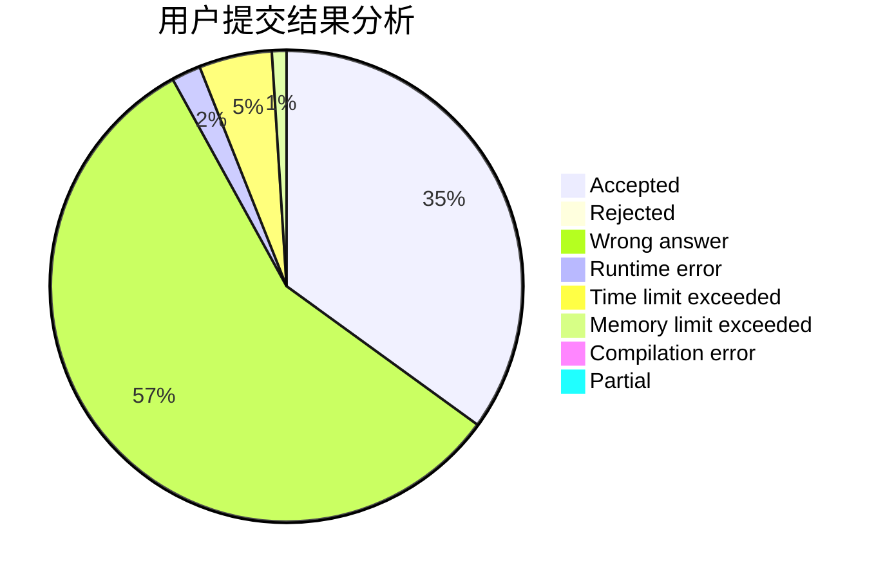
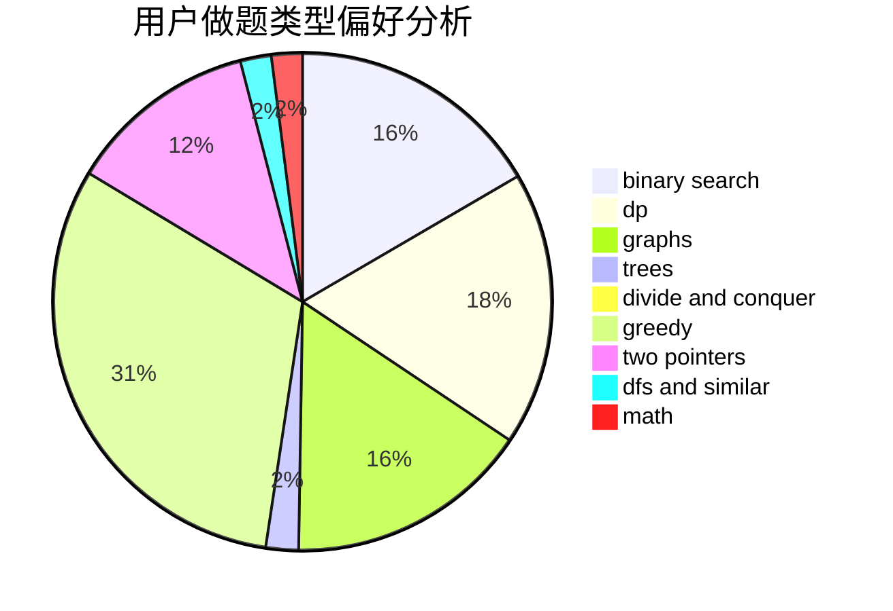

# Sstee1XD

<!-- tabs:start -->

#### **用户提交结果分析**

#### **用户做题类型偏好分析**

<!-- tabs:end -->
# 推荐题目
[1150E](https://codeforces.com/contest/1150/problem/E)
[1156D](https://codeforces.com/contest/1156/problem/D)
[1182A](https://codeforces.com/contest/1182/problem/A)
[696F](https://codeforces.com/contest/696/problem/F)
[681E](https://codeforces.com/contest/681/problem/E)
[985E](https://codeforces.com/contest/985/problem/E)
[288E](https://codeforces.com/contest/288/problem/E)
[1008D](https://codeforces.com/contest/1008/problem/D)
[687A](https://codeforces.com/contest/687/problem/A)
[486D](https://codeforces.com/contest/486/problem/D)
