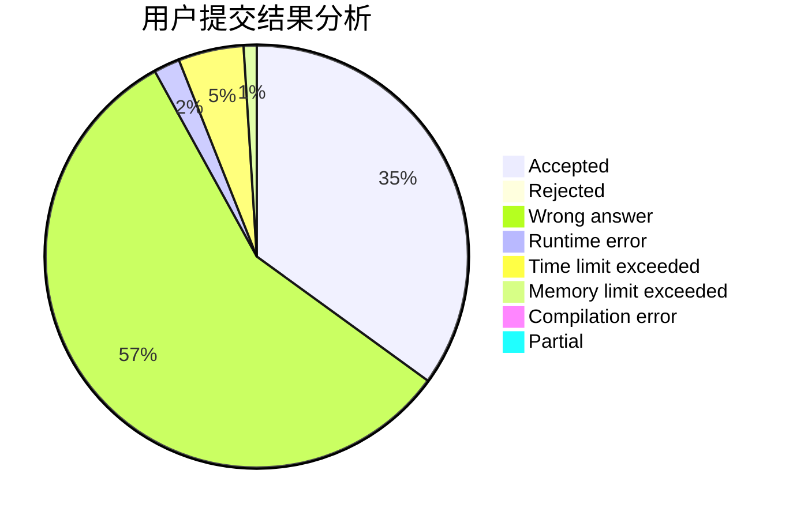
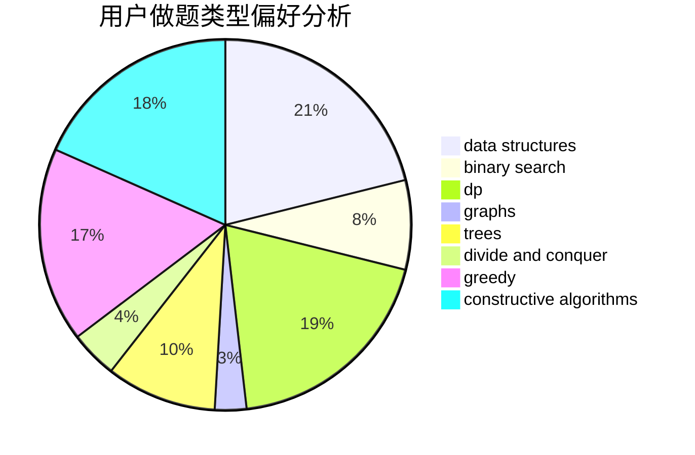
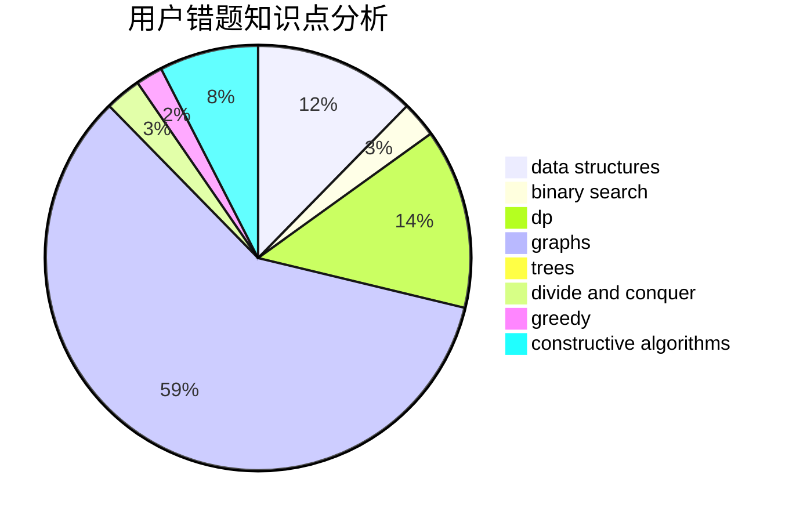

# Sstee1XD

<!-- tabs:start -->

#### **用户提交结果分析**

#### **用户做题类型偏好分析**

#### **用户错题知识点分析**

<!-- tabs:end -->
# 推荐题目
[1150E](https://codeforces.com/contest/1150/problem/E)		dsu,graphs,sortings,trees		  
[1156D](https://codeforces.com/contest/1156/problem/D)		dfs and similar,
                        divide and conquer,
                        dp,
                        dsu,
                        trees		  
[1182A](https://codeforces.com/contest/1182/problem/A)		dp,
                        math		  
[696F](https://codeforces.com/contest/696/problem/F)		binary search,
                        geometry,
                        two pointers		  
[681E](https://codeforces.com/contest/681/problem/E)		geometry,
                        sortings		  
[985E](https://codeforces.com/contest/985/problem/E)		binary search,
                        data structures,
                        dp,
                        greedy,
                        two pointers		  
[288E](https://codeforces.com/contest/288/problem/E)		dp,
                        implementation,
                        math		  
[1008D](https://codeforces.com/contest/1008/problem/D)		dsu,graphs,sortings,trees		  
[687A](https://codeforces.com/contest/687/problem/A)		dfs and similar,
                        graphs		  
[486D](https://codeforces.com/contest/486/problem/D)		dfs and similar,
                        dp,
                        math,
                        trees		  
