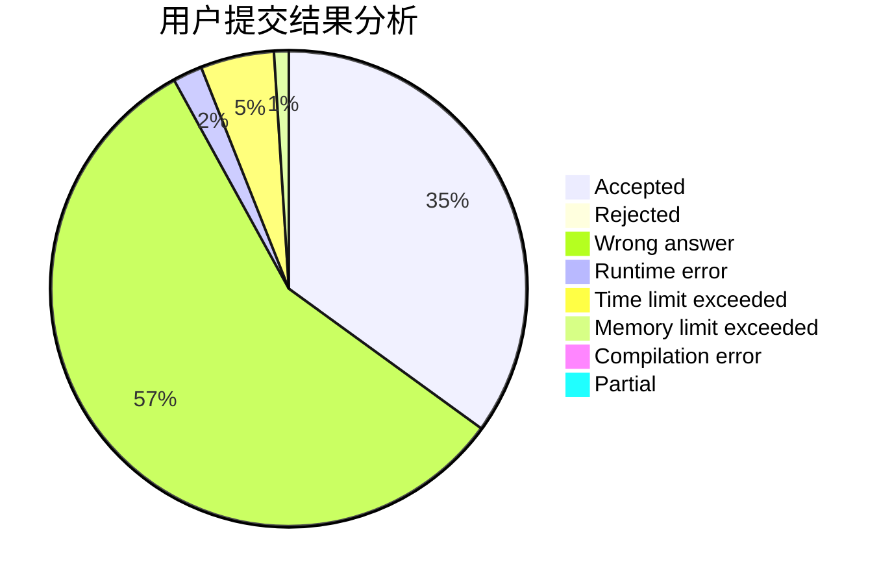
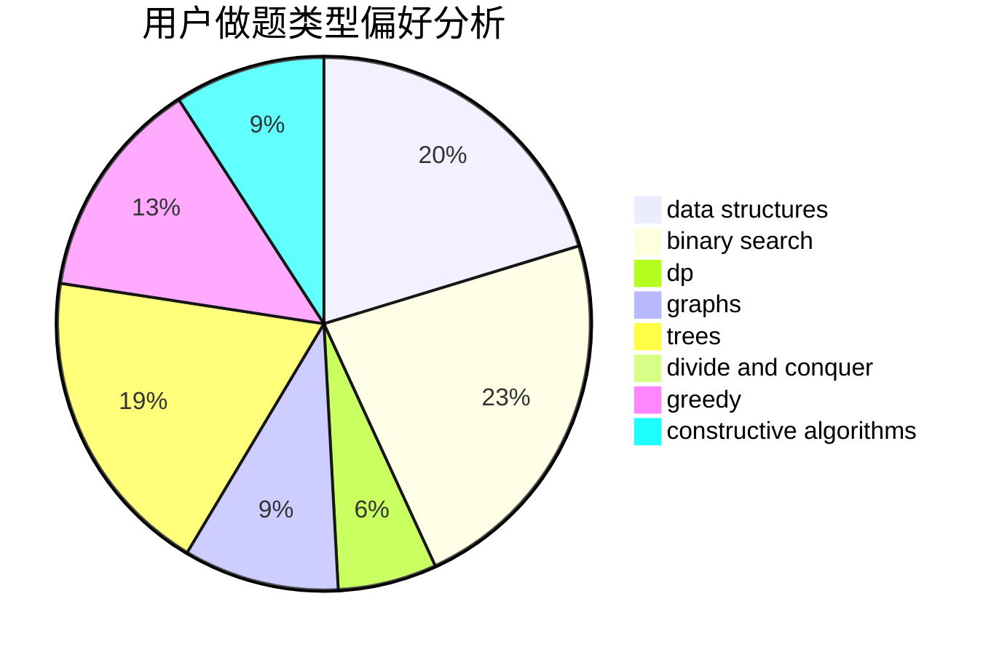
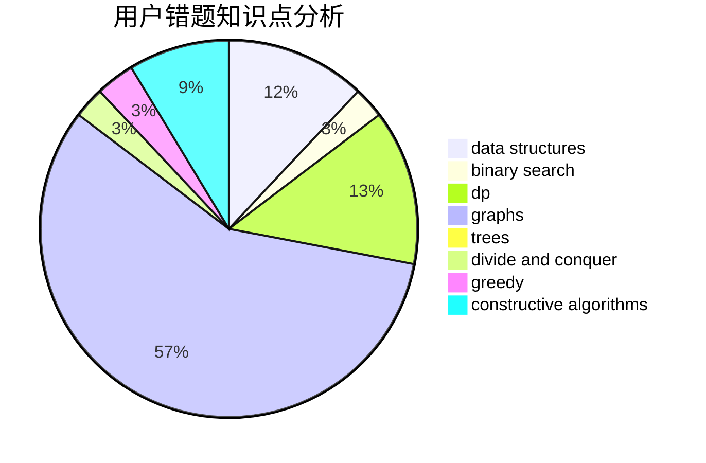

# Sstee1XD

<!-- tabs:start -->

#### **用户提交结果分析**

#### **用户做题类型偏好分析**

#### **用户错题知识点分析**

<!-- tabs:end -->
# 推荐题目
[1149B](https://codeforces.com/contest/1149/problem/B)		dp,
                        implementation,
                        strings		  
[1154D](https://codeforces.com/contest/1154/problem/D)		greedy		  
[1179B](https://codeforces.com/contest/1179/problem/B)		constructive algorithms		  
[671A](https://codeforces.com/contest/671/problem/A)		dp,
                        geometry,
                        greedy,
                        implementation		  
[660F](https://codeforces.com/contest/660/problem/F)		binary search,
                        data structures,
                        geometry,
                        ternary search		  
[962G](https://codeforces.com/contest/962/problem/G)		data structures,
                        dsu,
                        geometry,
                        trees		  
[272E](https://codeforces.com/contest/272/problem/E)		combinatorics,
                        constructive algorithms,
                        graphs		  
[1008A](https://codeforces.com/contest/1008/problem/A)		implementation,
                        strings		  
[666A](https://codeforces.com/contest/666/problem/A)		dp,
                        implementation,
                        strings		  
[467A](https://codeforces.com/contest/467/problem/A)		implementation		  
