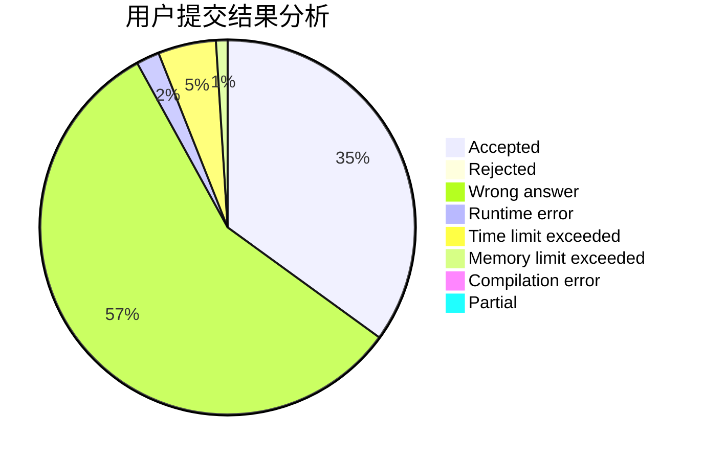
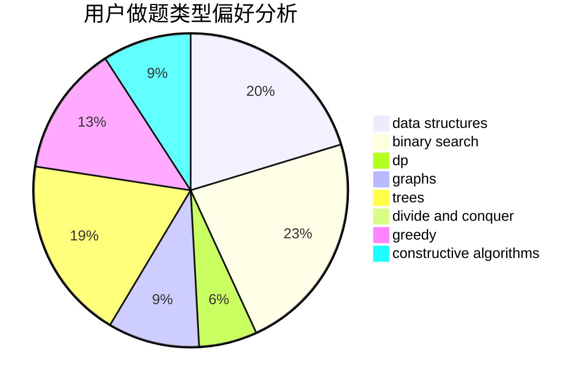
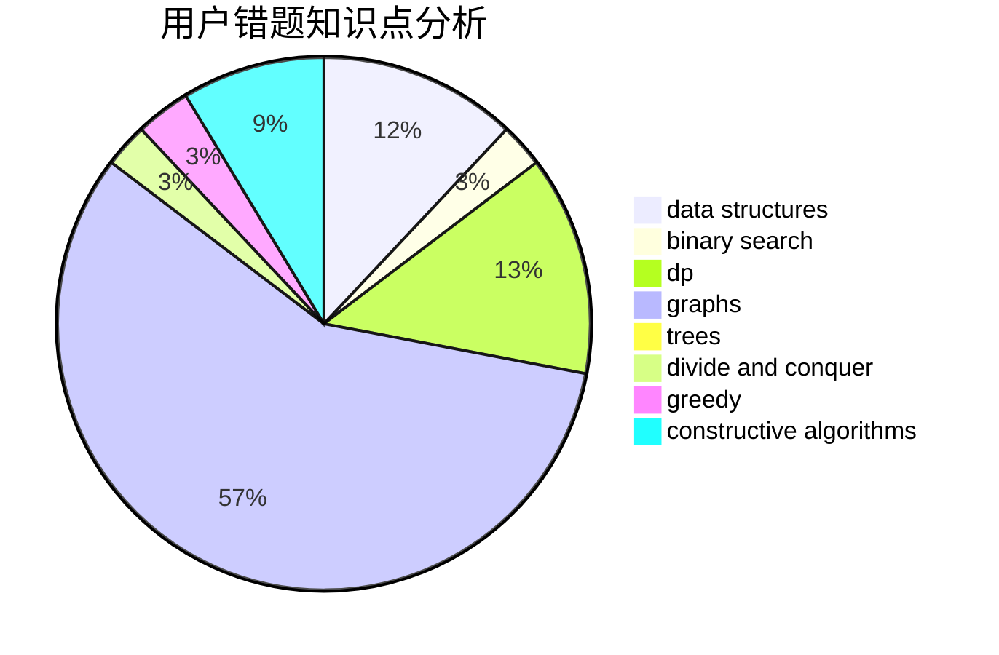

# Sstee1XD
<!-- tabs:start -->
#### **用户提交结果分析**

#### **用户做题类型偏好分析**

#### **用户错题知识点分析**

<!-- tabs:end -->
# 推荐题目
[George and Accommodation](http://codeforces.com/problemset/problem/467/A)		implementation		  
[Walking Robot](http://codeforces.com/problemset/problem/1154/D)		greedy		  
[Recycling Bottles](http://codeforces.com/problemset/problem/671/A)		dp,
                        geometry,
                        greedy,
                        implementation		  
[Maximum Xor Secondary](http://codeforces.com/problemset/problem/280/B)		data structures,
                        implementation,
                        two pointers		  
[Decoding Genome](http://codeforces.com/problemset/problem/222/E)		dp,
                        matrices		  
[The Meaningless Game](http://codeforces.com/problemset/problem/833/A)		math,
                        number theory		  
[I Wanna Be the Guy](http://codeforces.com/problemset/problem/469/A)		greedy,
                        implementation		  
[Developing Game](http://codeforces.com/problemset/problem/377/D)		data structures		  
[New Year and Boolean Bridges](http://codeforces.com/problemset/problem/908/H)		nan		  
[Tolik and His Uncle](http://codeforces.com/problemset/problem/1179/B)		constructive algorithms		  
<!-- tabs:start -->
#### **data structures**
[George and Accommodation](http://codeforces.com/problemset/problem/280/B)		data structures,
                        implementation,
                        two pointers		  
[Walking Robot](http://codeforces.com/problemset/problem/377/D)		data structures		  
[Recycling Bottles](http://codeforces.com/problemset/problem/962/G)		data structures,
                        dsu,
                        geometry,
                        trees		  
[Maximum Xor Secondary](http://codeforces.com/problemset/problem/660/F)		binary search,
                        data structures,
                        geometry,
                        ternary search		  
[Decoding Genome](http://codeforces.com/problemset/problem/834/B)		data structures,
                        implementation		  
[The Meaningless Game](https://codeforces.com/contest/1504/problem/E)		binary search,
                        data structures,
                        dp,
                        greedy,
                        shortest paths,
                        sortings,
                        two pointers		  
[I Wanna Be the Guy](http://codeforces.com/problemset/problem/1492/C)		binary search,
                        data structures,
                        dp,
                        greedy,
                        two pointers		  
[Developing Game](http://codeforces.com/problemset/problem/1490/G)		binary search,
                        data structures,
                        math		  
[New Year and Boolean Bridges](http://codeforces.com/problemset/problem/1479/D)		binary search,
                        bitmasks,
                        brute force,
                        data structures,
                        probabilities,
                        trees		  
[Tolik and His Uncle](http://codeforces.com/problemset/problem/1497/A)		brute force,
                        data structures,
                        greedy,
                        sortings		  
#### **binary search**
[George and Accommodation](http://codeforces.com/problemset/problem/660/F)		binary search,
                        data structures,
                        geometry,
                        ternary search		  
[Walking Robot](https://codeforces.com/contest/1504/problem/E)		binary search,
                        data structures,
                        dp,
                        greedy,
                        shortest paths,
                        sortings,
                        two pointers		  
[Recycling Bottles](https://codeforces.com/contest/1509/problem/E)		binary search,
                        bitmasks,
                        combinatorics,
                        constructive algorithms,
                        implementation,
                        math		  
[Maximum Xor Secondary](http://codeforces.com/problemset/problem/1494/C)		binary search,
                        dp,
                        greedy,
                        implementation,
                        two pointers		  
[Decoding Genome](http://codeforces.com/problemset/problem/1492/C)		binary search,
                        data structures,
                        dp,
                        greedy,
                        two pointers		  
[The Meaningless Game](http://codeforces.com/problemset/problem/1463/D)		binary search,
                        constructive algorithms,
                        greedy,
                        two pointers		  
[I Wanna Be the Guy](http://codeforces.com/problemset/problem/1490/G)		binary search,
                        data structures,
                        math		  
[Developing Game](http://codeforces.com/problemset/problem/1479/D)		binary search,
                        bitmasks,
                        brute force,
                        data structures,
                        probabilities,
                        trees		  
[New Year and Boolean Bridges](http://codeforces.com/problemset/problem/1436/E)		binary search,
                        data structures,
                        two pointers		  
[Tolik and His Uncle](http://codeforces.com/problemset/problem/1461/D)		binary search,
                        brute force,
                        data structures,
                        divide and conquer,
                        implementation,
                        sortings		  
#### **dp**
[George and Accommodation](http://codeforces.com/problemset/problem/671/A)		dp,
                        geometry,
                        greedy,
                        implementation		  
[Walking Robot](http://codeforces.com/problemset/problem/222/E)		dp,
                        matrices		  
[Recycling Bottles](http://codeforces.com/problemset/problem/383/D)		dp		  
[Maximum Xor Secondary](https://codeforces.com/contest/438/problem/C)		dp,
                        geometry		  
[Decoding Genome](http://codeforces.com/problemset/problem/1282/B1)		dp,
                        greedy,
                        sortings		  
[The Meaningless Game](http://codeforces.com/problemset/problem/666/A)		dp,
                        implementation,
                        strings		  
[I Wanna Be the Guy](http://codeforces.com/problemset/problem/1149/B)		dp,
                        implementation,
                        strings		  
[Developing Game](http://codeforces.com/problemset/problem/687/C)		dp		  
[New Year and Boolean Bridges](https://codeforces.com/contest/1504/problem/E)		binary search,
                        data structures,
                        dp,
                        greedy,
                        shortest paths,
                        sortings,
                        two pointers		  
[Tolik and His Uncle](http://codeforces.com/problemset/problem/1322/F)		dp,
                        trees		  
#### **graph**
[George and Accommodation](http://codeforces.com/problemset/problem/272/E)		combinatorics,
                        constructive algorithms,
                        graphs		  
[Walking Robot](http://codeforces.com/problemset/problem/1198/C)		constructive algorithms,
                        graphs,
                        greedy,
                        sortings		  
[Recycling Bottles](http://codeforces.com/problemset/problem/933/C)		geometry,
                        graphs		  
[Maximum Xor Secondary](http://codeforces.com/problemset/problem/1487/C)		brute force,
                        constructive algorithms,
                        dfs and similar,
                        graphs,
                        greedy,
                        implementation,
                        math		  
[Decoding Genome](http://codeforces.com/problemset/problem/1437/C)		dp,
                        flows,
                        graph matchings,
                        greedy,
                        math,
                        sortings		  
[The Meaningless Game](http://codeforces.com/problemset/problem/1470/D)		constructive algorithms,
                        dfs and similar,
                        graph matchings,
                        graphs,
                        greedy		  
[I Wanna Be the Guy](http://codeforces.com/problemset/problem/1476/C)		dp,
                        graphs,
                        greedy		  
[Developing Game](http://codeforces.com/problemset/problem/1304/D)		constructive algorithms,
                        graphs,
                        greedy,
                        two pointers		  
[New Year and Boolean Bridges](http://codeforces.com/problemset/problem/1475/C)		combinatorics,
                        graphs,
                        math		  
[Tolik and His Uncle](http://codeforces.com/problemset/problem/553/E)		dp,
                        fft,
                        graphs,
                        math,
                        probabilities		  
#### **trees**
[George and Accommodation](http://codeforces.com/problemset/problem/962/G)		data structures,
                        dsu,
                        geometry,
                        trees		  
[Walking Robot](http://codeforces.com/problemset/problem/1322/F)		dp,
                        trees		  
[Recycling Bottles](http://codeforces.com/problemset/problem/1479/D)		binary search,
                        bitmasks,
                        brute force,
                        data structures,
                        probabilities,
                        trees		  
[Maximum Xor Secondary](http://codeforces.com/problemset/problem/1511/C)		brute force,
                        data structures,
                        implementation,
                        trees		  
[Decoding Genome](http://codeforces.com/problemset/problem/1499/F)		combinatorics,
                        dfs and similar,
                        dp,
                        trees		  
[The Meaningless Game](http://codeforces.com/problemset/problem/1491/E)		brute force,
                        dfs and similar,
                        divide and conquer,
                        number theory,
                        trees		  
[I Wanna Be the Guy](http://codeforces.com/problemset/problem/1466/D)		data structures,
                        greedy,
                        sortings,
                        trees		  
[Developing Game](http://codeforces.com/problemset/problem/1495/D)		combinatorics,
                        dfs and similar,
                        graphs,
                        math,
                        shortest paths,
                        trees		  
[New Year and Boolean Bridges](http://codeforces.com/problemset/problem/1303/G)		data structures,
                        divide and conquer,
                        geometry,
                        trees		  
[Tolik and His Uncle](http://codeforces.com/problemset/problem/1454/E)		combinatorics,
                        dfs and similar,
                        graphs,
                        trees		  
#### **divide and conquer**
[George and Accommodation](http://codeforces.com/problemset/problem/1461/D)		binary search,
                        brute force,
                        data structures,
                        divide and conquer,
                        implementation,
                        sortings		  
[Walking Robot](http://codeforces.com/problemset/problem/1466/G)		combinatorics,
                        divide and conquer,
                        hashing,
                        math,
                        string suffix structures,
                        strings		  
[Recycling Bottles](http://codeforces.com/problemset/problem/1490/D)		dfs and similar,
                        divide and conquer,
                        implementation		  
[Maximum Xor Secondary](https://codeforces.com/contest/1483/problem/C)		data structures,
                        divide and conquer,
                        dp		  
[Decoding Genome](http://codeforces.com/problemset/problem/1491/E)		brute force,
                        dfs and similar,
                        divide and conquer,
                        number theory,
                        trees		  
[The Meaningless Game](http://codeforces.com/problemset/problem/1303/G)		data structures,
                        divide and conquer,
                        geometry,
                        trees		  
[I Wanna Be the Guy](http://codeforces.com/problemset/problem/1494/D)		constructive algorithms,
                        data structures,
                        dfs and similar,
                        divide and conquer,
                        dsu,
                        greedy,
                        sortings,
                        trees		  
[Developing Game](http://codeforces.com/problemset/problem/1482/E)		data structures,
                        divide and conquer,
                        dp		  
[New Year and Boolean Bridges](http://codeforces.com/problemset/problem/566/C)		dfs and similar,
                        divide and conquer,
                        trees		  
[Tolik and His Uncle](http://codeforces.com/problemset/problem/1428/F)		binary search,
                        data structures,
                        divide and conquer,
                        dp,
                        two pointers		  
#### **greedy**
[George and Accommodation](http://codeforces.com/problemset/problem/1154/D)		greedy		  
[Walking Robot](http://codeforces.com/problemset/problem/671/A)		dp,
                        geometry,
                        greedy,
                        implementation		  
[Recycling Bottles](http://codeforces.com/problemset/problem/469/A)		greedy,
                        implementation		  
[Maximum Xor Secondary](http://codeforces.com/problemset/problem/515/D)		constructive algorithms,
                        greedy		  
[Decoding Genome](http://codeforces.com/problemset/problem/1282/B1)		dp,
                        greedy,
                        sortings		  
[The Meaningless Game](http://codeforces.com/problemset/problem/1198/C)		constructive algorithms,
                        graphs,
                        greedy,
                        sortings		  
[I Wanna Be the Guy](http://codeforces.com/problemset/problem/1294/E)		greedy,
                        implementation,
                        math		  
[Developing Game](https://codeforces.com/contest/1504/problem/E)		binary search,
                        data structures,
                        dp,
                        greedy,
                        shortest paths,
                        sortings,
                        two pointers		  
[New Year and Boolean Bridges](http://codeforces.com/problemset/problem/1181/A)		greedy,
                        math		  
[Tolik and His Uncle](http://codeforces.com/problemset/problem/1494/C)		binary search,
                        dp,
                        greedy,
                        implementation,
                        two pointers		  
#### **constructive algorithms**
[George and Accommodation](http://codeforces.com/problemset/problem/1179/B)		constructive algorithms		  
[Walking Robot](http://codeforces.com/problemset/problem/272/E)		combinatorics,
                        constructive algorithms,
                        graphs		  
[Recycling Bottles](http://codeforces.com/problemset/problem/515/D)		constructive algorithms,
                        greedy		  
[Maximum Xor Secondary](http://codeforces.com/problemset/problem/1198/C)		constructive algorithms,
                        graphs,
                        greedy,
                        sortings		  
[Decoding Genome](http://codeforces.com/problemset/problem/820/B)		constructive algorithms,
                        geometry,
                        math		  
[The Meaningless Game](https://codeforces.com/contest/1509/problem/E)		binary search,
                        bitmasks,
                        combinatorics,
                        constructive algorithms,
                        implementation,
                        math		  
[I Wanna Be the Guy](http://codeforces.com/problemset/problem/1493/A)		constructive algorithms,
                        greedy		  
[Developing Game](http://codeforces.com/problemset/problem/1463/D)		binary search,
                        constructive algorithms,
                        greedy,
                        two pointers		  
[New Year and Boolean Bridges](https://codeforces.com/contest/1456/problem/B)		bitmasks,
                        brute force,
                        constructive algorithms		  
[Tolik and His Uncle](http://codeforces.com/problemset/problem/1492/D)		bitmasks,
                        constructive algorithms,
                        greedy,
                        math		  
#### **sortings**
[George and Accommodation](http://codeforces.com/problemset/problem/1282/B1)		dp,
                        greedy,
                        sortings		  
[Walking Robot](http://codeforces.com/problemset/problem/1198/C)		constructive algorithms,
                        graphs,
                        greedy,
                        sortings		  
[Recycling Bottles](https://codeforces.com/contest/1504/problem/E)		binary search,
                        data structures,
                        dp,
                        greedy,
                        shortest paths,
                        sortings,
                        two pointers		  
[Maximum Xor Secondary](https://codeforces.com/contest/1496/problem/C)		geometry,
                        greedy,
                        math,
                        sortings		  
[Decoding Genome](http://codeforces.com/problemset/problem/1495/A)		geometry,
                        greedy,
                        math,
                        sortings		  
[The Meaningless Game](http://codeforces.com/problemset/problem/1497/A)		brute force,
                        data structures,
                        greedy,
                        sortings		  
[I Wanna Be the Guy](http://codeforces.com/problemset/problem/1427/A)		math,
                        sortings		  
[Developing Game](http://codeforces.com/problemset/problem/1461/D)		binary search,
                        brute force,
                        data structures,
                        divide and conquer,
                        implementation,
                        sortings		  
[New Year and Boolean Bridges](http://codeforces.com/problemset/problem/1437/C)		dp,
                        flows,
                        graph matchings,
                        greedy,
                        math,
                        sortings		  
[Tolik and His Uncle](http://codeforces.com/problemset/problem/1473/A)		greedy,
                        implementation,
                        math,
                        sortings		  
<!-- tabs:end -->
