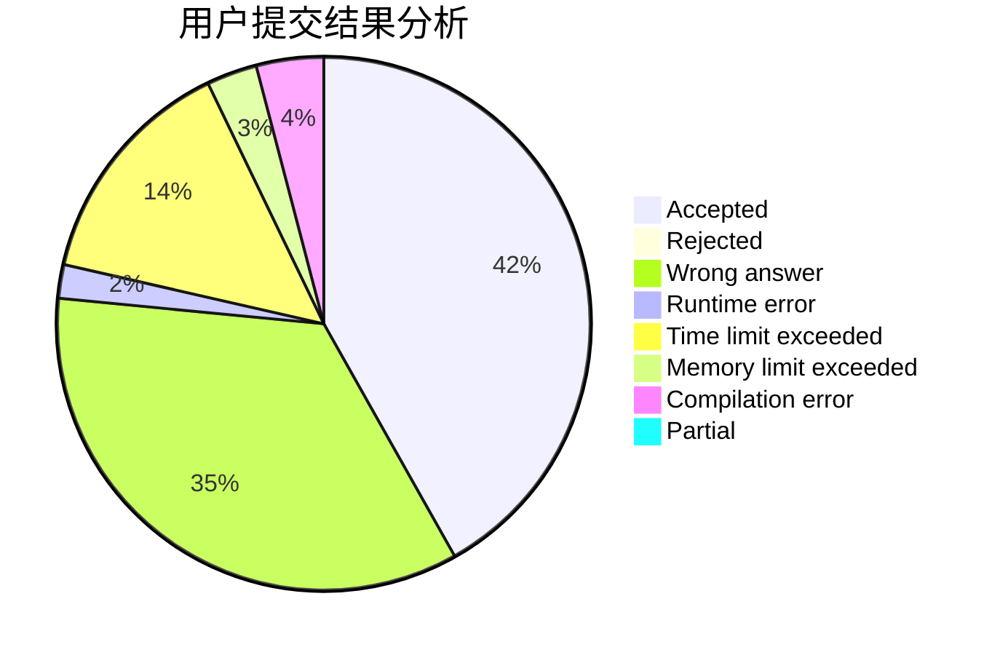
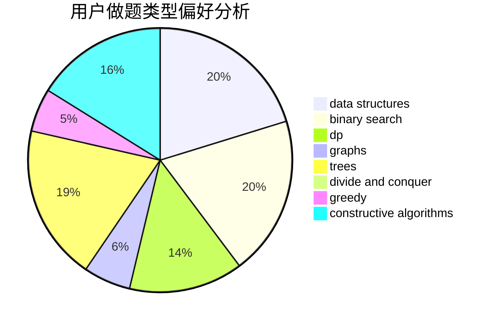
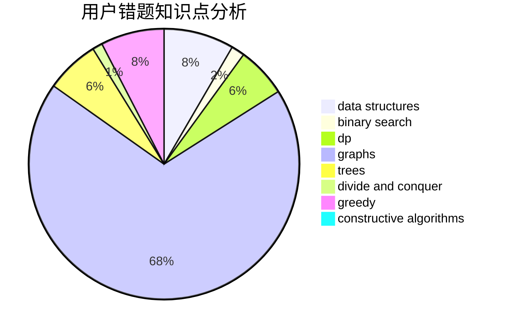

# Star_Cried

<!-- tabs:start -->

#### **用户提交结果分析**

#### **用户做题类型偏好分析**

#### **用户错题知识点分析**

<!-- tabs:end -->
# 推荐题目
[911A](https://codeforces.com/contest/911/problem/A)		implementation		  
[763A](https://codeforces.com/contest/763/problem/A)		dfs and similar,
                        dp,
                        dsu,
                        graphs,
                        implementation,
                        trees		  
[843A](https://codeforces.com/contest/843/problem/A)		dfs and similar,
                        dsu,
                        implementation,
                        math,
                        sortings		  
[474A](https://codeforces.com/contest/474/problem/A)		implementation		  
[490F](https://codeforces.com/contest/490/problem/F)		data structures,
                        dfs and similar,
                        dp,
                        trees		  
[18E](https://codeforces.com/contest/18/problem/E)		dp		  
[967D](https://codeforces.com/contest/967/problem/D)		dsu,graphs,sortings,trees		  
[1062A](https://codeforces.com/contest/1062/problem/A)		greedy,
                        implementation		  
[570A](https://codeforces.com/contest/570/problem/A)		implementation		  
[575G](https://codeforces.com/contest/575/problem/G)		dfs and similar,
                        shortest paths		  
