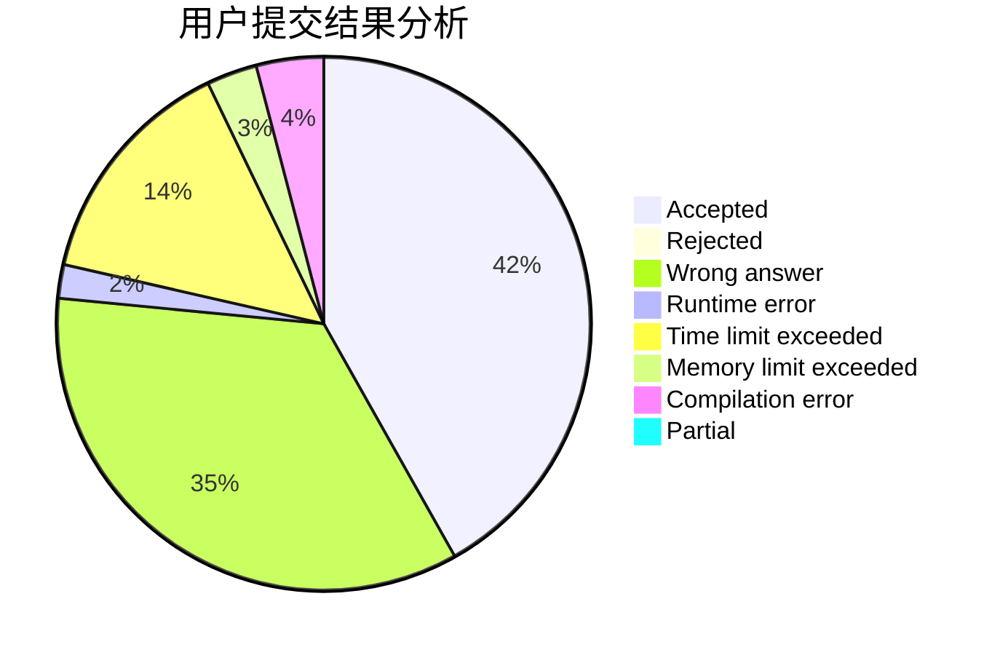
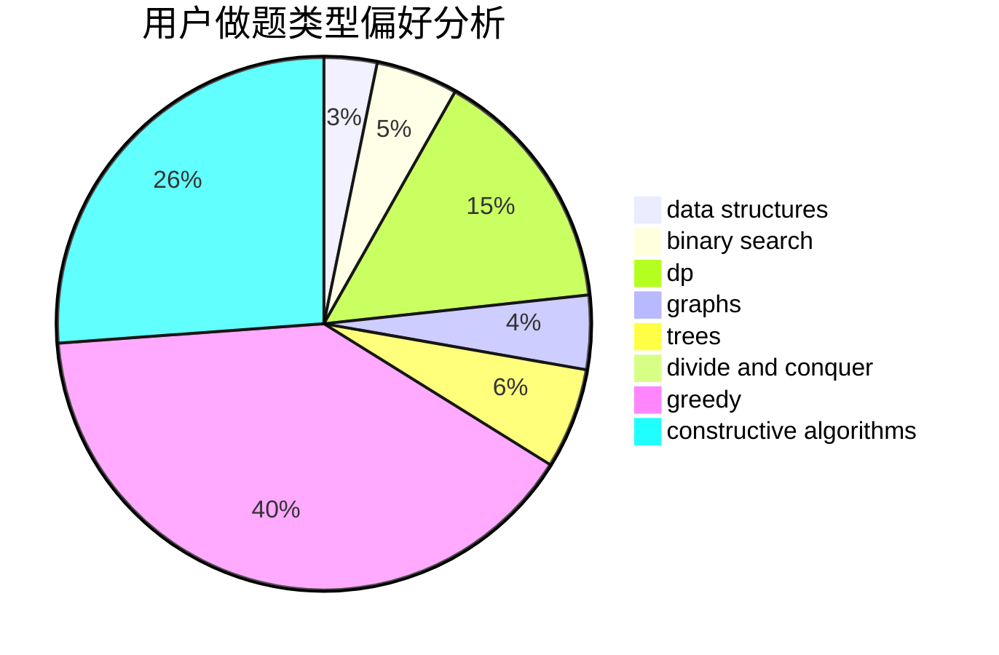
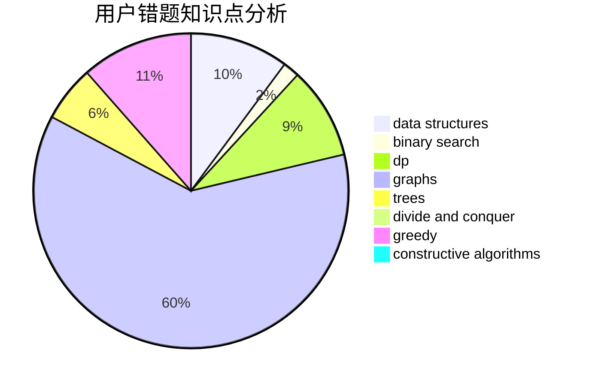

# Star_Cried

<!-- tabs:start -->

#### **用户提交结果分析**

#### **用户做题类型偏好分析**

#### **用户错题知识点分析**

<!-- tabs:end -->
# 推荐题目
[893A](https://codeforces.com/contest/893/problem/A)		implementation		  
[742D](https://codeforces.com/contest/742/problem/D)		dsu,graphs,sortings,trees		  
[825A](https://codeforces.com/contest/825/problem/A)		implementation		  
[452A](https://codeforces.com/contest/452/problem/A)		brute force,
                        implementation,
                        strings		  
[472C](https://codeforces.com/contest/472/problem/C)		greedy		  
[165C](https://codeforces.com/contest/165/problem/C)		binary search,
                        brute force,
                        dp,
                        math,
                        strings,
                        two pointers		  
[950B](https://codeforces.com/contest/950/problem/B)		greedy,
                        implementation		  
[1061C](https://codeforces.com/contest/1061/problem/C)		data structures,
                        dp,
                        implementation,
                        math,
                        number theory		  
[545D](https://codeforces.com/contest/545/problem/D)		greedy,
                        implementation,
                        sortings		  
[550C](https://codeforces.com/contest/550/problem/C)		brute force,
                        dp,
                        math		  
