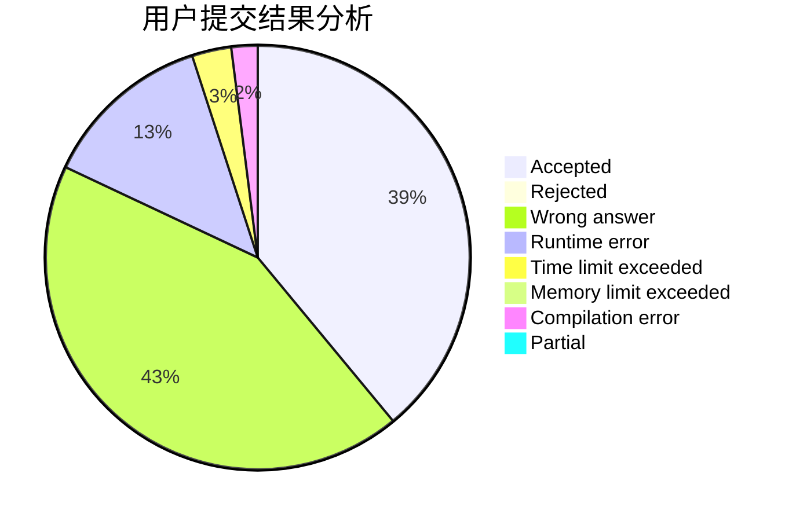
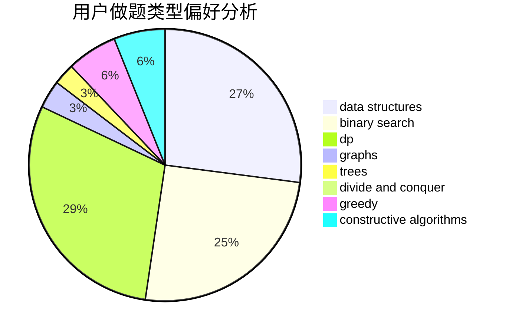

# Starlight_Glimmer

<!-- tabs:start -->

#### **用户提交结果分析**

#### **用户做题类型偏好分析**

#### **用户错题知识点分析**

<!-- tabs:end -->
# 推荐题目
[1336A](https://codeforces.com/contest/1336/problem/A)		dfs and similar,
                        dp,
                        greedy,
                        sortings,
                        trees		  
[727F](https://codeforces.com/contest/727/problem/F)		binary search,
                        dp,
                        greedy		  
[183A](https://codeforces.com/contest/183/problem/A)		constructive algorithms,
                        math		  
[14C](https://codeforces.com/contest/14/problem/C)		brute force,
                        constructive algorithms,
                        geometry,
                        implementation,
                        math		  
[1090M](https://codeforces.com/contest/1090/problem/M)		implementation		  
[979A](https://codeforces.com/contest/979/problem/A)		math		  
[916C](https://codeforces.com/contest/916/problem/C)		constructive algorithms,
                        graphs,
                        shortest paths		  
[754B](https://codeforces.com/contest/754/problem/B)		brute force,
                        implementation		  
[620F](https://codeforces.com/contest/620/problem/F)		data structures,
                        strings,
                        trees		  
[712E](https://codeforces.com/contest/712/problem/E)		data structures,
                        math,
                        probabilities		  
