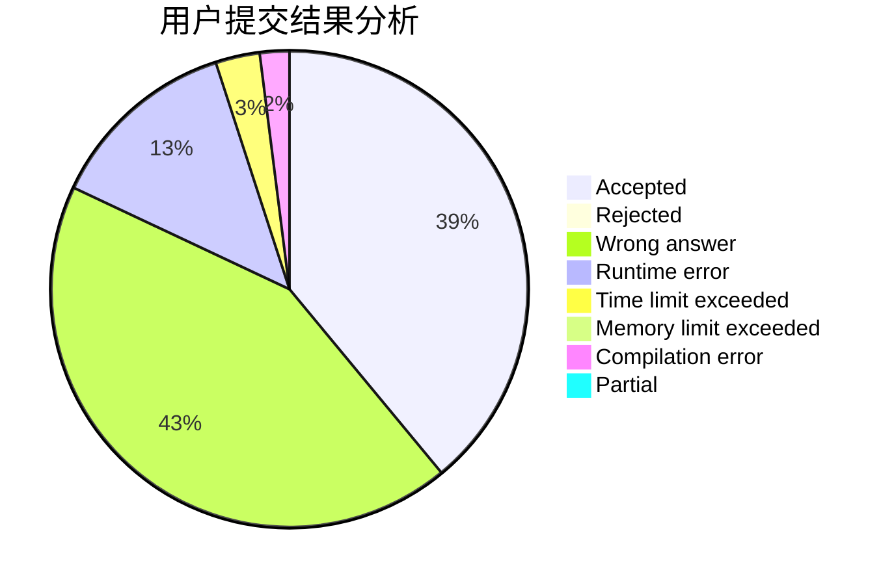
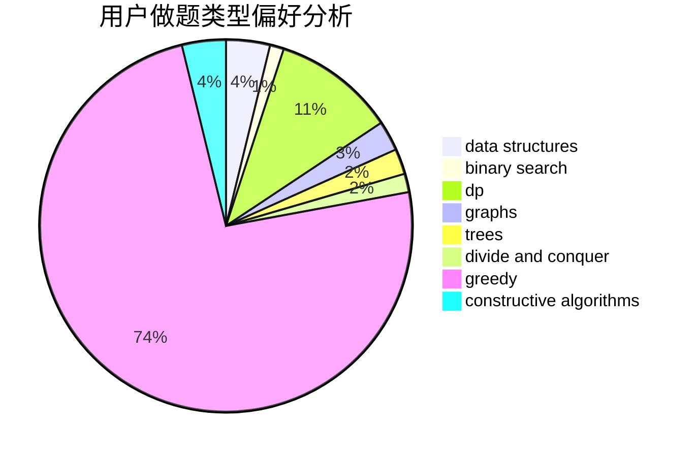

# Starlight_Glimmer

<!-- tabs:start -->

#### **用户提交结果分析**

#### **用户做题类型偏好分析**

#### **用户错题知识点分析**

<!-- tabs:end -->
# 推荐题目
[1330A](https://codeforces.com/contest/1330/problem/A)		implementation		  
[708D](https://codeforces.com/contest/708/problem/D)		flows		  
[15D](https://codeforces.com/contest/15/problem/D)		data structures,
                        implementation,
                        sortings		  
[1491F](https://codeforces.com/contest/1491/problem/F)		binary search,
                        constructive algorithms,
                        interactive		  
[1090B](https://codeforces.com/contest/1090/problem/B)		nan		  
[957E](https://codeforces.com/contest/957/problem/E)		dsu,graphs,sortings,trees		  
[8E](https://codeforces.com/contest/8/problem/E)		dp,
                        graphs		  
[733F](https://codeforces.com/contest/733/problem/F)		data structures,
                        dsu,
                        graphs,
                        trees		  
[601D](https://codeforces.com/contest/601/problem/D)		data structures,
                        dfs and similar,
                        dsu,
                        hashing,
                        strings,
                        trees		  
[696B](https://codeforces.com/contest/696/problem/B)		dfs and similar,
                        math,
                        probabilities,
                        trees		  
