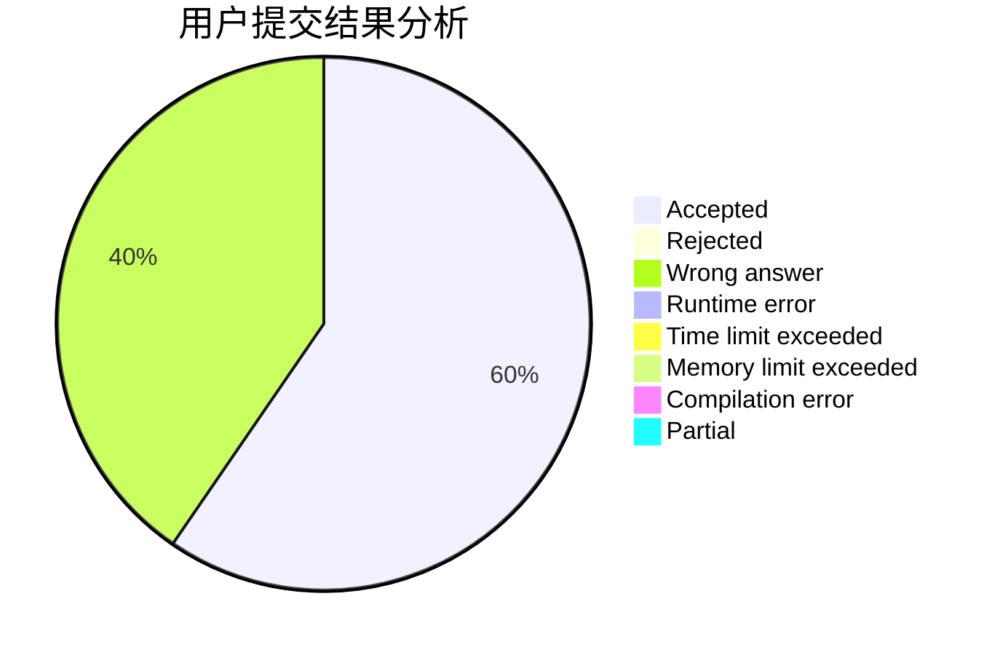
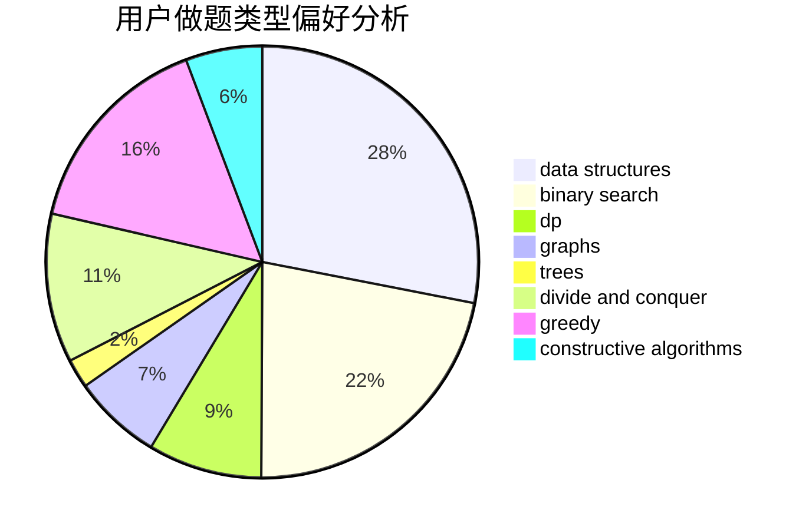

# Starria

<!-- tabs:start -->

#### **用户提交结果分析**

#### **用户做题类型偏好分析**

#### **用户错题知识点分析**

<!-- tabs:end -->
# 推荐题目
[1436E](https://codeforces.com/contest/1436/problem/E)		binary search,
                        data structures,
                        two pointers		  
[1003F](https://codeforces.com/contest/1003/problem/F)		dp,
                        hashing,
                        strings		  
[633D](https://codeforces.com/contest/633/problem/D)		brute force,
                        dp,
                        hashing,
                        implementation,
                        math		  
[1424G](https://codeforces.com/contest/1424/problem/G)		data structures,
                        sortings		  
[306D](https://codeforces.com/contest/306/problem/D)		constructive algorithms,
                        geometry		  
[180D](https://codeforces.com/contest/180/problem/D)		greedy,
                        strings		  
[1194D](https://codeforces.com/contest/1194/problem/D)		games,
                        math		  
[627D](https://codeforces.com/contest/627/problem/D)		binary search,
                        dfs and similar,
                        dp,
                        graphs,
                        greedy,
                        trees		  
[1399F](https://codeforces.com/contest/1399/problem/F)		data structures,
                        dp,
                        graphs,
                        sortings		  
[1184B2](https://codeforces.com/contest/1184B/problem/2)		flows,
                        graph matchings,
                        graphs,
                        shortest paths,
                        sortings		  
