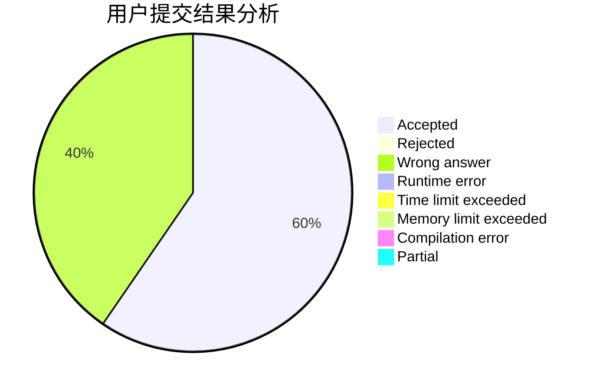
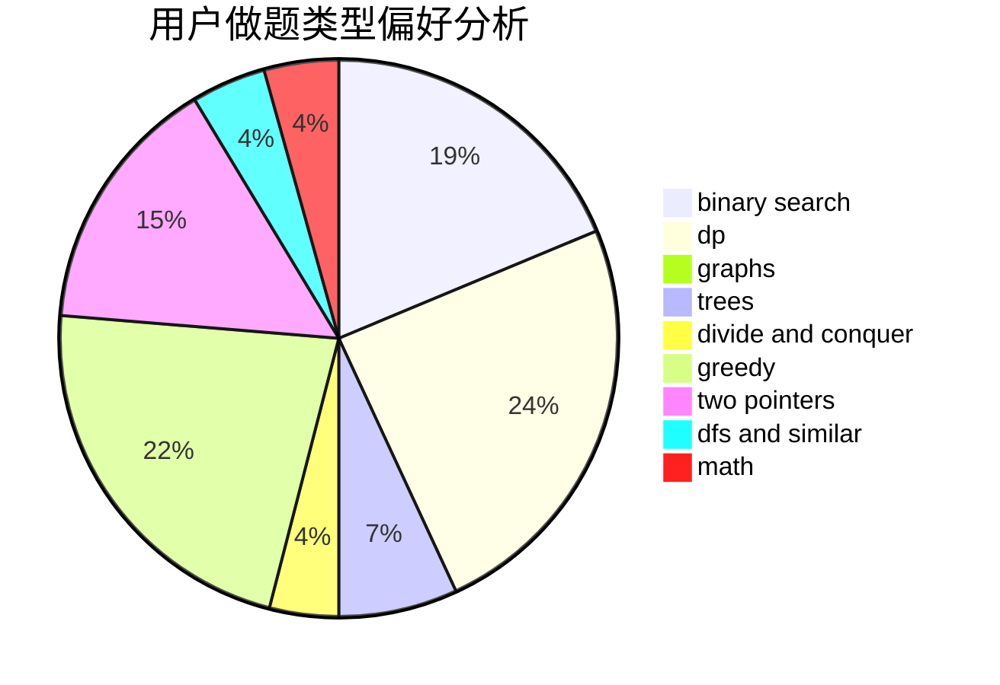

# Starria

<!-- tabs:start -->

#### **用户提交结果分析**

#### **用户做题类型偏好分析**

<!-- tabs:end -->
# 推荐题目
[1446C](https://codeforces.com/contest/1446/problem/C)
[1004C](https://codeforces.com/contest/1004/problem/C)
[665F](https://codeforces.com/contest/665/problem/F)
[1432F](https://codeforces.com/contest/1432/problem/F)
[329B](https://codeforces.com/contest/329/problem/B)
[208A](https://codeforces.com/contest/208/problem/A)
[1198F](https://codeforces.com/contest/1198/problem/F)
[653D](https://codeforces.com/contest/653/problem/D)
[1408H](https://codeforces.com/contest/1408/problem/H)
[1187E](https://codeforces.com/contest/1187/problem/E)
