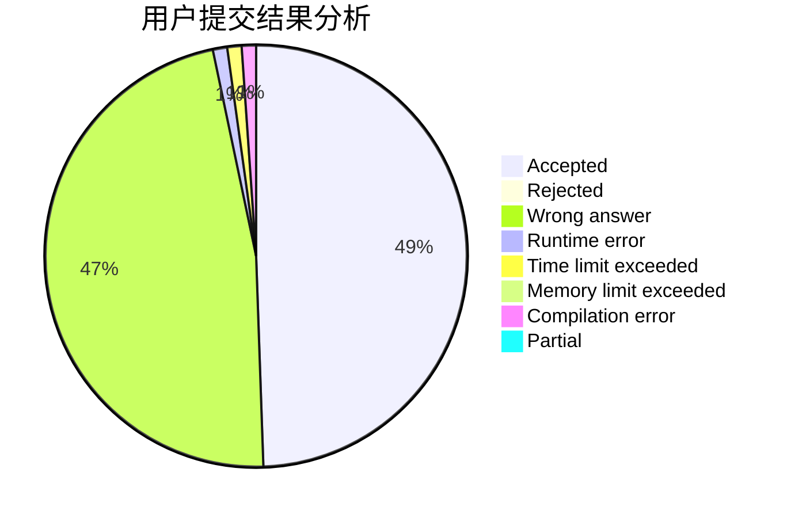
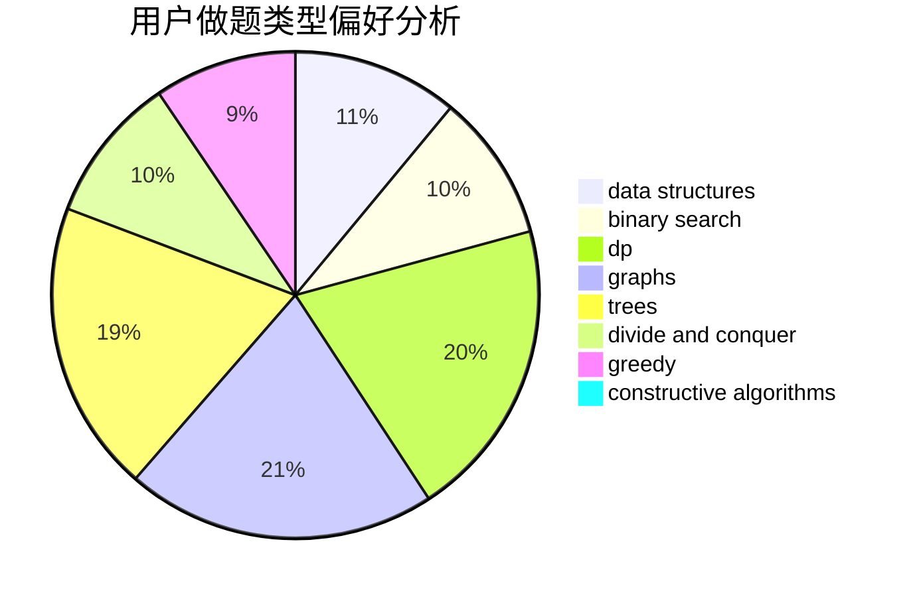
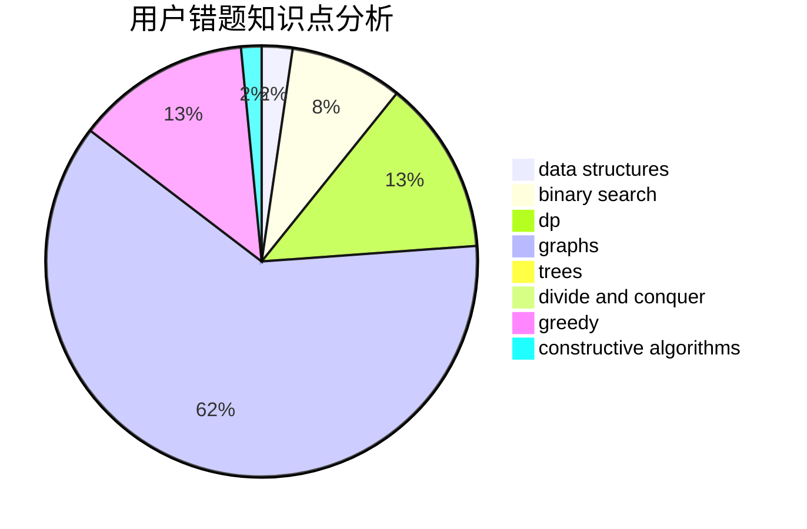

# AaronChang_

<!-- tabs:start -->

#### **用户提交结果分析**

#### **用户做题类型偏好分析**

#### **用户错题知识点分析**

<!-- tabs:end -->
# 推荐题目
[171H](https://codeforces.com/contest/171/problem/H)		*special problem,
                        implementation		  
[171F](https://codeforces.com/contest/171/problem/F)		*special problem,
                        brute force,
                        implementation,
                        number theory		  
[11951](https://codeforces.com/contest/1195/problem/1)		dsu,graphs,sortings,trees		  
[1180C](https://codeforces.com/contest/1180/problem/C)		dsu,graphs,sortings,trees		  
[171G](https://codeforces.com/contest/171/problem/G)		*special problem		  
[1082C](https://codeforces.com/contest/1082/problem/C)		greedy,
                        sortings		  
[12132](https://codeforces.com/contest/1213/problem/2)		dsu,graphs,sortings,trees		  
[13351](https://codeforces.com/contest/1335/problem/1)		dsu,graphs,sortings,trees		  
[171D](https://codeforces.com/contest/171/problem/D)		*special problem,
                        brute force		  
[171E](https://codeforces.com/contest/171/problem/E)		*special problem		  
