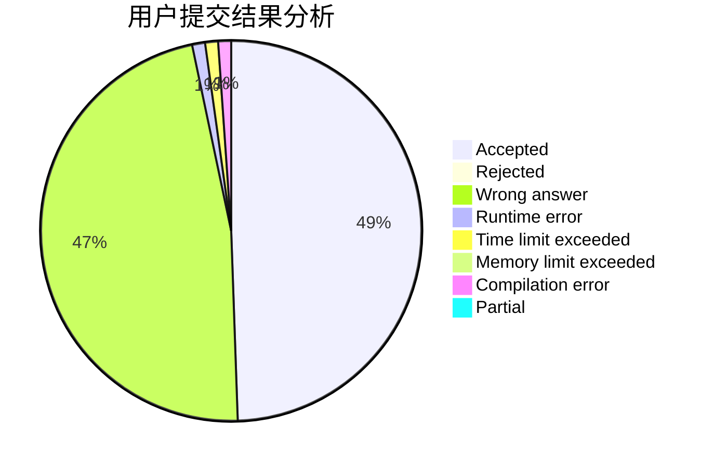
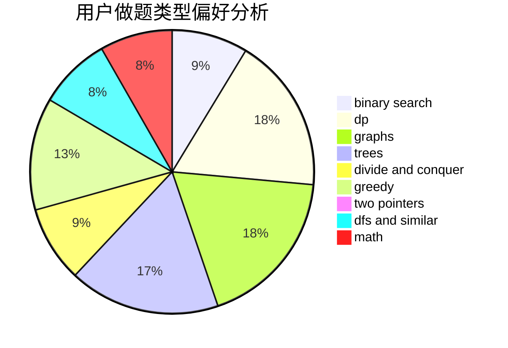

# AaronChang_

<!-- tabs:start -->

#### **用户提交结果分析**

#### **用户做题类型偏好分析**

<!-- tabs:end -->
# 推荐题目
[171H](https://codeforces.com/contest/171/problem/H)
[171F](https://codeforces.com/contest/171/problem/F)
[11951](https://codeforces.com/contest/1195/problem/1)
[1180C](https://codeforces.com/contest/1180/problem/C)
[171G](https://codeforces.com/contest/171/problem/G)
[1082C](https://codeforces.com/contest/1082/problem/C)
[12132](https://codeforces.com/contest/1213/problem/2)
[13351](https://codeforces.com/contest/1335/problem/1)
[171D](https://codeforces.com/contest/171/problem/D)
[171E](https://codeforces.com/contest/171/problem/E)
