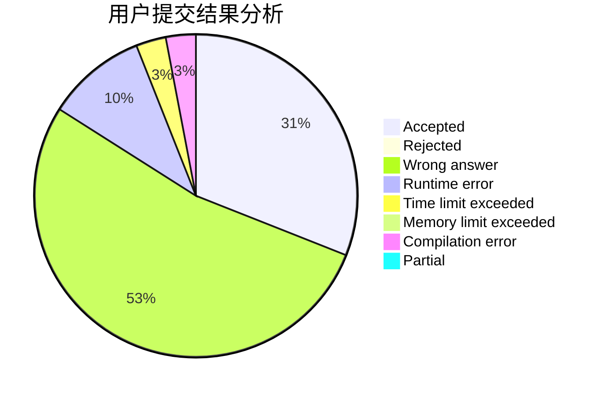
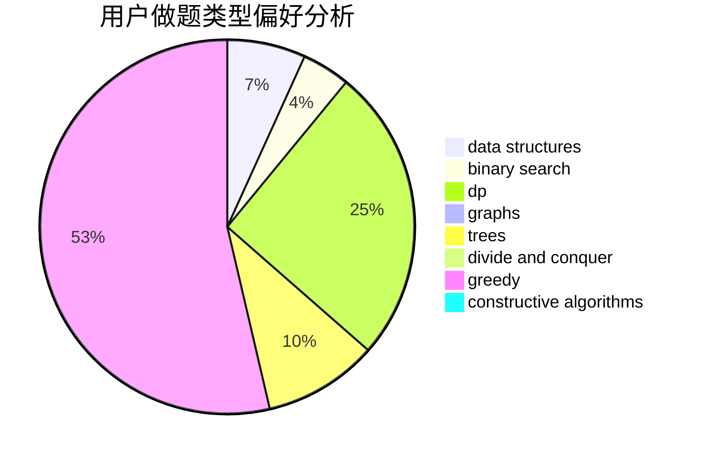
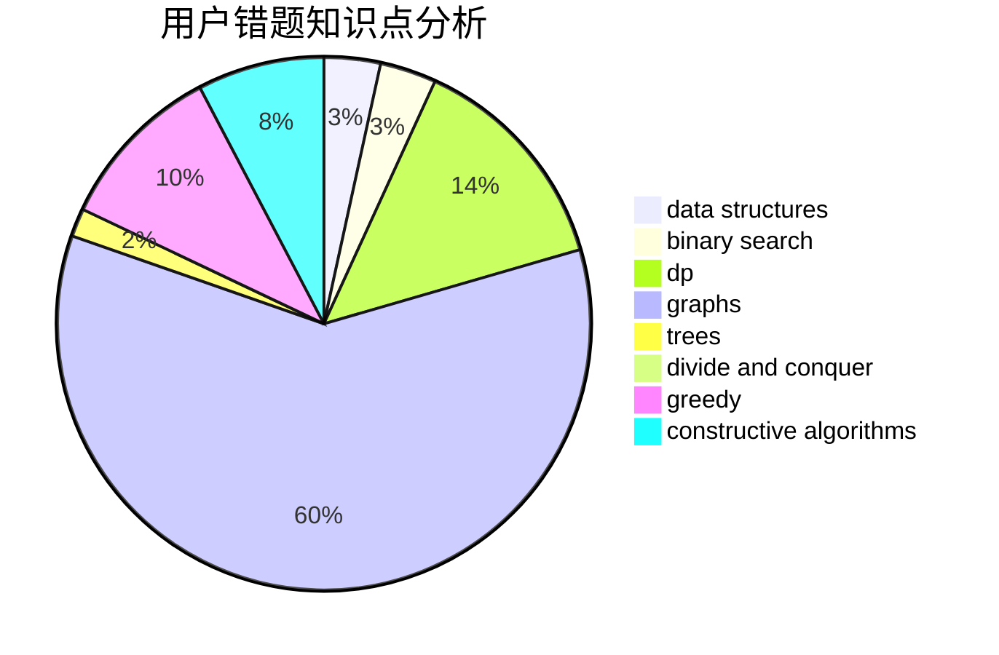

# Starry

<!-- tabs:start -->

#### **用户提交结果分析**

#### **用户做题类型偏好分析**

#### **用户错题知识点分析**

<!-- tabs:end -->
# 推荐题目
[960B](https://codeforces.com/contest/960/problem/B)		data structures,
                        greedy,
                        sortings		  
[1143F](https://codeforces.com/contest/1143/problem/F)		dsu,graphs,sortings,trees		  
[21D](https://codeforces.com/contest/21/problem/D)		bitmasks,
                        graph matchings,
                        graphs		  
[369B](https://codeforces.com/contest/369/problem/B)		constructive algorithms,
                        implementation,
                        math		  
[235A](https://codeforces.com/contest/235/problem/A)		number theory		  
[729C](https://codeforces.com/contest/729/problem/C)		binary search,
                        greedy,
                        sortings		  
[28A](https://codeforces.com/contest/28/problem/A)		implementation		  
[1437B](https://codeforces.com/contest/1437/problem/B)		constructive algorithms,
                        greedy		  
[1197B](https://codeforces.com/contest/1197/problem/B)		greedy,
                        implementation		  
[789A](https://codeforces.com/contest/789/problem/A)		implementation,
                        math		  
