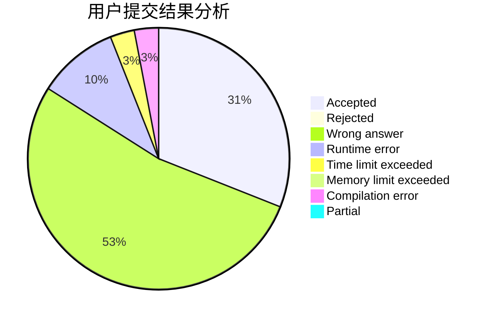
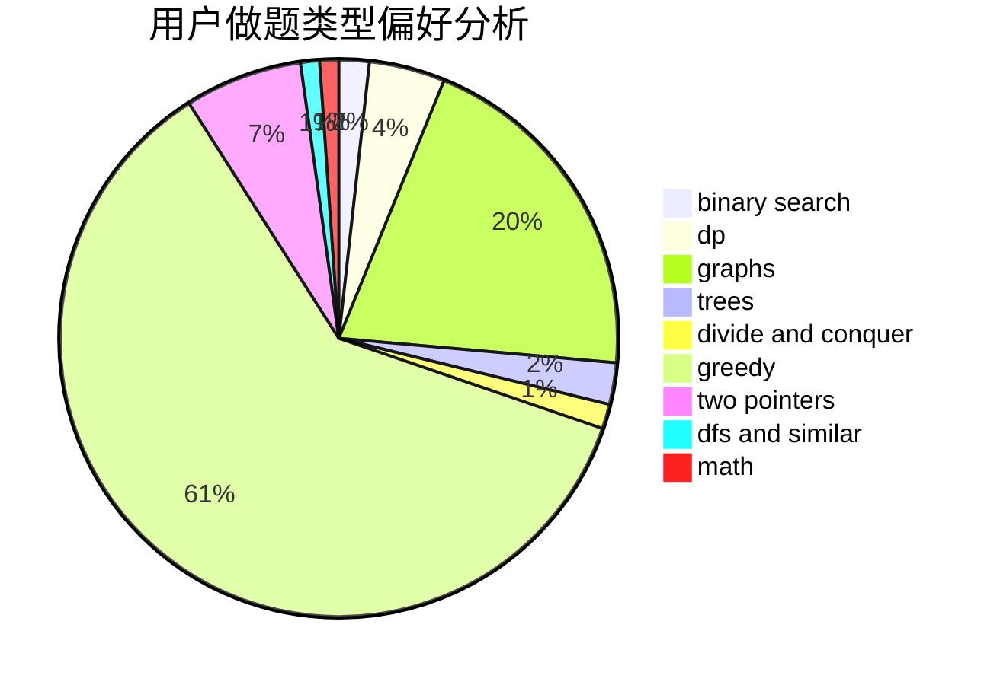

# Starry

<!-- tabs:start -->

#### **用户提交结果分析**

#### **用户做题类型偏好分析**

<!-- tabs:end -->
# 推荐题目
[982A](https://codeforces.com/contest/982/problem/A)
[1146A](https://codeforces.com/contest/1146/problem/A)
[23B](https://codeforces.com/contest/23/problem/B)
[39D](https://codeforces.com/contest/39/problem/D)
[257D](https://codeforces.com/contest/257/problem/D)
[746C](https://codeforces.com/contest/746/problem/C)
[303E](https://codeforces.com/contest/303/problem/E)
[14471](https://codeforces.com/contest/1447/problem/1)
[1200D](https://codeforces.com/contest/1200/problem/D)
[804C](https://codeforces.com/contest/804/problem/C)
