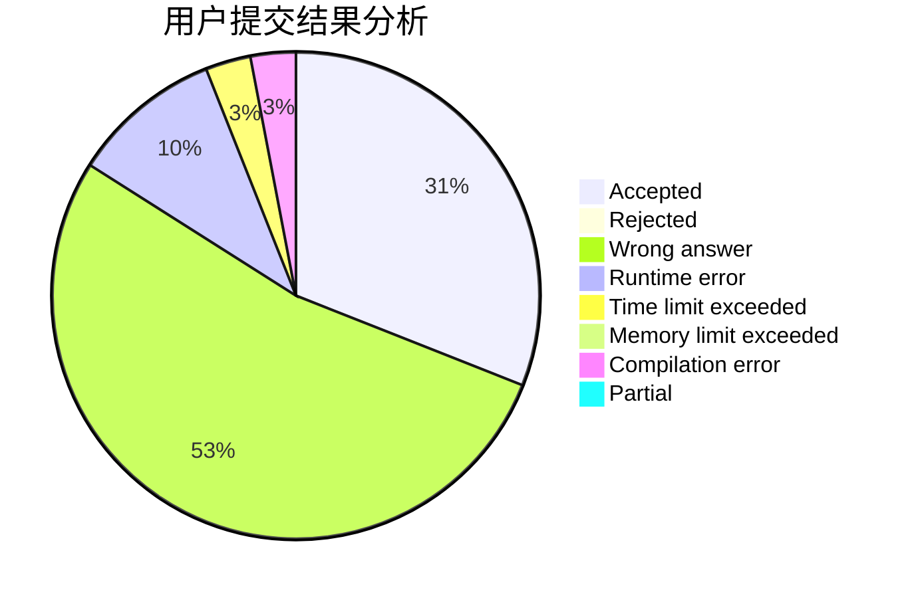
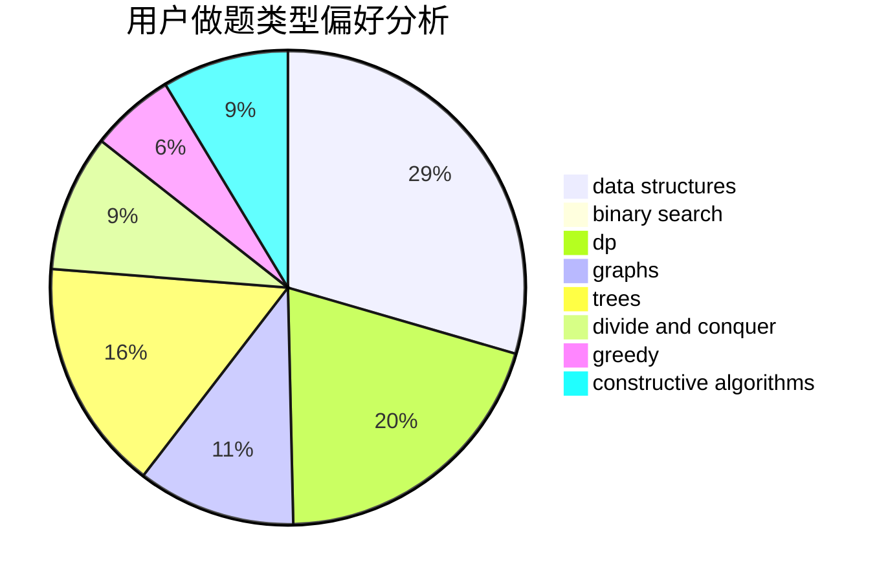
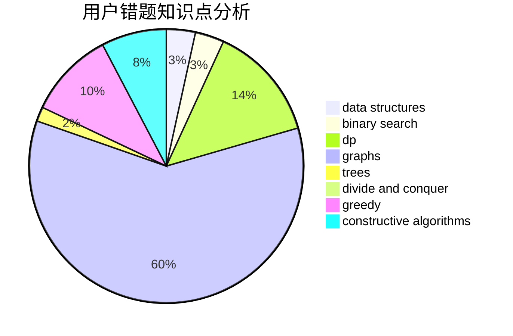

# Starry

<!-- tabs:start -->

#### **用户提交结果分析**

#### **用户做题类型偏好分析**

#### **用户错题知识点分析**

<!-- tabs:end -->
# 推荐题目
[982A](https://codeforces.com/contest/982/problem/A)		brute force,
                        constructive algorithms		  
[1146A](https://codeforces.com/contest/1146/problem/A)		implementation,
                        strings		  
[23B](https://codeforces.com/contest/23/problem/B)		constructive algorithms,
                        graphs,
                        math		  
[39D](https://codeforces.com/contest/39/problem/D)		math		  
[257D](https://codeforces.com/contest/257/problem/D)		greedy,
                        math		  
[746C](https://codeforces.com/contest/746/problem/C)		constructive algorithms,
                        implementation,
                        math		  
[303E](https://codeforces.com/contest/303/problem/E)		dp,
                        math,
                        probabilities		  
[14471](https://codeforces.com/contest/1447/problem/1)		dsu,graphs,sortings,trees		  
[1200D](https://codeforces.com/contest/1200/problem/D)		brute force,
                        data structures,
                        dp,
                        implementation,
                        two pointers		  
[804C](https://codeforces.com/contest/804/problem/C)		constructive algorithms,
                        dfs and similar,
                        greedy		  
