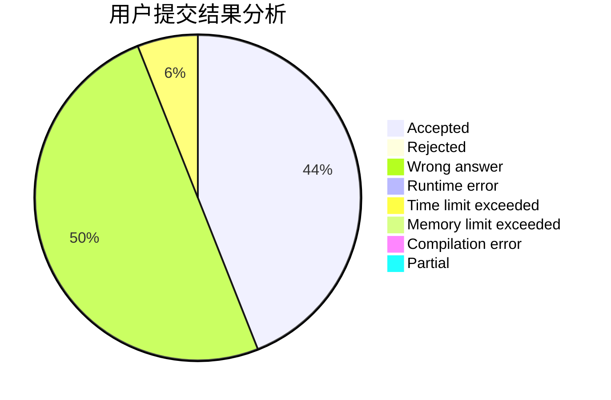
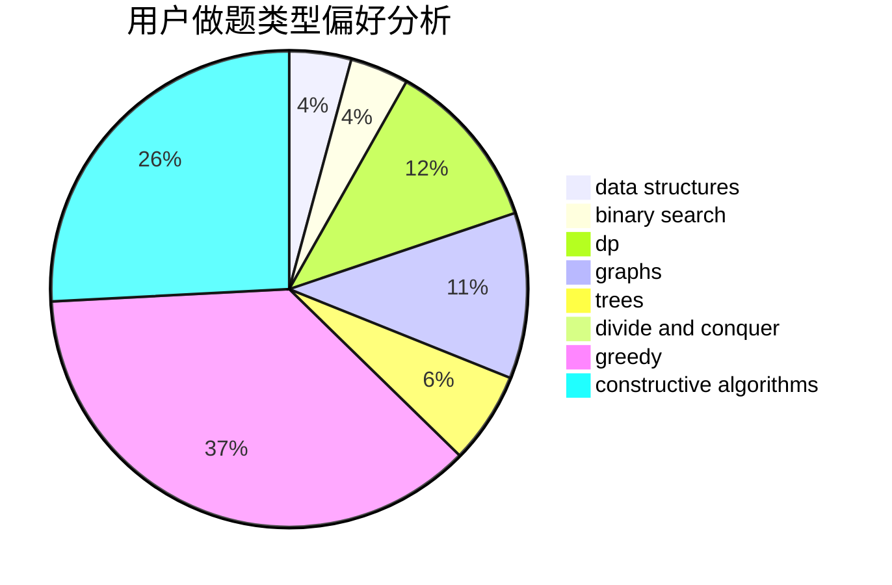

# StelaYuri

<!-- tabs:start -->

#### **用户提交结果分析**

#### **用户做题类型偏好分析**

#### **用户错题知识点分析**

<!-- tabs:end -->
# 推荐题目
[832C](https://codeforces.com/contest/832/problem/C)		binary search,
                        implementation,
                        math		  
[864D](https://codeforces.com/contest/864/problem/D)		greedy,
                        implementation,
                        math		  
[44I](https://codeforces.com/contest/44/problem/I)		brute force,
                        combinatorics		  
[1327A](https://codeforces.com/contest/1327/problem/A)		math		  
[1488E](https://codeforces.com/contest/1488/problem/E)		*special problem,
                        data structures,
                        dp		  
[703C](https://codeforces.com/contest/703/problem/C)		geometry,
                        implementation		  
[1041F](https://codeforces.com/contest/1041/problem/F)		data structures,
                        divide and conquer,
                        dp,
                        math		  
[760A](https://codeforces.com/contest/760/problem/A)		implementation,
                        math		  
[420C](https://codeforces.com/contest/420/problem/C)		data structures,
                        graphs,
                        implementation,
                        two pointers		  
[1161D](https://codeforces.com/contest/1161/problem/D)		dsu,graphs,sortings,trees		  
