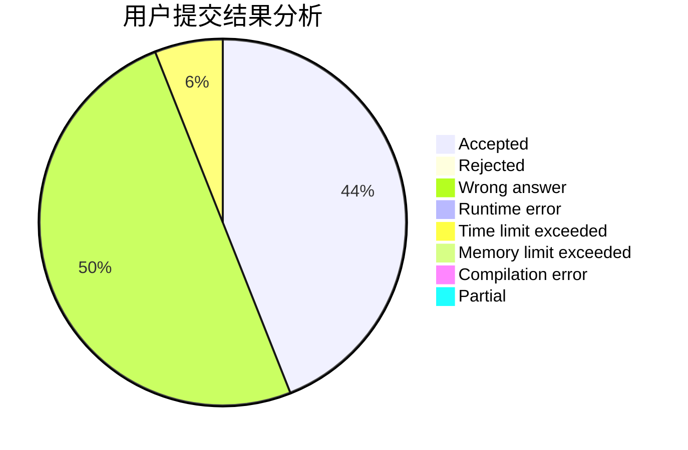
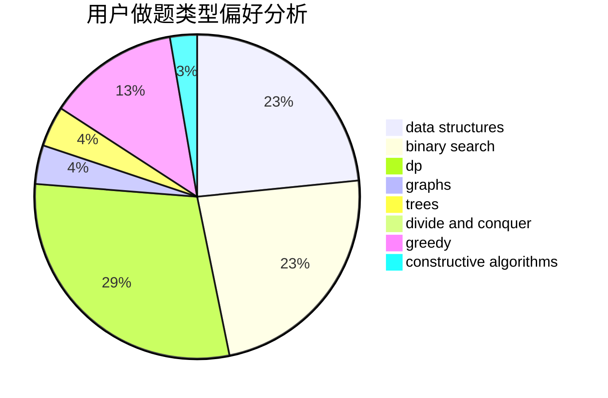

# StelaYuri

<!-- tabs:start -->

#### **用户提交结果分析**

#### **用户做题类型偏好分析**

#### **用户错题知识点分析**

<!-- tabs:end -->
# 推荐题目
[814A](https://codeforces.com/contest/814/problem/A)		constructive algorithms,
                        greedy,
                        implementation,
                        sortings		  
[846B](https://codeforces.com/contest/846/problem/B)		brute force,
                        greedy		  
[429C](https://codeforces.com/contest/429/problem/C)		bitmasks,
                        constructive algorithms,
                        dp,
                        greedy,
                        trees		  
[1320A](https://codeforces.com/contest/1320/problem/A)		data structures,
                        dp,
                        greedy,
                        math,
                        sortings		  
[1480A](https://codeforces.com/contest/1480/problem/A)		games,
                        greedy,
                        strings		  
[679E](https://codeforces.com/contest/679/problem/E)		data structures		  
[1041C](https://codeforces.com/contest/1041/problem/C)		binary search,
                        data structures,
                        greedy,
                        two pointers		  
[739E](https://codeforces.com/contest/739/problem/E)		brute force,
                        data structures,
                        dp,
                        flows,
                        math,
                        probabilities,
                        sortings		  
[391E2](https://codeforces.com/contest/391E/problem/2)		nan		  
[1158F](https://codeforces.com/contest/1158/problem/F)		dp,
                        math		  
