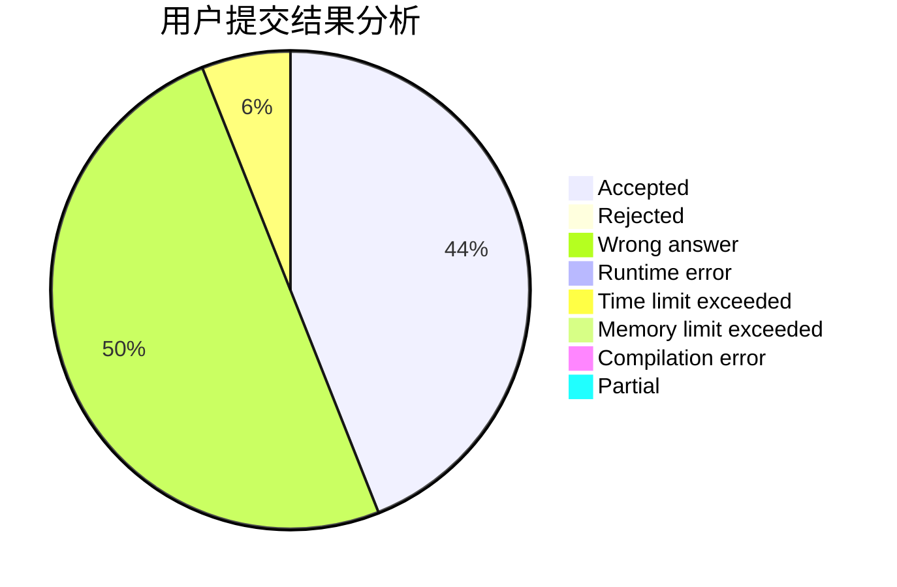
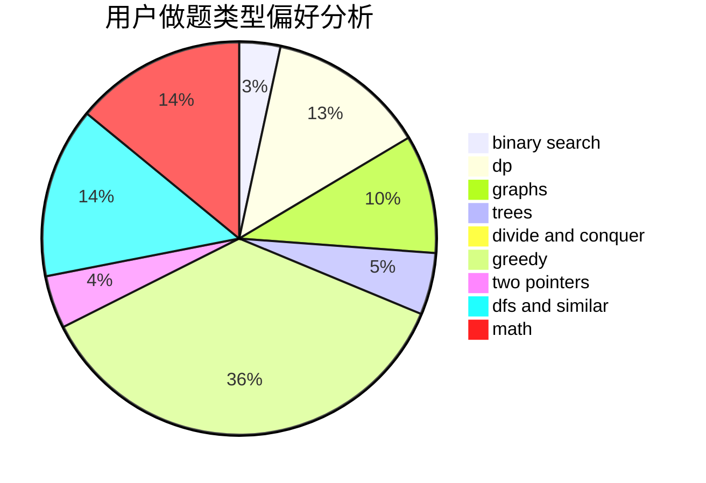

# StelaYuri

<!-- tabs:start -->

#### **用户提交结果分析**

#### **用户做题类型偏好分析**

<!-- tabs:end -->
# 推荐题目
[832C](https://codeforces.com/contest/832/problem/C)
[864D](https://codeforces.com/contest/864/problem/D)
[44I](https://codeforces.com/contest/44/problem/I)
[1327A](https://codeforces.com/contest/1327/problem/A)
[1488E](https://codeforces.com/contest/1488/problem/E)
[703C](https://codeforces.com/contest/703/problem/C)
[1041F](https://codeforces.com/contest/1041/problem/F)
[760A](https://codeforces.com/contest/760/problem/A)
[420C](https://codeforces.com/contest/420/problem/C)
[1161D](https://codeforces.com/contest/1161/problem/D)
