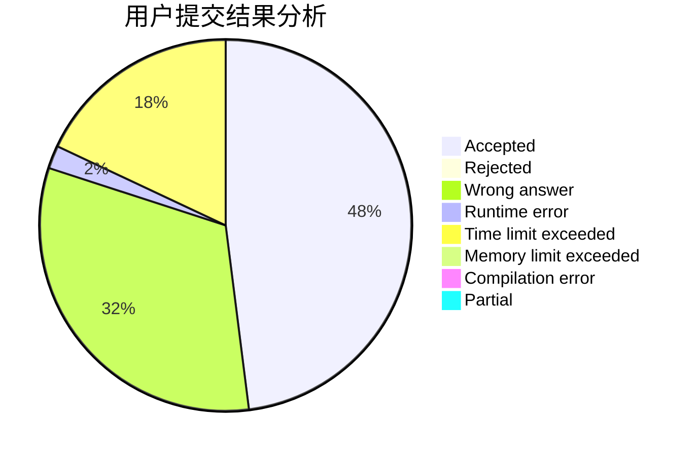
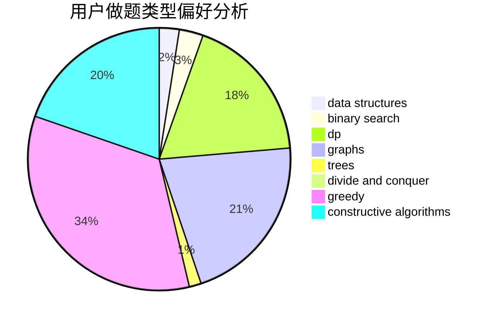
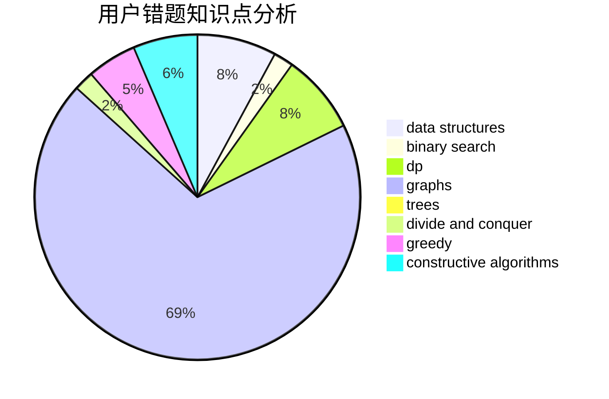

# Steve-Liu

<!-- tabs:start -->

#### **用户提交结果分析**

#### **用户做题类型偏好分析**

#### **用户错题知识点分析**

<!-- tabs:end -->
# 推荐题目
[952A](https://codeforces.com/contest/952/problem/A)		math		  
[343E](https://codeforces.com/contest/343/problem/E)		brute force,
                        dfs and similar,
                        divide and conquer,
                        flows,
                        graphs,
                        greedy,
                        trees		  
[1012C](https://codeforces.com/contest/1012/problem/C)		dp		  
[644A](https://codeforces.com/contest/644/problem/A)		*special problem,
                        constructive algorithms		  
[1065C](https://codeforces.com/contest/1065/problem/C)		greedy		  
[955A](https://codeforces.com/contest/955/problem/A)		greedy,
                        math		  
[1227G](https://codeforces.com/contest/1227/problem/G)		constructive algorithms		  
[1163B2](https://codeforces.com/contest/1163B/problem/2)		data structures,
                        implementation		  
[1129B](https://codeforces.com/contest/1129/problem/B)		constructive algorithms		  
[171H](https://codeforces.com/contest/171/problem/H)		*special problem,
                        implementation		  
