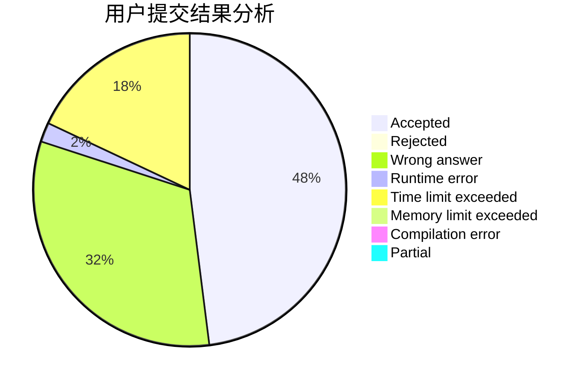
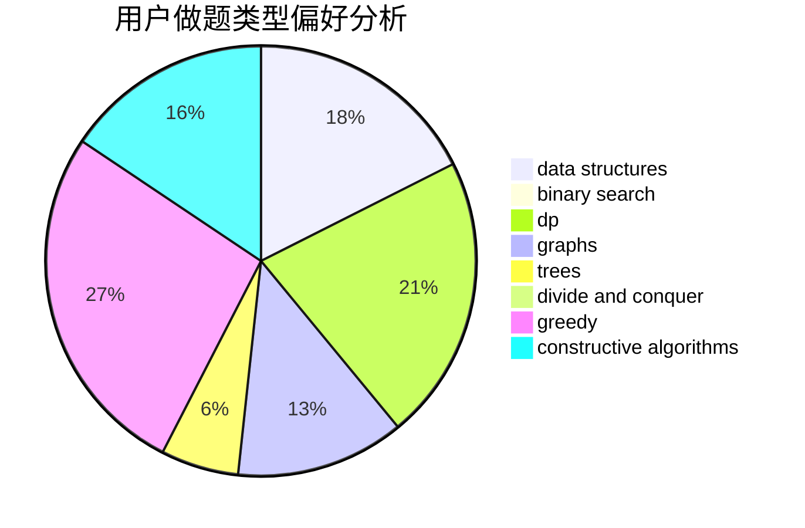
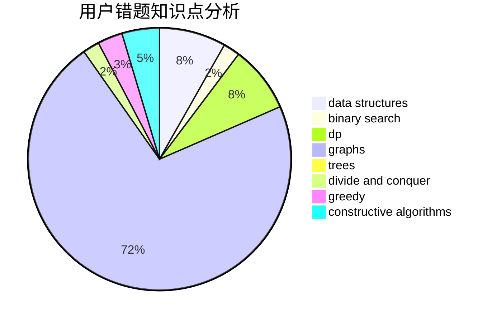

# Steve-Liu

<!-- tabs:start -->

#### **用户提交结果分析**

#### **用户做题类型偏好分析**

#### **用户错题知识点分析**

<!-- tabs:end -->
# 推荐题目
[96B](https://codeforces.com/contest/96/problem/B)		binary search,
                        bitmasks,
                        brute force		  
[370A](https://codeforces.com/contest/370/problem/A)		graphs,
                        math,
                        shortest paths		  
[1013A](https://codeforces.com/contest/1013/problem/A)		math		  
[671C](https://codeforces.com/contest/671/problem/C)		data structures,
                        number theory		  
[1065G](https://codeforces.com/contest/1065/problem/G)		strings		  
[977A](https://codeforces.com/contest/977/problem/A)		implementation		  
[1236E](https://codeforces.com/contest/1236/problem/E)		binary search,
                        data structures,
                        dp,
                        dsu		  
[1164Q](https://codeforces.com/contest/1164/problem/Q)		dsu,graphs,sortings,trees		  
[1131B](https://codeforces.com/contest/1131/problem/B)		greedy,
                        implementation		  
[19A](https://codeforces.com/contest/19/problem/A)		implementation		  
