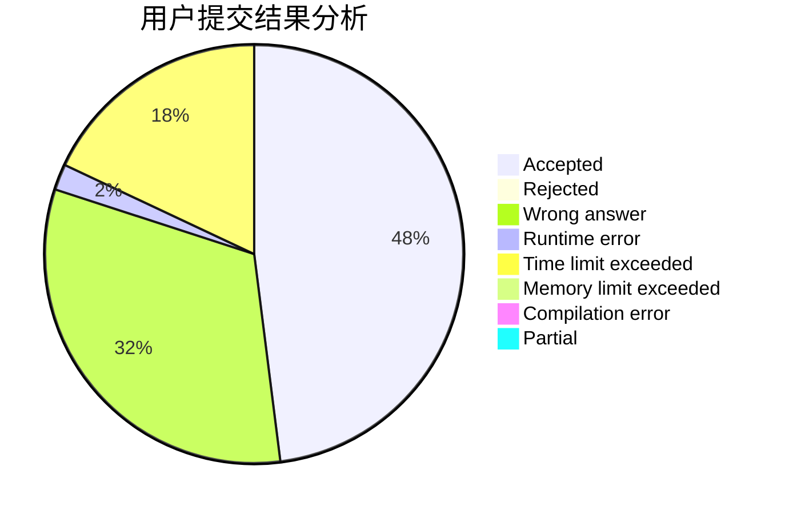
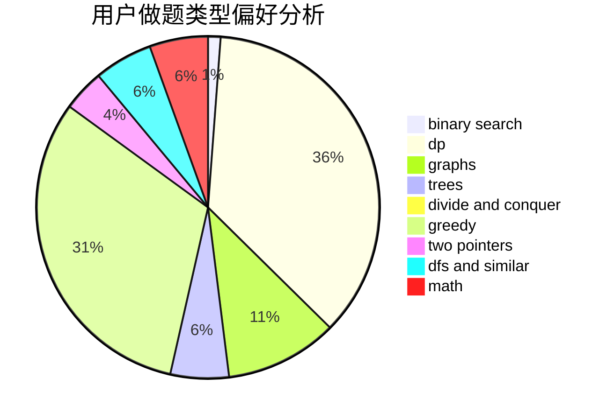

# Steve-Liu

<!-- tabs:start -->

#### **用户提交结果分析**

#### **用户做题类型偏好分析**

<!-- tabs:end -->
# 推荐题目
[96B](https://codeforces.com/contest/96/problem/B)
[370A](https://codeforces.com/contest/370/problem/A)
[1013A](https://codeforces.com/contest/1013/problem/A)
[671C](https://codeforces.com/contest/671/problem/C)
[1065G](https://codeforces.com/contest/1065/problem/G)
[977A](https://codeforces.com/contest/977/problem/A)
[1236E](https://codeforces.com/contest/1236/problem/E)
[1164Q](https://codeforces.com/contest/1164/problem/Q)
[1131B](https://codeforces.com/contest/1131/problem/B)
[19A](https://codeforces.com/contest/19/problem/A)
