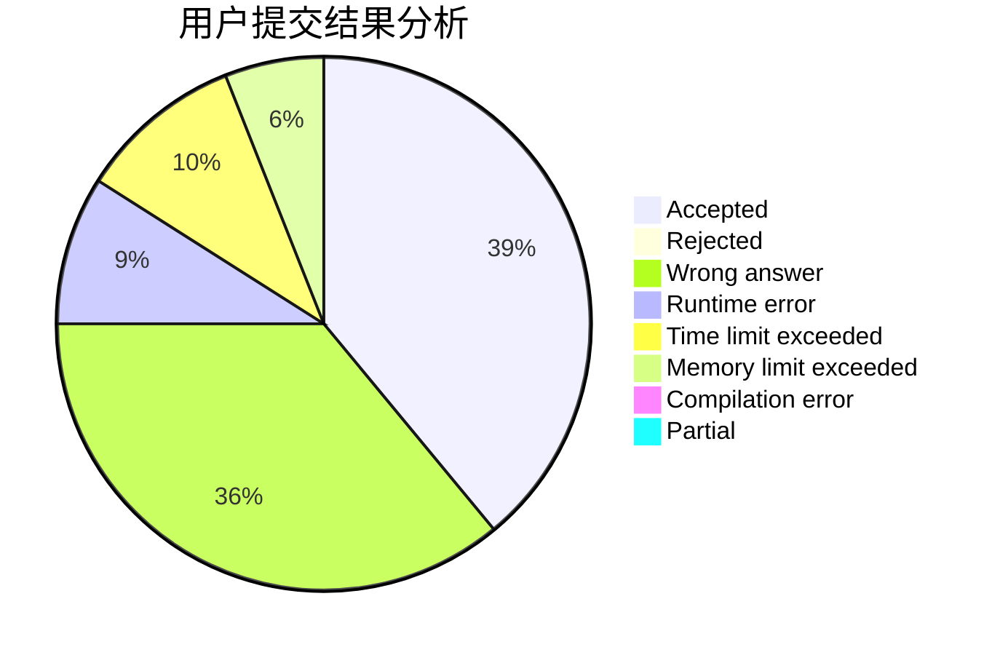
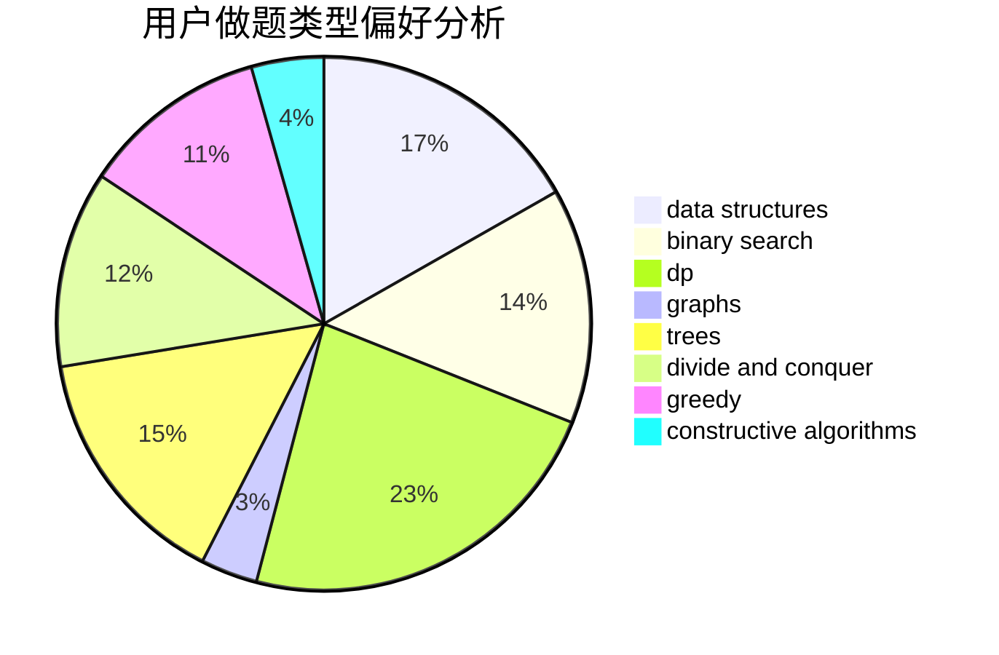

# StevenZhu

<!-- tabs:start -->

#### **用户提交结果分析**

#### **用户做题类型偏好分析**

#### **用户错题知识点分析**

<!-- tabs:end -->
# 推荐题目
[736D](https://codeforces.com/contest/736/problem/D)		math,
                        matrices		  
[1771](https://codeforces.com/contest/177/problem/1)		dsu,graphs,sortings,trees		  
[1033G](https://codeforces.com/contest/1033/problem/G)		games		  
[544D](https://codeforces.com/contest/544/problem/D)		dsu,graphs,sortings,trees		  
[362C](https://codeforces.com/contest/362/problem/C)		data structures,
                        dp,
                        implementation,
                        math		  
[1347C](https://codeforces.com/contest/1347/problem/C)		dsu,graphs,sortings,trees		  
[730C](https://codeforces.com/contest/730/problem/C)		binary search,
                        dfs and similar		  
[1282C](https://codeforces.com/contest/1282/problem/C)		greedy,
                        sortings,
                        two pointers		  
[486B](https://codeforces.com/contest/486/problem/B)		greedy,
                        hashing,
                        implementation		  
[1213F](https://codeforces.com/contest/1213/problem/F)		data structures,
                        dfs and similar,
                        dsu,
                        graphs,
                        greedy,
                        implementation,
                        strings		  
