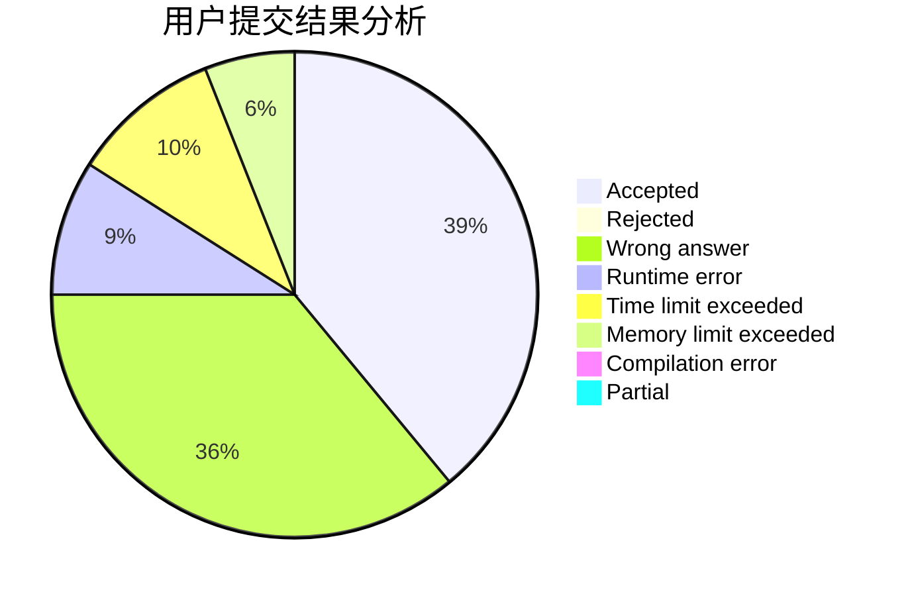
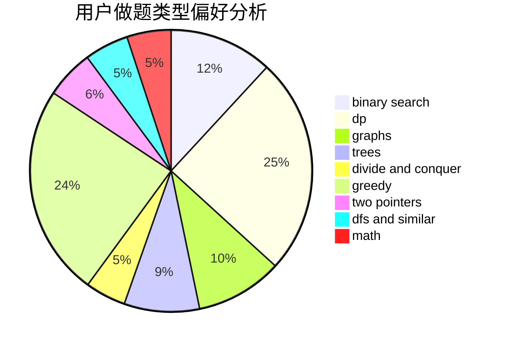

# StevenZhu

<!-- tabs:start -->

#### **用户提交结果分析**

#### **用户做题类型偏好分析**

<!-- tabs:end -->
# 推荐题目
[736D](https://codeforces.com/contest/736/problem/D)
[1771](https://codeforces.com/contest/177/problem/1)
[1033G](https://codeforces.com/contest/1033/problem/G)
[544D](https://codeforces.com/contest/544/problem/D)
[362C](https://codeforces.com/contest/362/problem/C)
[1347C](https://codeforces.com/contest/1347/problem/C)
[730C](https://codeforces.com/contest/730/problem/C)
[1282C](https://codeforces.com/contest/1282/problem/C)
[486B](https://codeforces.com/contest/486/problem/B)
[1213F](https://codeforces.com/contest/1213/problem/F)
