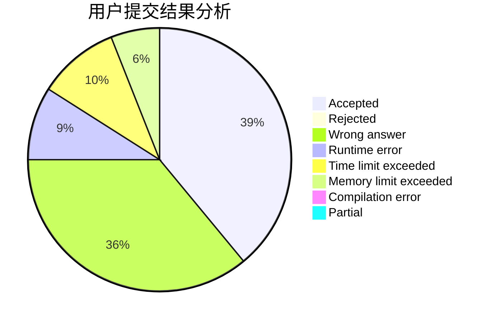
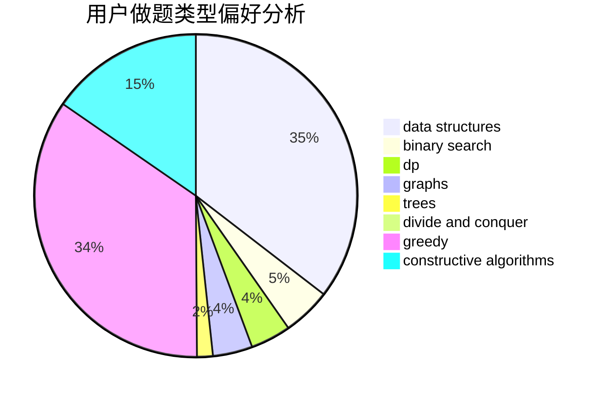

# StevenZhu

<!-- tabs:start -->

#### **用户提交结果分析**

#### **用户做题类型偏好分析**

#### **用户错题知识点分析**

<!-- tabs:end -->
# 推荐题目
[719C](https://codeforces.com/contest/719/problem/C)		dsu,graphs,sortings,trees		  
[156C](https://codeforces.com/contest/156/problem/C)		combinatorics,
                        dp		  
[1033D](https://codeforces.com/contest/1033/problem/D)		interactive,
                        math,
                        number theory		  
[519B](https://codeforces.com/contest/519/problem/B)		data structures,
                        implementation,
                        sortings		  
[335D](https://codeforces.com/contest/335/problem/D)		brute force,
                        dp		  
[1340D](https://codeforces.com/contest/1340/problem/D)		constructive algorithms,
                        dfs and similar,
                        graphs,
                        trees		  
[70E](https://codeforces.com/contest/70/problem/E)		dp,
                        implementation,
                        trees		  
[1276B](https://codeforces.com/contest/1276/problem/B)		combinatorics,
                        dfs and similar,
                        dsu,
                        graphs		  
[466D](https://codeforces.com/contest/466/problem/D)		combinatorics,
                        dp		  
[1208B](https://codeforces.com/contest/1208/problem/B)		binary search,
                        brute force,
                        implementation,
                        two pointers		  
