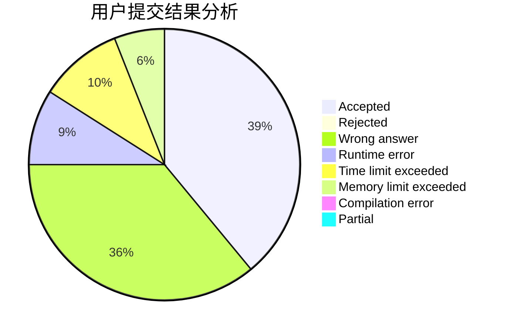
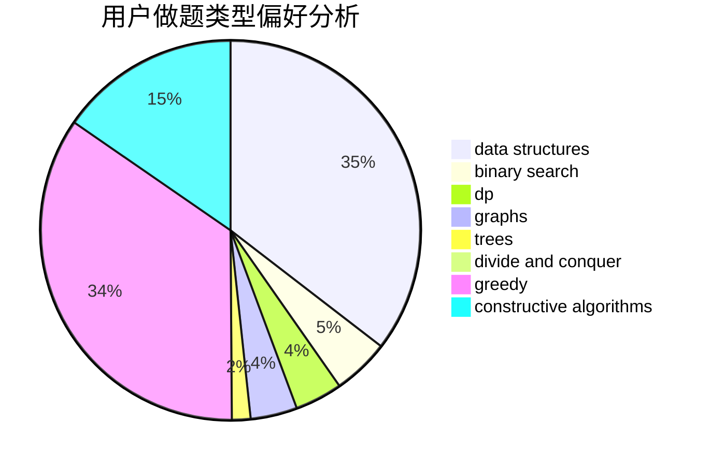

# StevenZhu
<!-- tabs:start -->
#### **用户提交结果分析**

#### **用户做题类型偏好分析**

#### **用户错题知识点分析**

<!-- tabs:end -->
# 推荐题目
[XORwice](http://codeforces.com/problemset/problem/1421/A)		bitmasks,
                        greedy,
                        math		  
[Cipher](http://codeforces.com/problemset/problem/156/C)		combinatorics,
                        dp		  
[Divisors](http://codeforces.com/problemset/problem/1033/D)		interactive,
                        math,
                        number theory		  
[Obsession with Robots](http://codeforces.com/problemset/problem/8/B)		constructive algorithms,
                        graphs,
                        implementation		  
[Sonya and Problem Wihtout a Legend](http://codeforces.com/problemset/problem/713/C)		dp,
                        sortings		  
[Cut and Paste](http://codeforces.com/problemset/problem/1280/A)		implementation,
                        math		  
[Great Vova Wall (Version 1)](http://codeforces.com/problemset/problem/1092/D1)		greedy,
                        implementation,
                        math		  
[Nastya and Time Machine](http://codeforces.com/problemset/problem/1340/D)		constructive algorithms,
                        dfs and similar,
                        graphs,
                        trees		  
[Two Fairs](http://codeforces.com/problemset/problem/1276/B)		combinatorics,
                        dfs and similar,
                        dsu,
                        graphs		  
[Rectangles and Square](http://codeforces.com/problemset/problem/335/D)		brute force,
                        dp		  
<!-- tabs:start -->
#### **data structures**
[XORwice](http://codeforces.com/problemset/problem/519/B)		data structures,
                        implementation,
                        sortings		  
[Cipher](https://codeforces.com/contest/871/problem/D)		data structures,
                        number theory		  
[Divisors](http://codeforces.com/problemset/problem/372/D)		binary search,
                        data structures,
                        dfs and similar,
                        trees,
                        two pointers		  
[Obsession with Robots](http://codeforces.com/problemset/problem/18/C)		data structures,
                        implementation		  
[Sonya and Problem Wihtout a Legend](http://codeforces.com/problemset/problem/678/F)		data structures,
                        divide and conquer,
                        geometry		  
[Cut and Paste](http://codeforces.com/problemset/problem/1329/C)		constructive algorithms,
                        data structures,
                        greedy,
                        implementation		  
[Great Vova Wall (Version 1)](http://codeforces.com/problemset/problem/452/E)		data structures,
                        dsu,
                        string suffix structures,
                        strings		  
[Nastya and Time Machine](http://codeforces.com/problemset/problem/1492/C)		binary search,
                        data structures,
                        dp,
                        greedy,
                        two pointers		  
[Two Fairs](http://codeforces.com/problemset/problem/1490/G)		binary search,
                        data structures,
                        math		  
[Rectangles and Square](http://codeforces.com/problemset/problem/1479/D)		binary search,
                        bitmasks,
                        brute force,
                        data structures,
                        probabilities,
                        trees		  
#### **binary search**
[XORwice](http://codeforces.com/problemset/problem/1208/B)		binary search,
                        brute force,
                        implementation,
                        two pointers		  
[Cipher](http://codeforces.com/problemset/problem/372/D)		binary search,
                        data structures,
                        dfs and similar,
                        trees,
                        two pointers		  
[Divisors](http://codeforces.com/problemset/problem/325/B)		binary search,
                        math		  
[Obsession with Robots](http://codeforces.com/problemset/problem/468/C)		binary search,
                        constructive algorithms,
                        math		  
[Sonya and Problem Wihtout a Legend](http://codeforces.com/problemset/problem/1492/C)		binary search,
                        data structures,
                        dp,
                        greedy,
                        two pointers		  
[Cut and Paste](http://codeforces.com/problemset/problem/1463/D)		binary search,
                        constructive algorithms,
                        greedy,
                        two pointers		  
[Great Vova Wall (Version 1)](http://codeforces.com/problemset/problem/1490/G)		binary search,
                        data structures,
                        math		  
[Nastya and Time Machine](http://codeforces.com/problemset/problem/1479/D)		binary search,
                        bitmasks,
                        brute force,
                        data structures,
                        probabilities,
                        trees		  
[Two Fairs](http://codeforces.com/problemset/problem/1436/E)		binary search,
                        data structures,
                        two pointers		  
[Rectangles and Square](http://codeforces.com/problemset/problem/1461/D)		binary search,
                        brute force,
                        data structures,
                        divide and conquer,
                        implementation,
                        sortings		  
#### **dp**
[XORwice](http://codeforces.com/problemset/problem/156/C)		combinatorics,
                        dp		  
[Cipher](http://codeforces.com/problemset/problem/713/C)		dp,
                        sortings		  
[Divisors](http://codeforces.com/problemset/problem/335/D)		brute force,
                        dp		  
[Obsession with Robots](http://codeforces.com/problemset/problem/137/D)		dp,
                        strings		  
[Sonya and Problem Wihtout a Legend](http://codeforces.com/problemset/problem/70/E)		dp,
                        implementation,
                        trees		  
[Cut and Paste](http://codeforces.com/problemset/problem/1461/F)		constructive algorithms,
                        dp,
                        greedy		  
[Great Vova Wall (Version 1)](http://codeforces.com/problemset/problem/1295/C)		dp,
                        greedy,
                        strings		  
[Nastya and Time Machine](http://codeforces.com/problemset/problem/466/D)		combinatorics,
                        dp		  
[Two Fairs](https://codeforces.com/contest/719/problem/C)		dp,
                        implementation,
                        math		  
[Rectangles and Square](http://codeforces.com/problemset/problem/316/D3)		dp,
                        math		  
#### **graph**
[XORwice](http://codeforces.com/problemset/problem/8/B)		constructive algorithms,
                        graphs,
                        implementation		  
[Cipher](http://codeforces.com/problemset/problem/1340/D)		constructive algorithms,
                        dfs and similar,
                        graphs,
                        trees		  
[Divisors](http://codeforces.com/problemset/problem/1276/B)		combinatorics,
                        dfs and similar,
                        dsu,
                        graphs		  
[Obsession with Robots](https://codeforces.com/contest/1162/problem/C)		graphs		  
[Sonya and Problem Wihtout a Legend](http://codeforces.com/problemset/problem/1383/F)		flows,
                        graphs		  
[Cut and Paste](http://codeforces.com/problemset/problem/1487/C)		brute force,
                        constructive algorithms,
                        dfs and similar,
                        graphs,
                        greedy,
                        implementation,
                        math		  
[Great Vova Wall (Version 1)](http://codeforces.com/problemset/problem/1437/C)		dp,
                        flows,
                        graph matchings,
                        greedy,
                        math,
                        sortings		  
[Nastya and Time Machine](http://codeforces.com/problemset/problem/1470/D)		constructive algorithms,
                        dfs and similar,
                        graph matchings,
                        graphs,
                        greedy		  
[Two Fairs](http://codeforces.com/problemset/problem/1476/C)		dp,
                        graphs,
                        greedy		  
[Rectangles and Square](http://codeforces.com/problemset/problem/1304/D)		constructive algorithms,
                        graphs,
                        greedy,
                        two pointers		  
#### **trees**
[XORwice](http://codeforces.com/problemset/problem/1340/D)		constructive algorithms,
                        dfs and similar,
                        graphs,
                        trees		  
[Cipher](https://codeforces.com/contest/430/problem/C)		dfs and similar,
                        trees		  
[Divisors](http://codeforces.com/problemset/problem/372/D)		binary search,
                        data structures,
                        dfs and similar,
                        trees,
                        two pointers		  
[Obsession with Robots](http://codeforces.com/problemset/problem/70/E)		dp,
                        implementation,
                        trees		  
[Sonya and Problem Wihtout a Legend](http://codeforces.com/problemset/problem/1479/D)		binary search,
                        bitmasks,
                        brute force,
                        data structures,
                        probabilities,
                        trees		  
[Cut and Paste](http://codeforces.com/problemset/problem/1511/C)		brute force,
                        data structures,
                        implementation,
                        trees		  
[Great Vova Wall (Version 1)](http://codeforces.com/problemset/problem/1499/F)		combinatorics,
                        dfs and similar,
                        dp,
                        trees		  
[Nastya and Time Machine](http://codeforces.com/problemset/problem/1491/E)		brute force,
                        dfs and similar,
                        divide and conquer,
                        number theory,
                        trees		  
[Two Fairs](http://codeforces.com/problemset/problem/1466/D)		data structures,
                        greedy,
                        sortings,
                        trees		  
[Rectangles and Square](http://codeforces.com/problemset/problem/1495/D)		combinatorics,
                        dfs and similar,
                        graphs,
                        math,
                        shortest paths,
                        trees		  
#### **divide and conquer**
[XORwice](http://codeforces.com/problemset/problem/1338/C)		bitmasks,
                        brute force,
                        constructive algorithms,
                        divide and conquer,
                        math		  
[Cipher](http://codeforces.com/problemset/problem/678/F)		data structures,
                        divide and conquer,
                        geometry		  
[Divisors](http://codeforces.com/problemset/problem/1461/D)		binary search,
                        brute force,
                        data structures,
                        divide and conquer,
                        implementation,
                        sortings		  
[Obsession with Robots](http://codeforces.com/problemset/problem/1466/G)		combinatorics,
                        divide and conquer,
                        hashing,
                        math,
                        string suffix structures,
                        strings		  
[Sonya and Problem Wihtout a Legend](http://codeforces.com/problemset/problem/1490/D)		dfs and similar,
                        divide and conquer,
                        implementation		  
[Cut and Paste](https://codeforces.com/contest/1483/problem/C)		data structures,
                        divide and conquer,
                        dp		  
[Great Vova Wall (Version 1)](http://codeforces.com/problemset/problem/1491/E)		brute force,
                        dfs and similar,
                        divide and conquer,
                        number theory,
                        trees		  
[Nastya and Time Machine](http://codeforces.com/problemset/problem/1303/G)		data structures,
                        divide and conquer,
                        geometry,
                        trees		  
[Two Fairs](http://codeforces.com/problemset/problem/1494/D)		constructive algorithms,
                        data structures,
                        dfs and similar,
                        divide and conquer,
                        dsu,
                        greedy,
                        sortings,
                        trees		  
[Rectangles and Square](http://codeforces.com/problemset/problem/1482/E)		data structures,
                        divide and conquer,
                        dp		  
#### **greedy**
[XORwice](http://codeforces.com/problemset/problem/1421/A)		bitmasks,
                        greedy,
                        math		  
[Cipher](http://codeforces.com/problemset/problem/1092/D1)		greedy,
                        implementation,
                        math		  
[Divisors](http://codeforces.com/problemset/problem/898/E)		constructive algorithms,
                        greedy		  
[Obsession with Robots](http://codeforces.com/problemset/problem/1307/B)		geometry,
                        greedy,
                        math		  
[Sonya and Problem Wihtout a Legend](http://codeforces.com/problemset/problem/1461/F)		constructive algorithms,
                        dp,
                        greedy		  
[Cut and Paste](http://codeforces.com/problemset/problem/1295/C)		dp,
                        greedy,
                        strings		  
[Great Vova Wall (Version 1)](http://codeforces.com/problemset/problem/1478/A)		brute force,
                        greedy		  
[Nastya and Time Machine](https://codeforces.com/contest/146/problem/C)		greedy,
                        implementation		  
[Two Fairs](http://codeforces.com/problemset/problem/1329/C)		constructive algorithms,
                        data structures,
                        greedy,
                        implementation		  
[Rectangles and Square](http://codeforces.com/problemset/problem/1097/E)		constructive algorithms,
                        greedy		  
#### **constructive algorithms**
[XORwice](http://codeforces.com/problemset/problem/8/B)		constructive algorithms,
                        graphs,
                        implementation		  
[Cipher](http://codeforces.com/problemset/problem/1340/D)		constructive algorithms,
                        dfs and similar,
                        graphs,
                        trees		  
[Divisors](http://codeforces.com/problemset/problem/898/E)		constructive algorithms,
                        greedy		  
[Obsession with Robots](http://codeforces.com/problemset/problem/1461/F)		constructive algorithms,
                        dp,
                        greedy		  
[Sonya and Problem Wihtout a Legend](http://codeforces.com/problemset/problem/1415/D)		bitmasks,
                        brute force,
                        constructive algorithms		  
[Cut and Paste](http://codeforces.com/problemset/problem/1338/C)		bitmasks,
                        brute force,
                        constructive algorithms,
                        divide and conquer,
                        math		  
[Great Vova Wall (Version 1)](http://codeforces.com/problemset/problem/1004/D)		brute force,
                        constructive algorithms,
                        implementation		  
[Nastya and Time Machine](http://codeforces.com/problemset/problem/1242/A)		constructive algorithms,
                        math,
                        number theory		  
[Two Fairs](http://codeforces.com/problemset/problem/1329/C)		constructive algorithms,
                        data structures,
                        greedy,
                        implementation		  
[Rectangles and Square](http://codeforces.com/problemset/problem/1097/E)		constructive algorithms,
                        greedy		  
#### **sortings**
[XORwice](http://codeforces.com/problemset/problem/713/C)		dp,
                        sortings		  
[Cipher](http://codeforces.com/problemset/problem/519/B)		data structures,
                        implementation,
                        sortings		  
[Divisors](http://codeforces.com/problemset/problem/1121/A)		implementation,
                        sortings		  
[Obsession with Robots](http://codeforces.com/problemset/problem/13/C)		dp,
                        sortings		  
[Sonya and Problem Wihtout a Legend](http://codeforces.com/problemset/problem/632/C)		sortings,
                        strings		  
[Cut and Paste](https://codeforces.com/contest/1496/problem/C)		geometry,
                        greedy,
                        math,
                        sortings		  
[Great Vova Wall (Version 1)](http://codeforces.com/problemset/problem/1495/A)		geometry,
                        greedy,
                        math,
                        sortings		  
[Nastya and Time Machine](http://codeforces.com/problemset/problem/1497/A)		brute force,
                        data structures,
                        greedy,
                        sortings		  
[Two Fairs](http://codeforces.com/problemset/problem/1427/A)		math,
                        sortings		  
[Rectangles and Square](http://codeforces.com/problemset/problem/1461/D)		binary search,
                        brute force,
                        data structures,
                        divide and conquer,
                        implementation,
                        sortings		  
<!-- tabs:end -->
