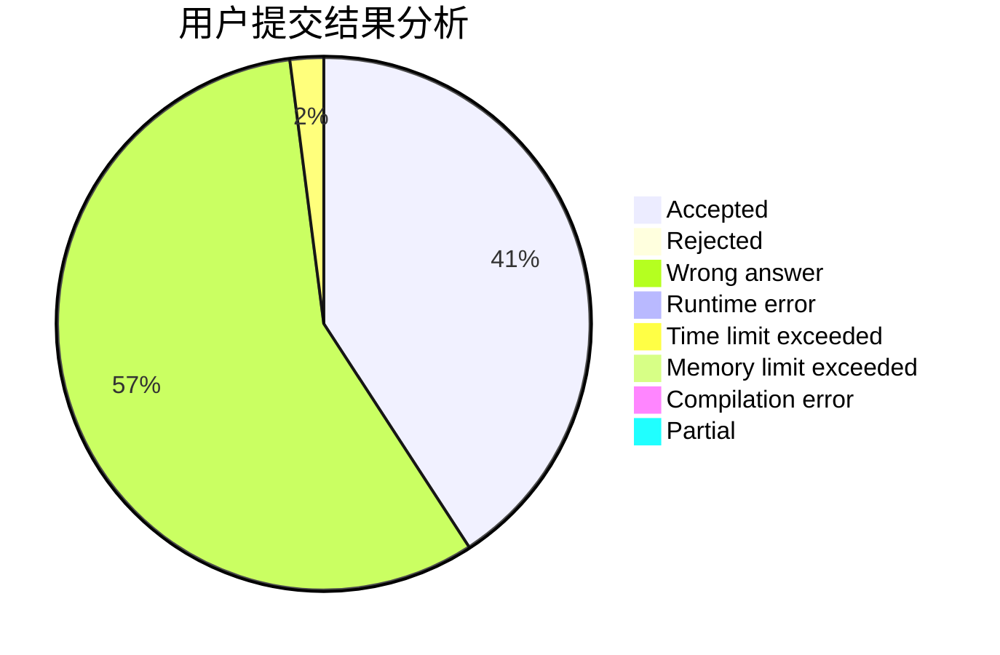
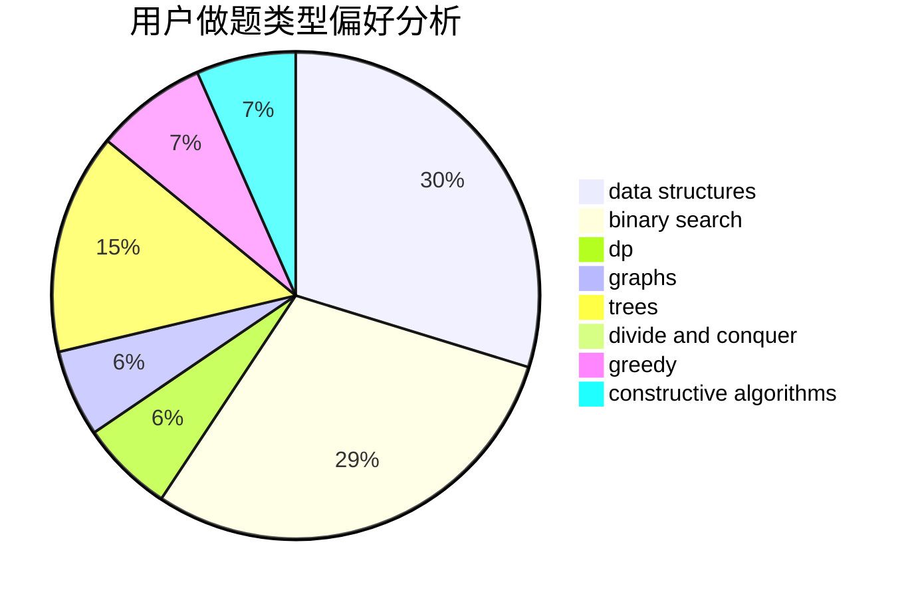
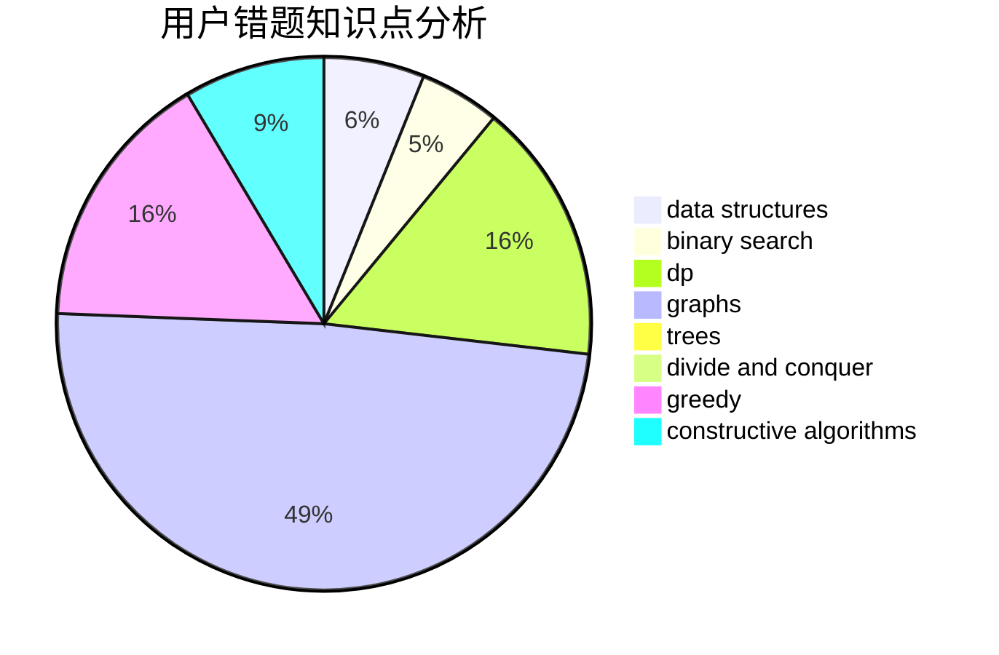

# Stylechick

<!-- tabs:start -->

#### **用户提交结果分析**

#### **用户做题类型偏好分析**

#### **用户错题知识点分析**

<!-- tabs:end -->
# 推荐题目
[553E](https://codeforces.com/contest/553/problem/E)		dp,
                        fft,
                        graphs,
                        math,
                        probabilities		  
[1033D](https://codeforces.com/contest/1033/problem/D)		interactive,
                        math,
                        number theory		  
[335D](https://codeforces.com/contest/335/problem/D)		brute force,
                        dp		  
[1129D](https://codeforces.com/contest/1129/problem/D)		data structures,
                        dp		  
[87C](https://codeforces.com/contest/87/problem/C)		dp,
                        games,
                        math		  
[683A](https://codeforces.com/contest/683/problem/A)		*special problem,
                        geometry		  
[750H](https://codeforces.com/contest/750/problem/H)		dfs and similar,
                        dsu,
                        graphs,
                        interactive		  
[962G](https://codeforces.com/contest/962/problem/G)		data structures,
                        dsu,
                        geometry,
                        trees		  
[864C](https://codeforces.com/contest/864/problem/C)		greedy,
                        implementation,
                        math		  
[601B](https://codeforces.com/contest/601/problem/B)		data structures,
                        math		  
