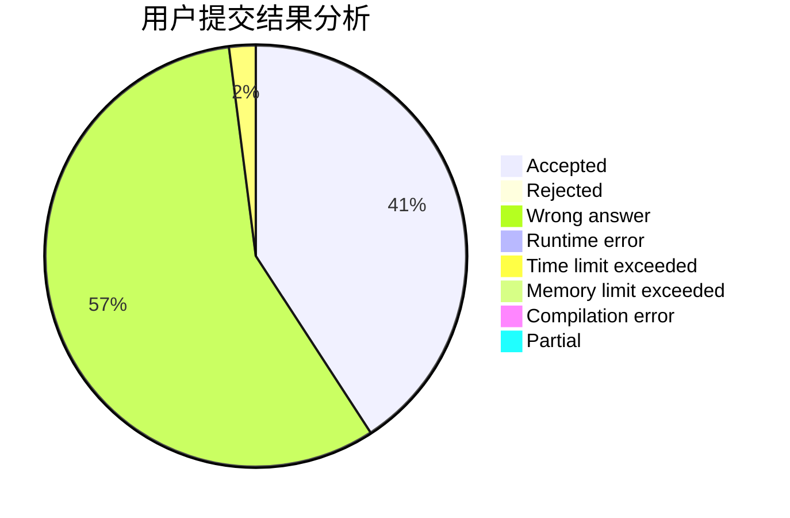
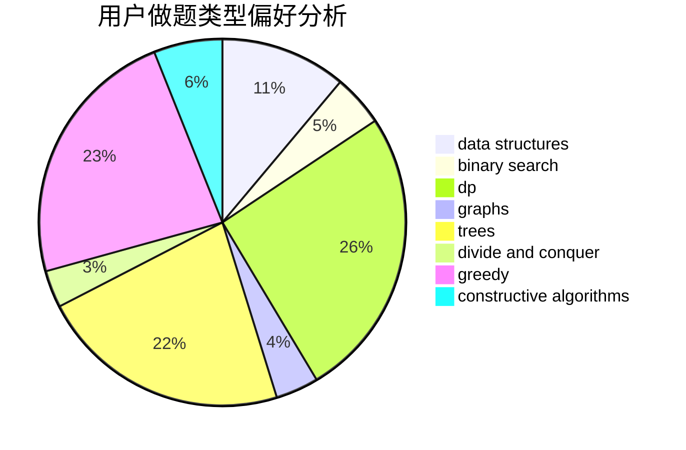
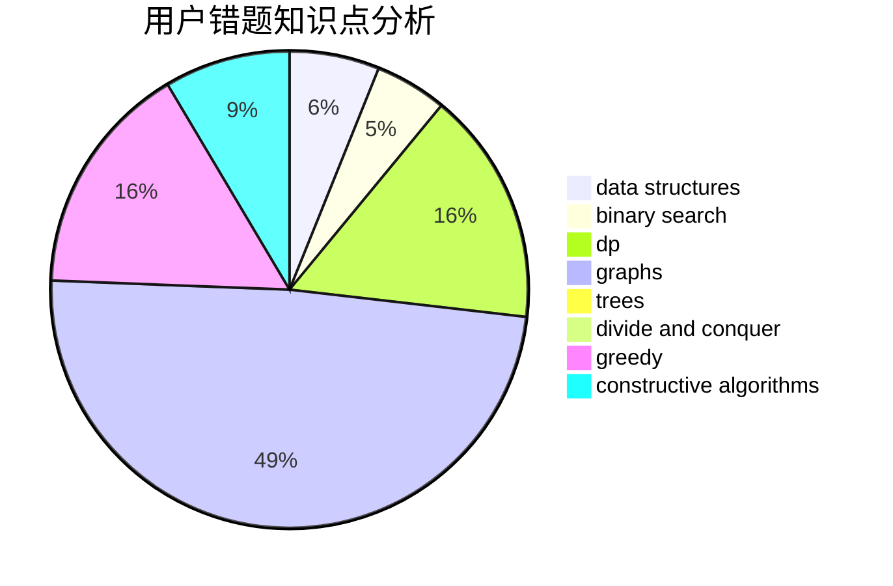

# Stylechick

<!-- tabs:start -->

#### **用户提交结果分析**

#### **用户做题类型偏好分析**

#### **用户错题知识点分析**

<!-- tabs:end -->
# 推荐题目
[579A](https://codeforces.com/contest/579/problem/A)		bitmasks		  
[1033G](https://codeforces.com/contest/1033/problem/G)		games		  
[362C](https://codeforces.com/contest/362/problem/C)		data structures,
                        dp,
                        implementation,
                        math		  
[1131D](https://codeforces.com/contest/1131/problem/D)		dfs and similar,
                        dp,
                        dsu,
                        graphs,
                        greedy		  
[8D](https://codeforces.com/contest/8/problem/D)		binary search,
                        geometry		  
[707B](https://codeforces.com/contest/707/problem/B)		graphs		  
[771D](https://codeforces.com/contest/771/problem/D)		dp		  
[985E](https://codeforces.com/contest/985/problem/E)		binary search,
                        data structures,
                        dp,
                        greedy,
                        two pointers		  
[883M](https://codeforces.com/contest/883/problem/M)		greedy,
                        math		  
[620D](https://codeforces.com/contest/620/problem/D)		binary search,
                        two pointers		  
