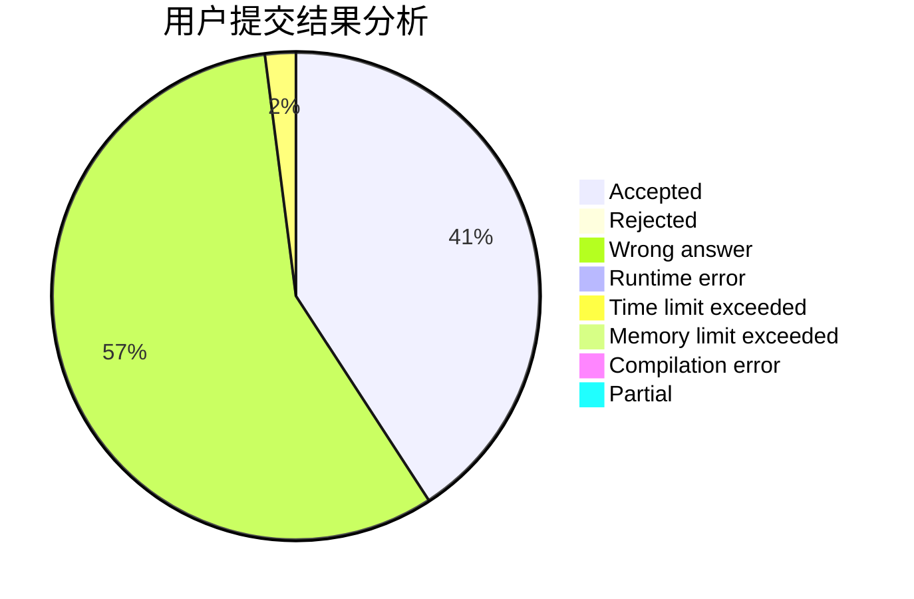
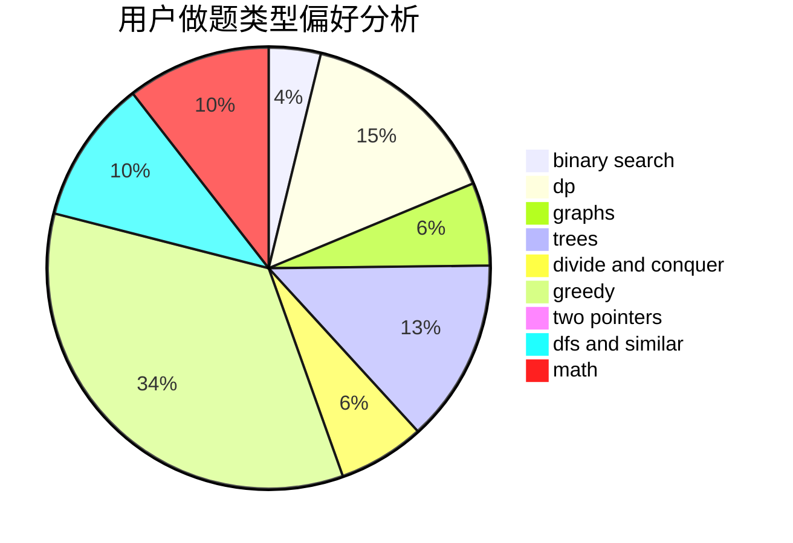

# Stylechick

<!-- tabs:start -->

#### **用户提交结果分析**

#### **用户做题类型偏好分析**

<!-- tabs:end -->
# 推荐题目
[579A](https://codeforces.com/contest/579/problem/A)
[1033G](https://codeforces.com/contest/1033/problem/G)
[362C](https://codeforces.com/contest/362/problem/C)
[1131D](https://codeforces.com/contest/1131/problem/D)
[8D](https://codeforces.com/contest/8/problem/D)
[707B](https://codeforces.com/contest/707/problem/B)
[771D](https://codeforces.com/contest/771/problem/D)
[985E](https://codeforces.com/contest/985/problem/E)
[883M](https://codeforces.com/contest/883/problem/M)
[620D](https://codeforces.com/contest/620/problem/D)
