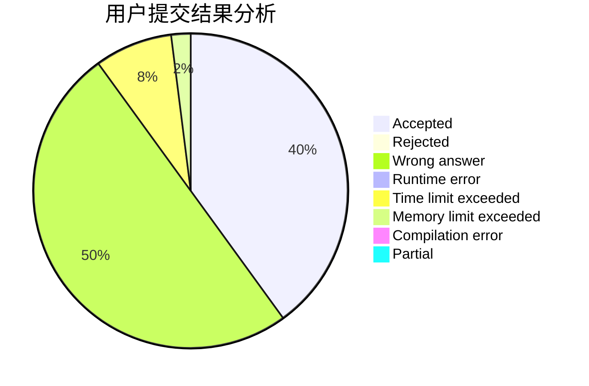
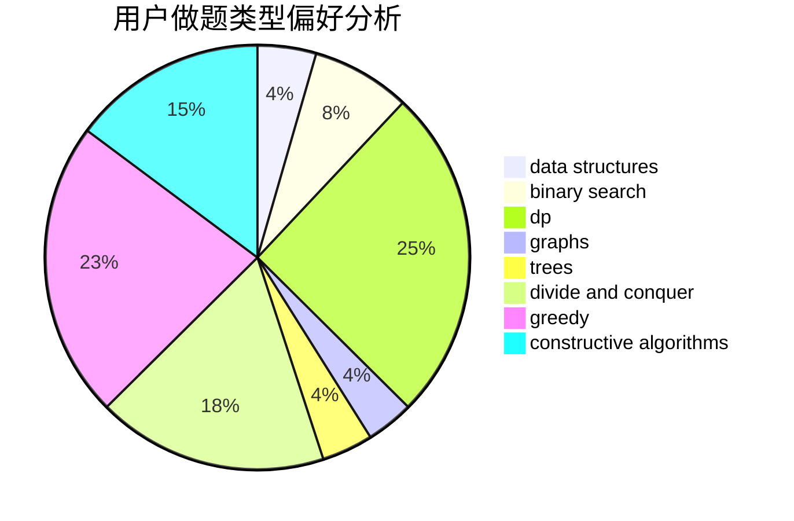

# Sugarnya

<!-- tabs:start -->

#### **用户提交结果分析**

#### **用户做题类型偏好分析**

#### **用户错题知识点分析**

<!-- tabs:end -->
# 推荐题目
[1338A](https://codeforces.com/contest/1338/problem/A)		greedy,
                        math		  
[1290C](https://codeforces.com/contest/1290/problem/C)		dfs and similar,
                        dsu,
                        graphs		  
[923B](https://codeforces.com/contest/923/problem/B)		binary search,
                        data structures		  
[763C](https://codeforces.com/contest/763/problem/C)		brute force,
                        implementation,
                        math,
                        number theory		  
[183D](https://codeforces.com/contest/183/problem/D)		dp,
                        greedy,
                        probabilities		  
[1280A](https://codeforces.com/contest/1280/problem/A)		implementation,
                        math		  
[1339A](https://codeforces.com/contest/1339/problem/A)		brute force,
                        dp,
                        implementation,
                        math		  
[935E](https://codeforces.com/contest/935/problem/E)		dfs and similar,
                        dp,
                        trees		  
[1377A1](https://codeforces.com/contest/1377A/problem/1)		dsu,graphs,sortings,trees		  
[1380E](https://codeforces.com/contest/1380/problem/E)		data structures,
                        dsu,
                        implementation,
                        trees		  
