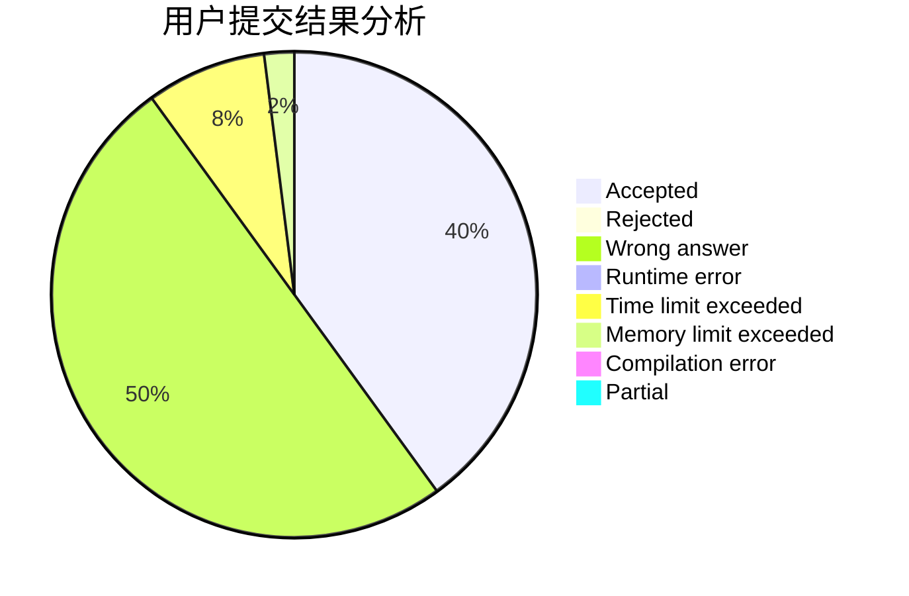
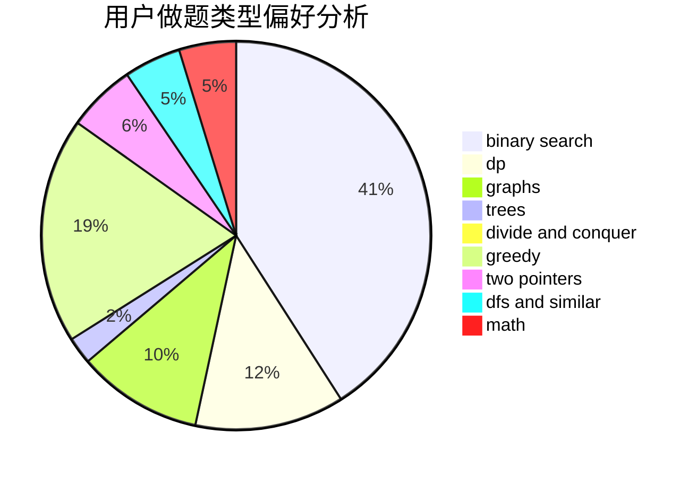

# Sugarnya

<!-- tabs:start -->

#### **用户提交结果分析**

#### **用户做题类型偏好分析**

<!-- tabs:end -->
# 推荐题目
[1345B](https://codeforces.com/contest/1345/problem/B)
[1296F](https://codeforces.com/contest/1296/problem/F)
[946G](https://codeforces.com/contest/946/problem/G)
[782A](https://codeforces.com/contest/782/problem/A)
[20A](https://codeforces.com/contest/20/problem/A)
[1286A](https://codeforces.com/contest/1286/problem/A)
[1346A](https://codeforces.com/contest/1346/problem/A)
[957D](https://codeforces.com/contest/957/problem/D)
[1386B](https://codeforces.com/contest/1386/problem/B)
[138C](https://codeforces.com/contest/138/problem/C)
