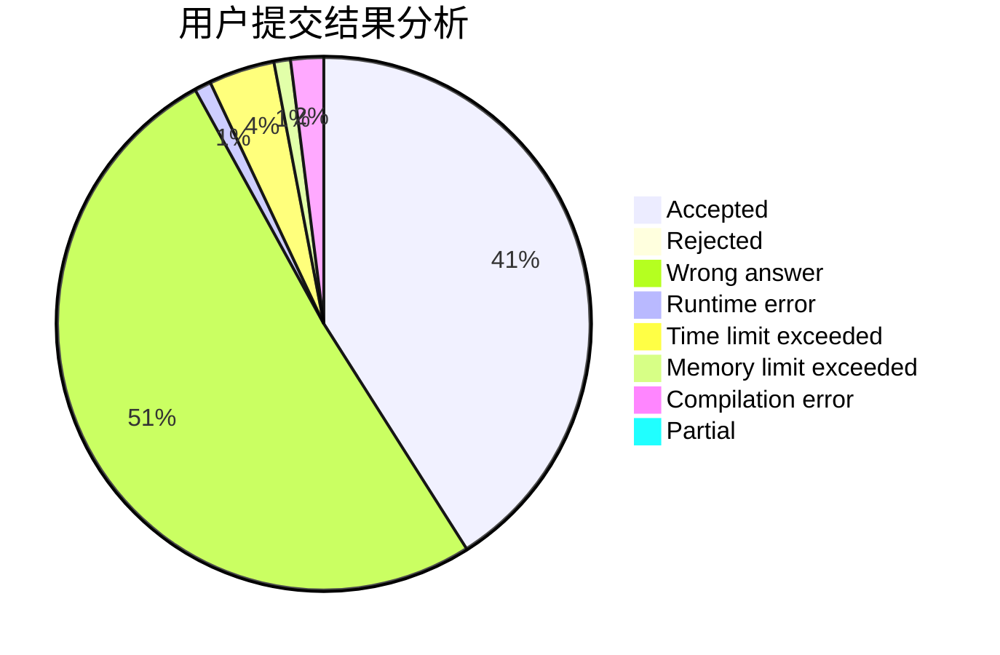
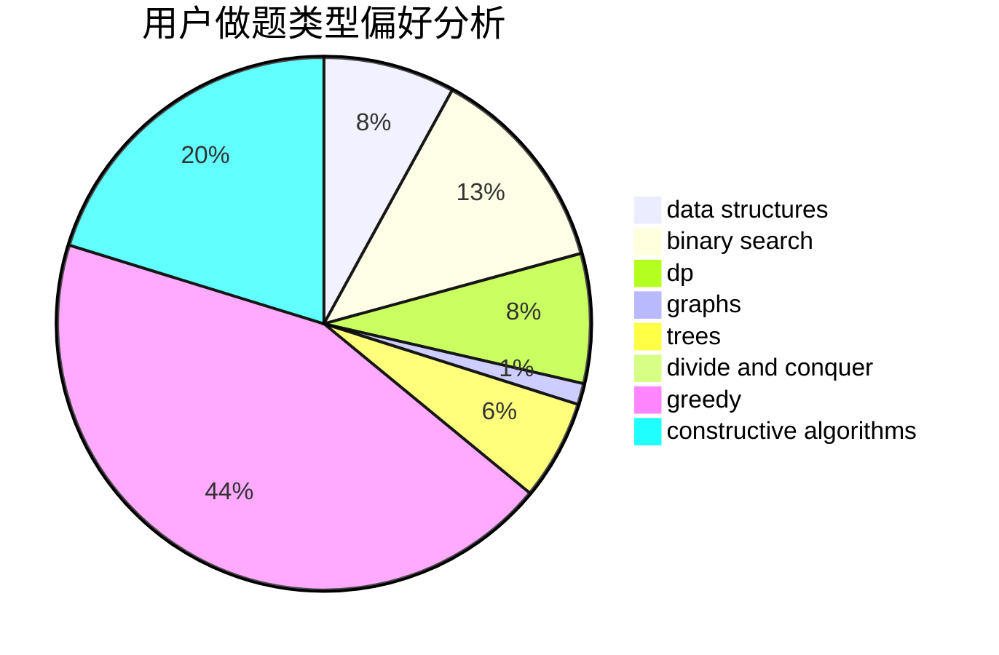
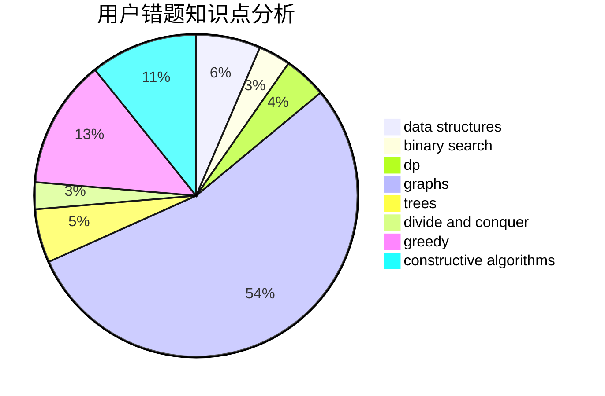

# Suika_predator

<!-- tabs:start -->

#### **用户提交结果分析**

#### **用户做题类型偏好分析**

#### **用户错题知识点分析**

<!-- tabs:end -->
# 推荐题目
[7C](https://codeforces.com/contest/7/problem/C)		math,
                        number theory		  
[505D](https://codeforces.com/contest/505/problem/D)		dfs and similar		  
[893A](https://codeforces.com/contest/893/problem/A)		implementation		  
[75D](https://codeforces.com/contest/75/problem/D)		data structures,
                        dp,
                        greedy,
                        implementation,
                        math,
                        trees		  
[1378A2](https://codeforces.com/contest/1378A/problem/2)		dsu,graphs,sortings,trees		  
[670D1](https://codeforces.com/contest/670D/problem/1)		binary search,
                        brute force,
                        implementation		  
[793D](https://codeforces.com/contest/793/problem/D)		dp,
                        graphs,
                        shortest paths		  
[1380B](https://codeforces.com/contest/1380/problem/B)		greedy		  
[527B](https://codeforces.com/contest/527/problem/B)		greedy		  
[1196B](https://codeforces.com/contest/1196/problem/B)		constructive algorithms,
                        math		  
