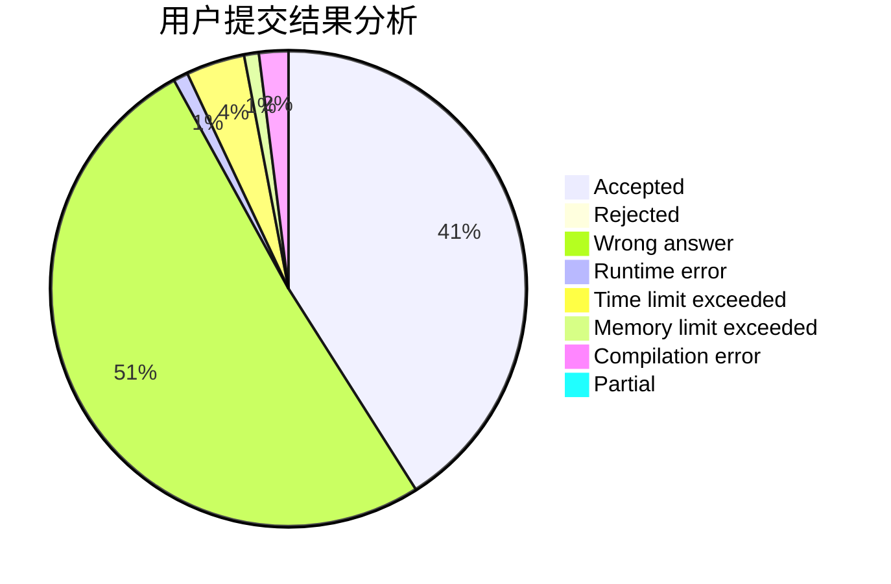
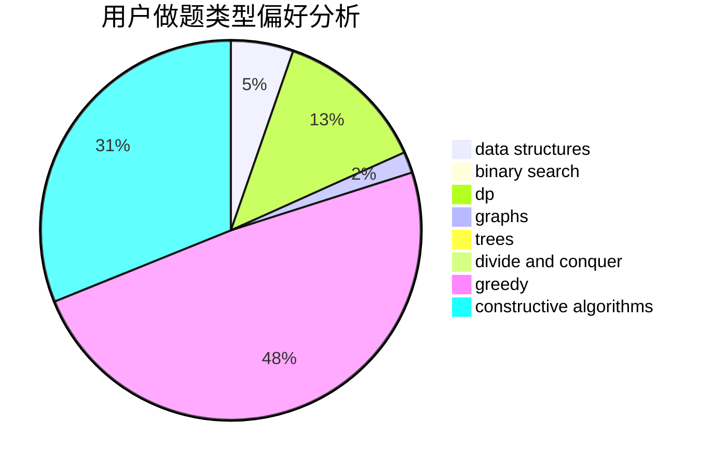

# Suika_predator

<!-- tabs:start -->

#### **用户提交结果分析**

#### **用户做题类型偏好分析**

#### **用户错题知识点分析**

<!-- tabs:end -->
# 推荐题目
[814D](https://codeforces.com/contest/814/problem/D)		dfs and similar,
                        dp,
                        geometry,
                        greedy,
                        trees		  
[526A](https://codeforces.com/contest/526/problem/A)		brute force,
                        implementation		  
[911A](https://codeforces.com/contest/911/problem/A)		implementation		  
[77B](https://codeforces.com/contest/77/problem/B)		math,
                        probabilities		  
[1387A](https://codeforces.com/contest/1387/problem/A)		*special problem,
                        binary search,
                        dfs and similar,
                        dp,
                        math,
                        ternary search		  
[696B](https://codeforces.com/contest/696/problem/B)		dfs and similar,
                        math,
                        probabilities,
                        trees		  
[808F](https://codeforces.com/contest/808/problem/F)		binary search,
                        flows,
                        graphs		  
[1389E](https://codeforces.com/contest/1389/problem/E)		math,
                        number theory		  
[551B](https://codeforces.com/contest/551/problem/B)		brute force,
                        constructive algorithms,
                        implementation,
                        strings		  
[11C](https://codeforces.com/contest/11/problem/C)		implementation		  
