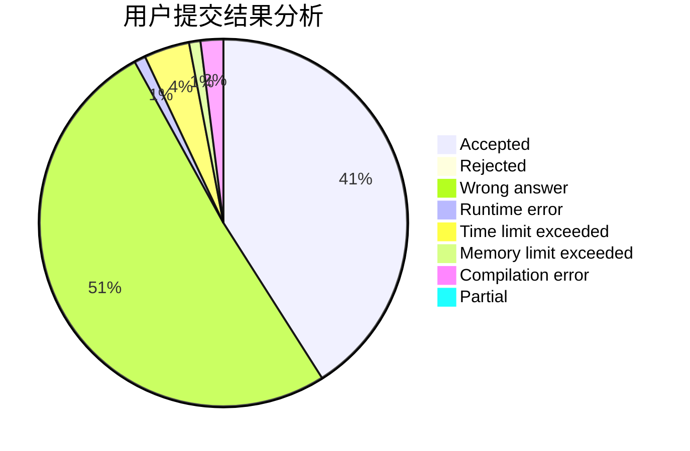
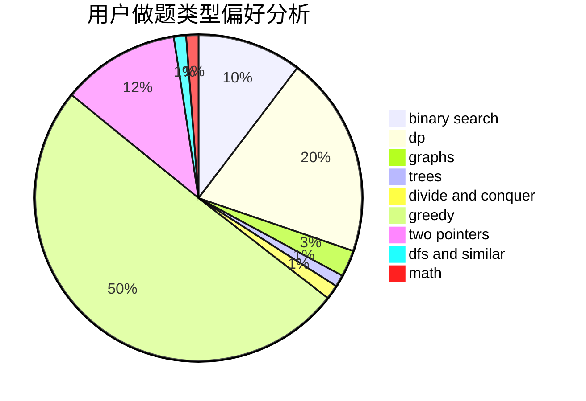

# Suika_predator

<!-- tabs:start -->

#### **用户提交结果分析**

#### **用户做题类型偏好分析**

<!-- tabs:end -->
# 推荐题目
[814D](https://codeforces.com/contest/814/problem/D)
[526A](https://codeforces.com/contest/526/problem/A)
[911A](https://codeforces.com/contest/911/problem/A)
[77B](https://codeforces.com/contest/77/problem/B)
[1387A](https://codeforces.com/contest/1387/problem/A)
[696B](https://codeforces.com/contest/696/problem/B)
[808F](https://codeforces.com/contest/808/problem/F)
[1389E](https://codeforces.com/contest/1389/problem/E)
[551B](https://codeforces.com/contest/551/problem/B)
[11C](https://codeforces.com/contest/11/problem/C)
