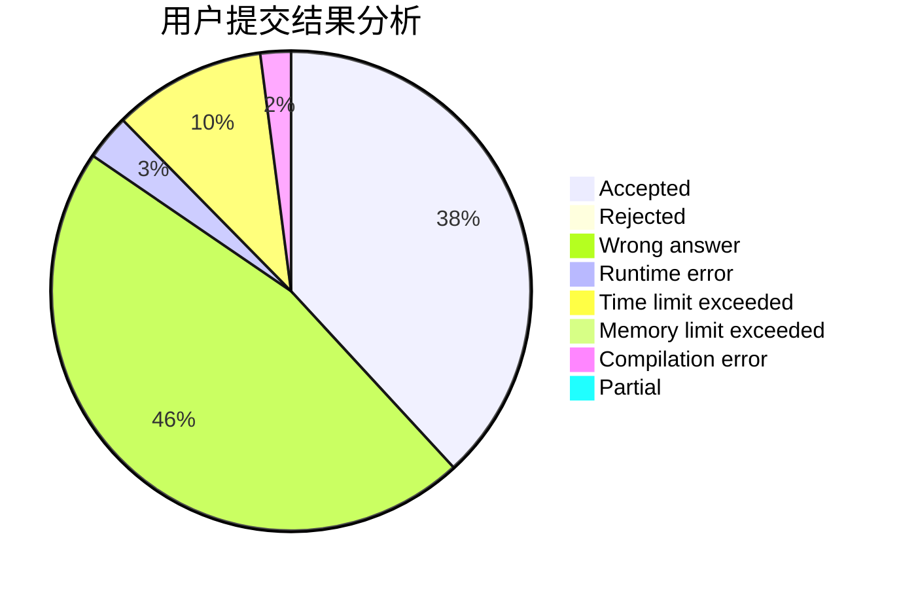
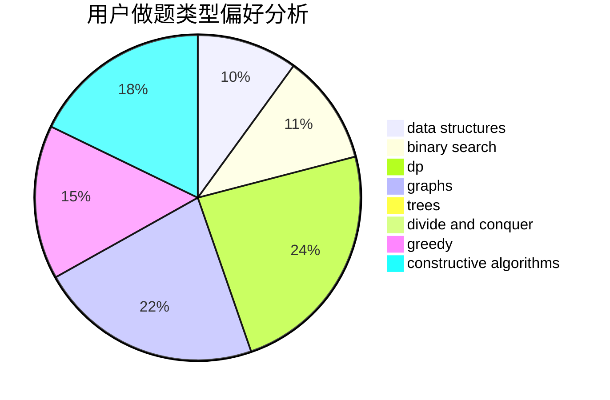

# Suiseiseki

<!-- tabs:start -->

#### **用户提交结果分析**

#### **用户做题类型偏好分析**

#### **用户错题知识点分析**

<!-- tabs:end -->
# 推荐题目
[699C](https://codeforces.com/contest/699/problem/C)		dsu,graphs,sortings,trees		  
[13571](https://codeforces.com/contest/1357/problem/1)		dsu,graphs,sortings,trees		  
[540B](https://codeforces.com/contest/540/problem/B)		greedy,
                        implementation		  
[1510A](https://codeforces.com/contest/1510/problem/A)		nan		  
[544D](https://codeforces.com/contest/544/problem/D)		dsu,graphs,sortings,trees		  
[603E](https://codeforces.com/contest/603/problem/E)		data structures,
                        divide and conquer,
                        dsu,
                        math,
                        trees		  
[32B](https://codeforces.com/contest/32/problem/B)		expression parsing,
                        implementation		  
[253A](https://codeforces.com/contest/253/problem/A)		greedy		  
[620A](https://codeforces.com/contest/620/problem/A)		implementation,
                        math		  
[938A](https://codeforces.com/contest/938/problem/A)		implementation		  
