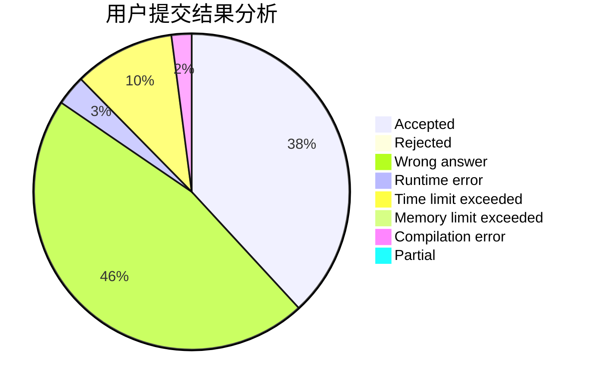
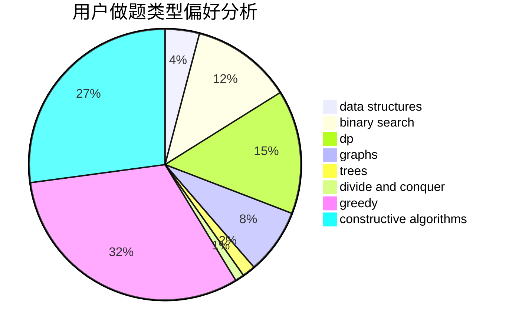

# Suiseiseki

<!-- tabs:start -->

#### **用户提交结果分析**

#### **用户做题类型偏好分析**

#### **用户错题知识点分析**

<!-- tabs:end -->
# 推荐题目
[674F](https://codeforces.com/contest/674/problem/F)		dsu,graphs,sortings,trees		  
[1349F1](https://codeforces.com/contest/1349F/problem/1)		dp,
                        fft,
                        math		  
[514D](https://codeforces.com/contest/514/problem/D)		binary search,
                        data structures,
                        two pointers		  
[149E](https://codeforces.com/contest/149/problem/E)		string suffix structures,
                        strings		  
[519B](https://codeforces.com/contest/519/problem/B)		data structures,
                        implementation,
                        sortings		  
[582D](https://codeforces.com/contest/582/problem/D)		dp,
                        math,
                        number theory		  
[309C](https://codeforces.com/contest/309/problem/C)		binary search,
                        bitmasks,
                        greedy		  
[231C](https://codeforces.com/contest/231/problem/C)		binary search,
                        sortings,
                        two pointers		  
[600E](https://codeforces.com/contest/600/problem/E)		data structures,
                        dfs and similar,
                        dsu,
                        trees		  
[917C](https://codeforces.com/contest/917/problem/C)		combinatorics,
                        dp,
                        matrices		  
