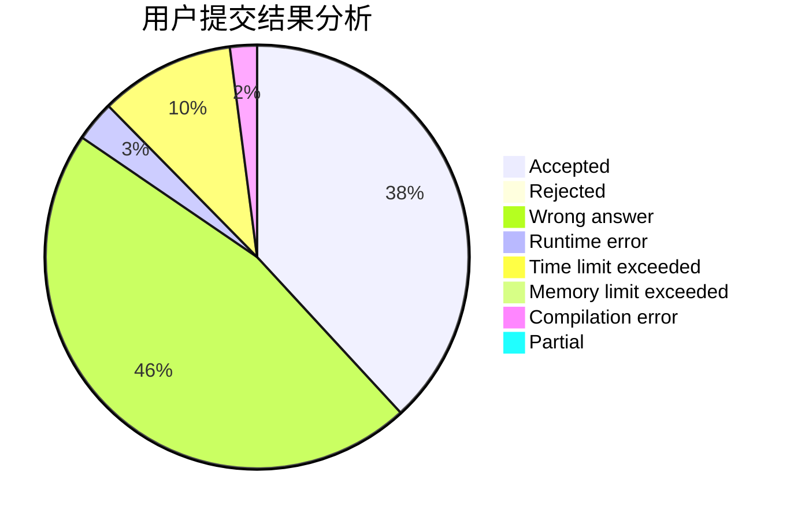
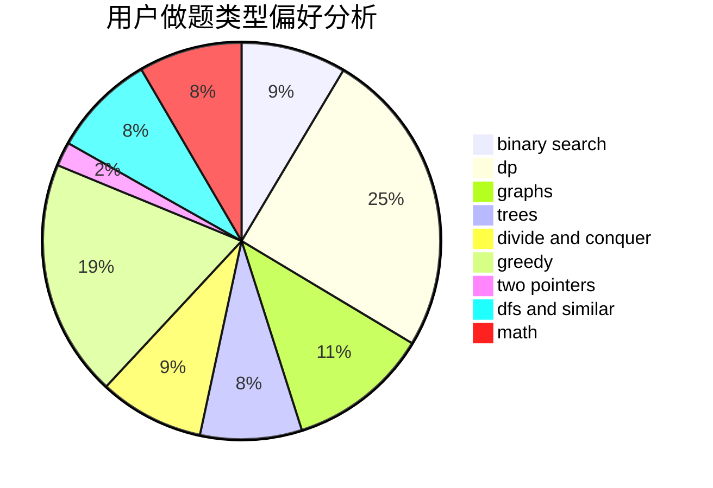

# Suiseiseki

<!-- tabs:start -->

#### **用户提交结果分析**

#### **用户做题类型偏好分析**

<!-- tabs:end -->
# 推荐题目
[699C](https://codeforces.com/contest/699/problem/C)
[13571](https://codeforces.com/contest/1357/problem/1)
[540B](https://codeforces.com/contest/540/problem/B)
[1510A](https://codeforces.com/contest/1510/problem/A)
[544D](https://codeforces.com/contest/544/problem/D)
[603E](https://codeforces.com/contest/603/problem/E)
[32B](https://codeforces.com/contest/32/problem/B)
[253A](https://codeforces.com/contest/253/problem/A)
[620A](https://codeforces.com/contest/620/problem/A)
[938A](https://codeforces.com/contest/938/problem/A)
