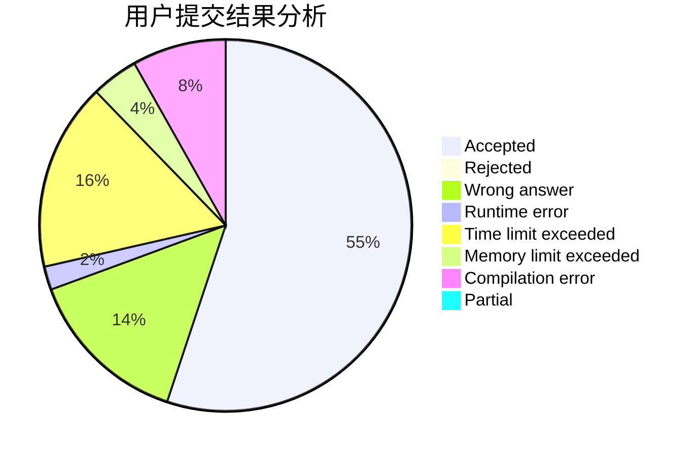
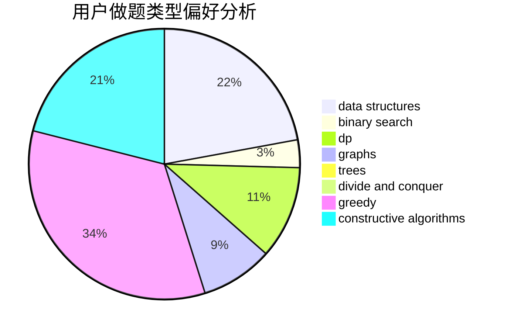
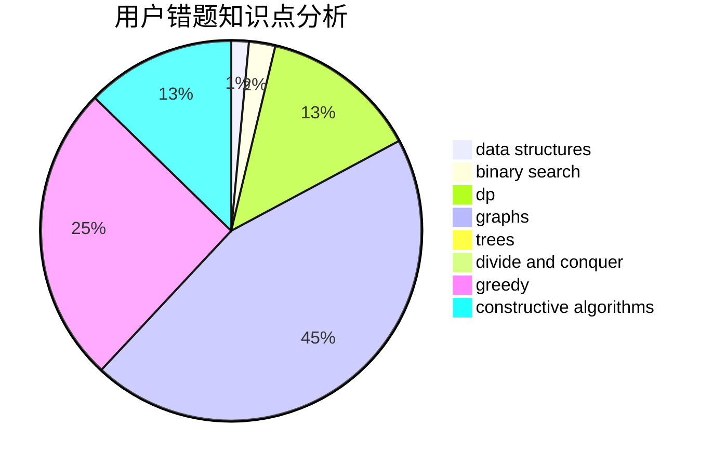

# Sulfur6_L8972

<!-- tabs:start -->

#### **用户提交结果分析**

#### **用户做题类型偏好分析**

#### **用户错题知识点分析**

<!-- tabs:end -->
# 推荐题目
[914C](https://codeforces.com/contest/914/problem/C)		brute force,
                        combinatorics,
                        dp		  
[1349A](https://codeforces.com/contest/1349/problem/A)		data structures,
                        math,
                        number theory		  
[1505B](https://codeforces.com/contest/1505/problem/B)		implementation,
                        number theory		  
[817A](https://codeforces.com/contest/817/problem/A)		implementation,
                        math,
                        number theory		  
[845F](https://codeforces.com/contest/845/problem/F)		bitmasks,
                        dp		  
[567D](https://codeforces.com/contest/567/problem/D)		binary search,
                        data structures,
                        greedy,
                        sortings		  
[607E](https://codeforces.com/contest/607/problem/E)		binary search,
                        geometry		  
[1223F](https://codeforces.com/contest/1223/problem/F)		data structures,
                        divide and conquer,
                        dp,
                        hashing		  
[617B](https://codeforces.com/contest/617/problem/B)		combinatorics		  
[1510C](https://codeforces.com/contest/1510/problem/C)		dfs and similar,
                        graph matchings,
                        graphs		  
