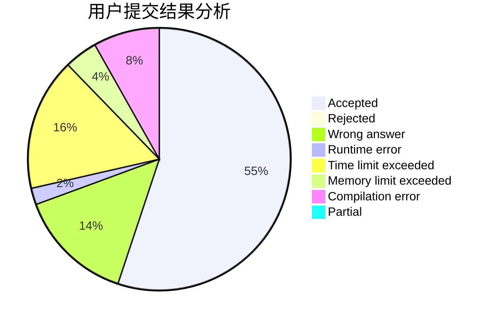
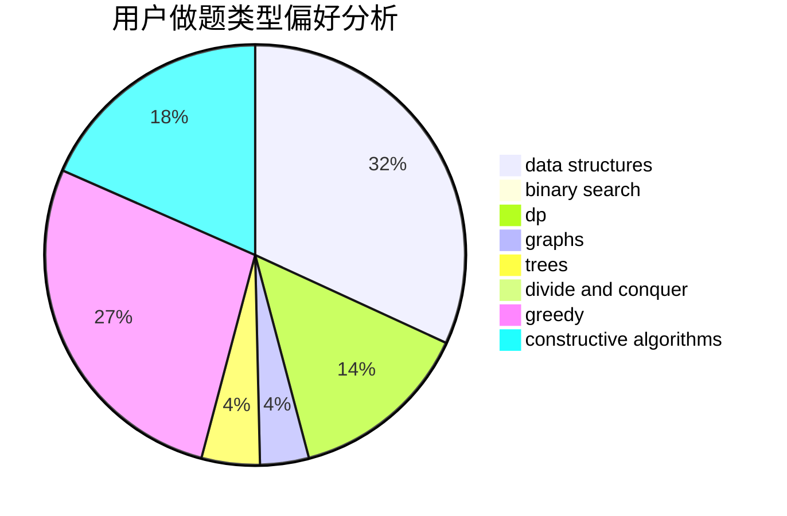
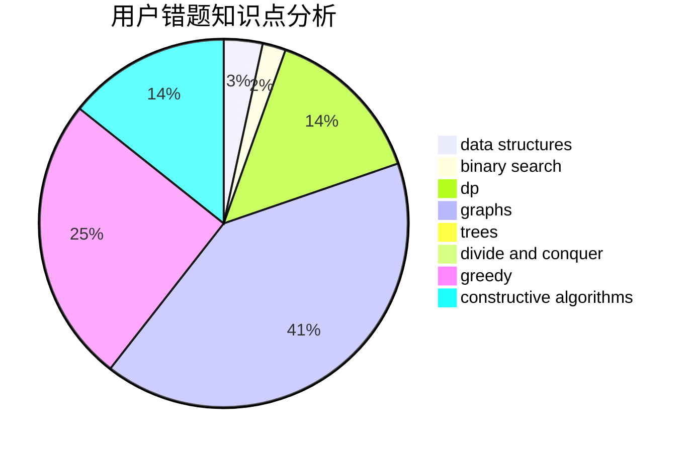

# Sulfur6_L8972

<!-- tabs:start -->

#### **用户提交结果分析**

#### **用户做题类型偏好分析**

#### **用户错题知识点分析**

<!-- tabs:end -->
# 推荐题目
[898A](https://codeforces.com/contest/898/problem/A)		implementation,
                        math		  
[1342C](https://codeforces.com/contest/1342/problem/C)		math,
                        number theory		  
[1496B](https://codeforces.com/contest/1496/problem/B)		math		  
[802B](https://codeforces.com/contest/802/problem/B)		data structures,
                        greedy		  
[827C](https://codeforces.com/contest/827/problem/C)		data structures,
                        strings		  
[543B](https://codeforces.com/contest/543/problem/B)		constructive algorithms,
                        graphs,
                        shortest paths		  
[587D](https://codeforces.com/contest/587/problem/D)		2-sat,
                        binary search		  
[1217B](https://codeforces.com/contest/1217/problem/B)		greedy,
                        math		  
[599C](https://codeforces.com/contest/599/problem/C)		sortings		  
[14B](https://codeforces.com/contest/14/problem/B)		implementation		  
