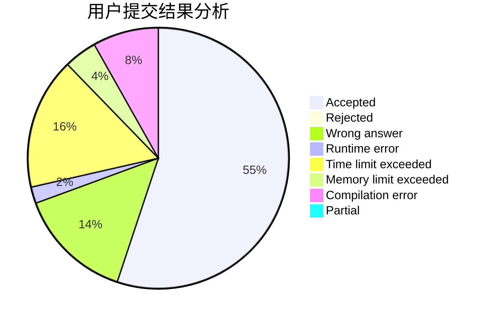
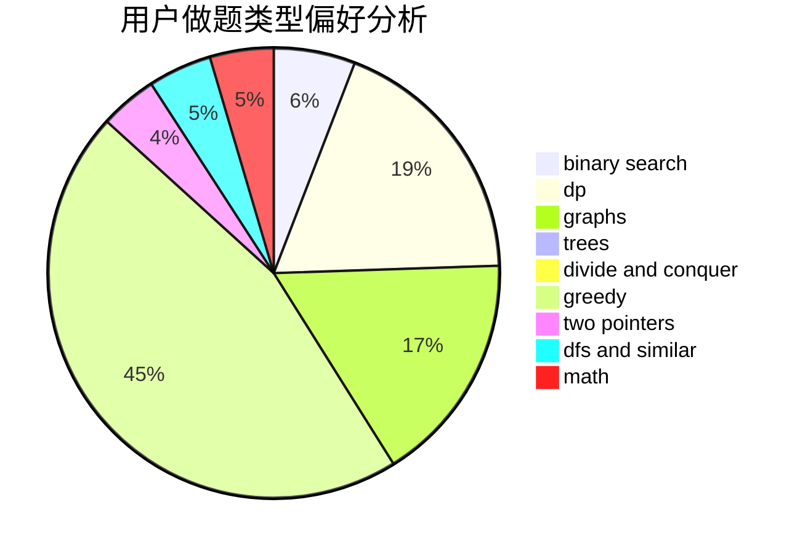

# Sulfur6_L8972

<!-- tabs:start -->

#### **用户提交结果分析**

#### **用户做题类型偏好分析**

<!-- tabs:end -->
# 推荐题目
[914C](https://codeforces.com/contest/914/problem/C)
[1349A](https://codeforces.com/contest/1349/problem/A)
[1505B](https://codeforces.com/contest/1505/problem/B)
[817A](https://codeforces.com/contest/817/problem/A)
[845F](https://codeforces.com/contest/845/problem/F)
[567D](https://codeforces.com/contest/567/problem/D)
[607E](https://codeforces.com/contest/607/problem/E)
[1223F](https://codeforces.com/contest/1223/problem/F)
[617B](https://codeforces.com/contest/617/problem/B)
[1510C](https://codeforces.com/contest/1510/problem/C)
