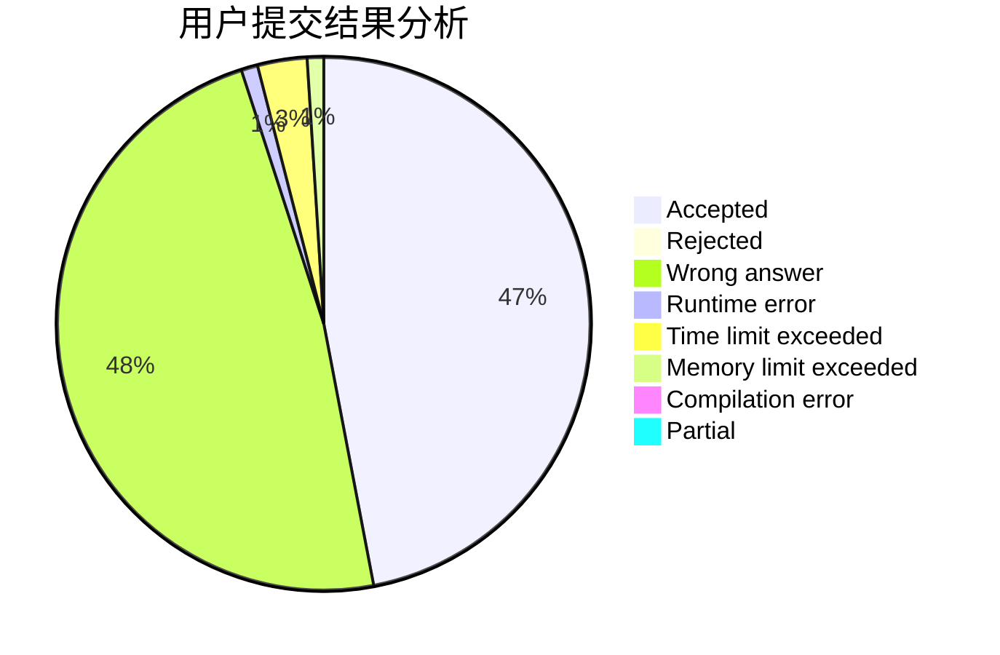
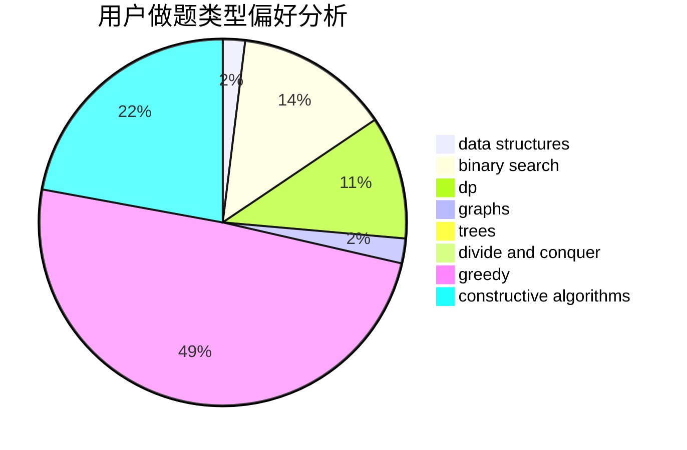
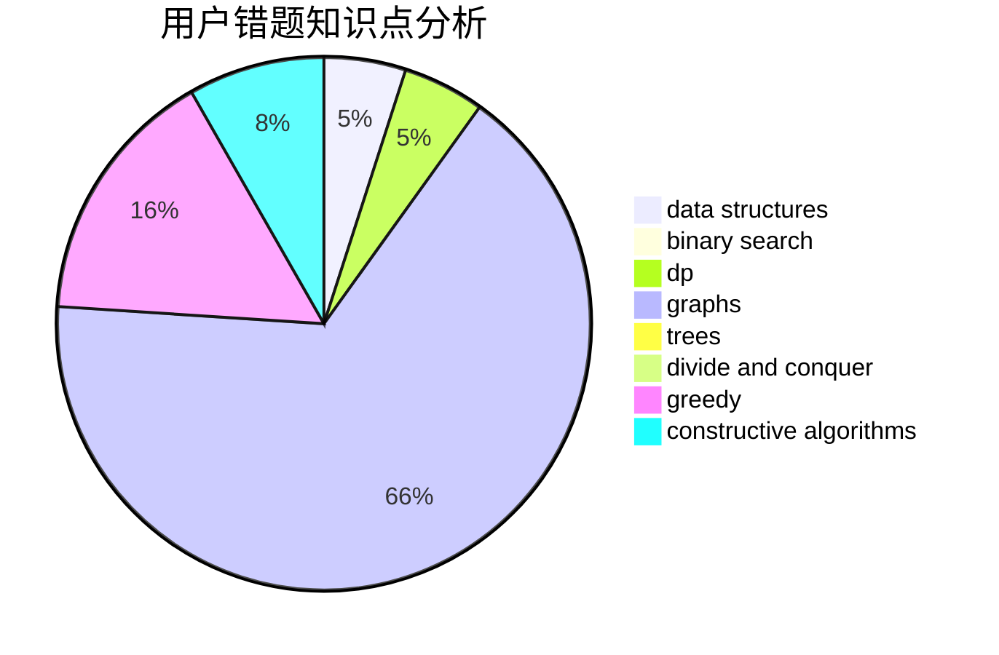

# Sunshine_HJ

<!-- tabs:start -->

#### **用户提交结果分析**

#### **用户做题类型偏好分析**

#### **用户错题知识点分析**

<!-- tabs:end -->
# 推荐题目
[548A](https://codeforces.com/contest/548/problem/A)		brute force,
                        implementation,
                        strings		  
[869E](https://codeforces.com/contest/869/problem/E)		data structures,
                        hashing		  
[1442B](https://codeforces.com/contest/1442/problem/B)		combinatorics,
                        data structures,
                        dsu,
                        greedy,
                        implementation		  
[1424G](https://codeforces.com/contest/1424/problem/G)		data structures,
                        sortings		  
[1083F](https://codeforces.com/contest/1083/problem/F)		data structures		  
[676D](https://codeforces.com/contest/676/problem/D)		graphs,
                        implementation,
                        shortest paths		  
[931F](https://codeforces.com/contest/931/problem/F)		dsu,graphs,sortings,trees		  
[15A](https://codeforces.com/contest/15/problem/A)		implementation,
                        sortings		  
[1055A](https://codeforces.com/contest/1055/problem/A)		graphs		  
[1060A](https://codeforces.com/contest/1060/problem/A)		brute force		  
