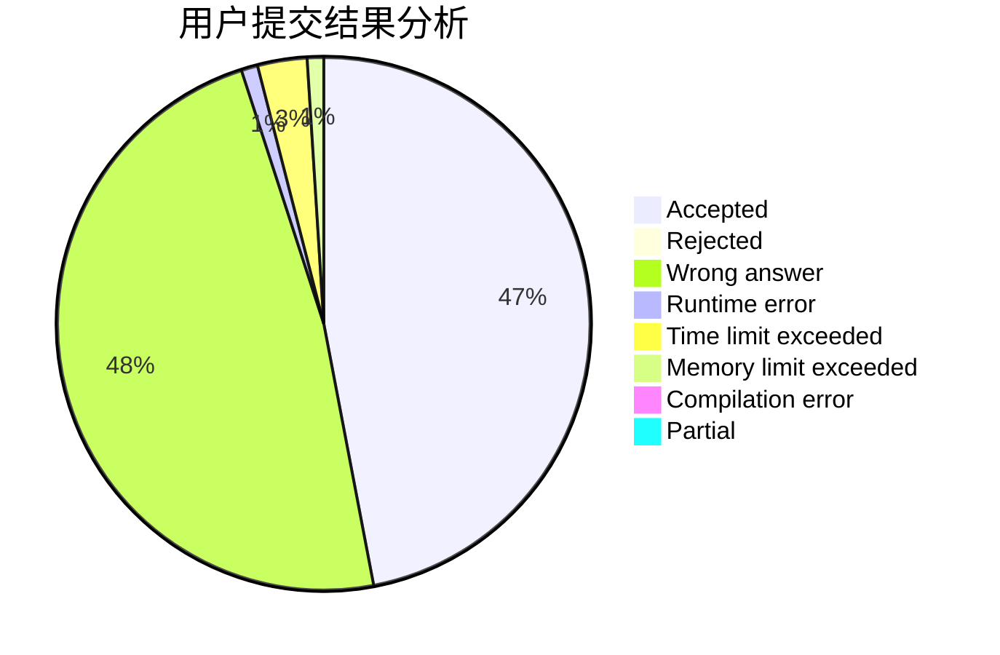
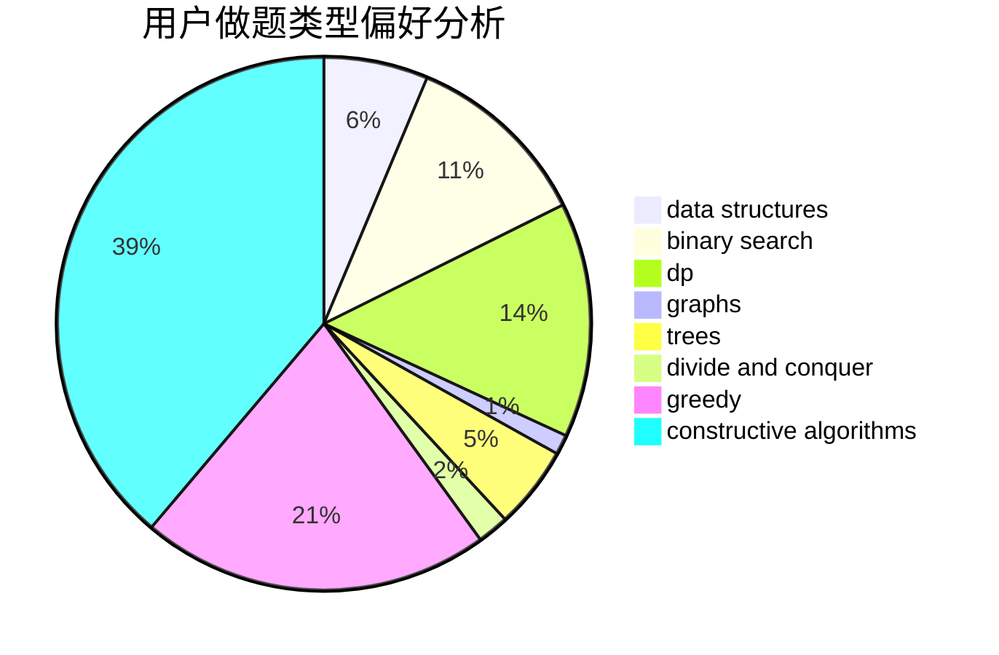
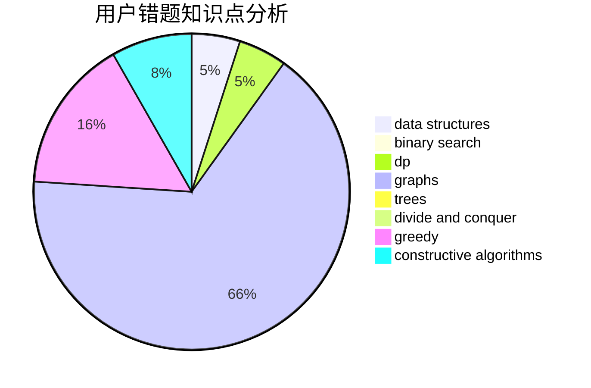

# Sunshine_HJ

<!-- tabs:start -->

#### **用户提交结果分析**

#### **用户做题类型偏好分析**

#### **用户错题知识点分析**

<!-- tabs:end -->
# 推荐题目
[522D](https://codeforces.com/contest/522/problem/D)		*special problem,
                        data structures		  
[850F](https://codeforces.com/contest/850/problem/F)		math		  
[1432C](https://codeforces.com/contest/1432/problem/C)		dsu,graphs,sortings,trees		  
[1416F](https://codeforces.com/contest/1416/problem/F)		flows,
                        graph matchings,
                        greedy,
                        implementation		  
[1083C](https://codeforces.com/contest/1083/problem/C)		data structures,
                        trees		  
[652E](https://codeforces.com/contest/652/problem/E)		dfs and similar,
                        dsu,
                        graphs,
                        trees		  
[913B](https://codeforces.com/contest/913/problem/B)		implementation,
                        trees		  
[1508C](https://codeforces.com/contest/1508/problem/C)		data structures,
                        dfs and similar,
                        dsu,
                        graphs,
                        greedy,
                        math		  
[1054F](https://codeforces.com/contest/1054/problem/F)		flows,
                        graph matchings		  
[1059D](https://codeforces.com/contest/1059/problem/D)		binary search,
                        geometry,
                        ternary search		  
