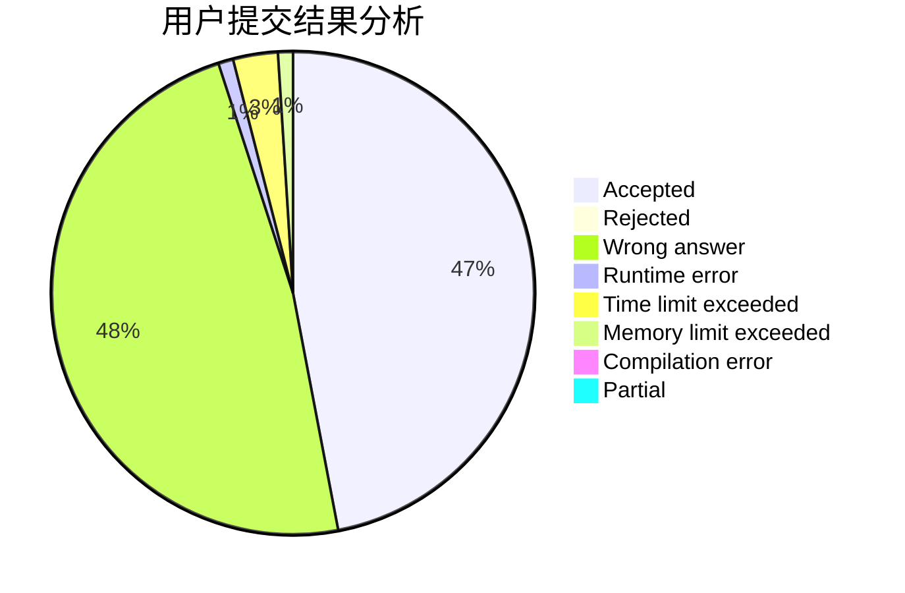
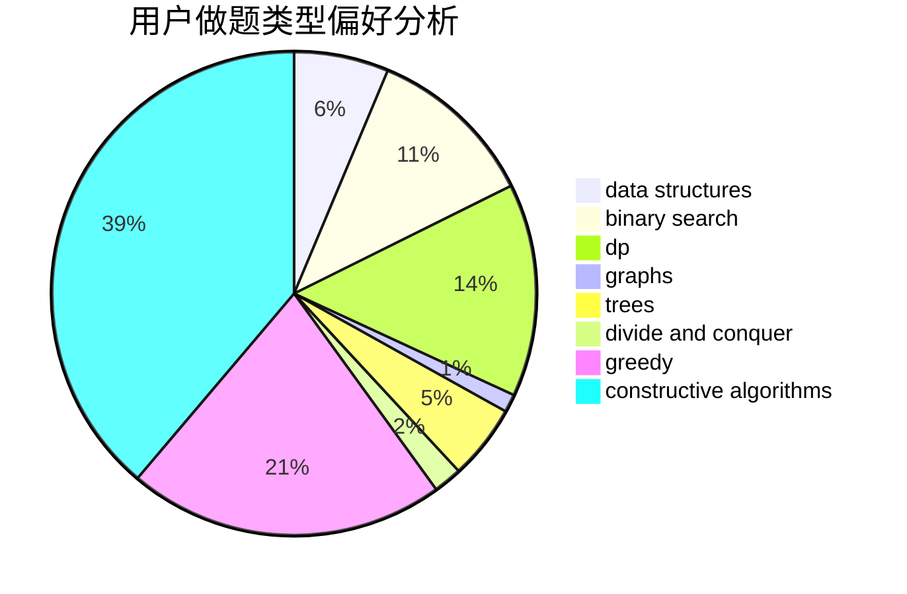
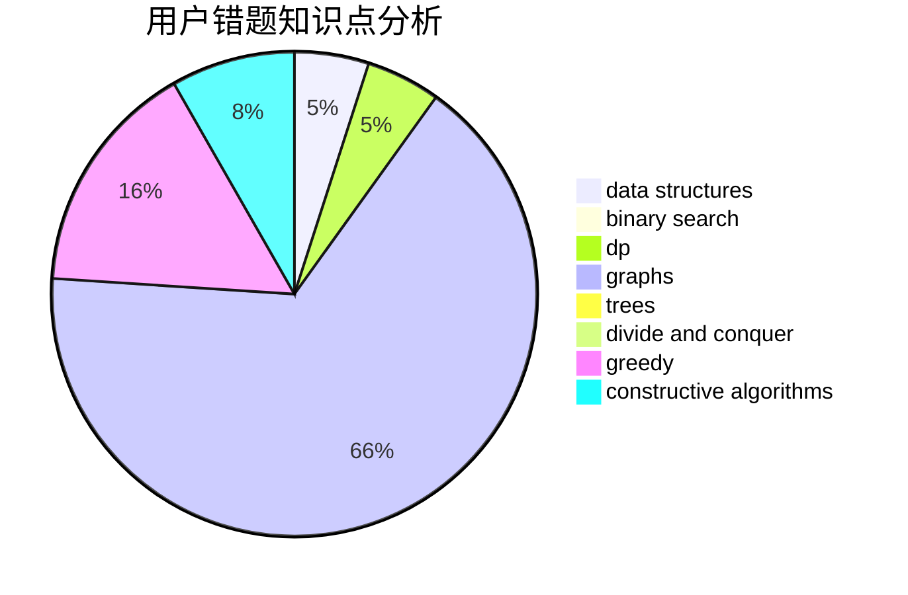

# Sunshine_HJ
<!-- tabs:start -->
#### **用户提交结果分析**

#### **用户做题类型偏好分析**

#### **用户错题知识点分析**

<!-- tabs:end -->
# 推荐题目
[Equalize Prices Again](https://codeforces.com/contest/1432/problem/C)		math		  
[Rainbow Balls](http://codeforces.com/problemset/problem/850/F)		math		  
[Closest Equals](http://codeforces.com/problemset/problem/522/D)		*special problem,
                        data structures		  
[Pursuit For Artifacts](http://codeforces.com/problemset/problem/652/E)		dfs and similar,
                        dsu,
                        graphs,
                        trees		  
[Showing Off](http://codeforces.com/problemset/problem/1416/F)		flows,
                        graph matchings,
                        greedy,
                        implementation		  
[Inversion Counting](http://codeforces.com/problemset/problem/911/D)		brute force,
                        math		  
[Tram](http://codeforces.com/problemset/problem/746/C)		constructive algorithms,
                        implementation,
                        math		  
[Nikita and stack](https://codeforces.com/contest/759/problem/C)		data structures		  
[Three Paths on a Tree](http://codeforces.com/problemset/problem/1294/F)		dfs and similar,
                        dp,
                        greedy,
                        trees		  
[Sleuth](http://codeforces.com/problemset/problem/49/A)		implementation		  
<!-- tabs:start -->
#### **data structures**
[Equalize Prices Again](http://codeforces.com/problemset/problem/522/D)		*special problem,
                        data structures		  
[Rainbow Balls](https://codeforces.com/contest/759/problem/C)		data structures		  
[Closest Equals](http://codeforces.com/problemset/problem/780/G)		data structures,
                        dp		  
[Pursuit For Artifacts](http://codeforces.com/problemset/problem/1083/C)		data structures,
                        trees		  
[Showing Off](http://codeforces.com/problemset/problem/1490/G)		binary search,
                        data structures,
                        math		  
[Inversion Counting](http://codeforces.com/problemset/problem/713/D)		binary search,
                        data structures		  
[Tram](http://codeforces.com/problemset/problem/1419/F)		binary search,
                        data structures,
                        dfs and similar,
                        dsu,
                        graphs,
                        implementation		  
[Nikita and stack](http://codeforces.com/problemset/problem/650/A)		data structures,
                        geometry,
                        math		  
[Three Paths on a Tree](http://codeforces.com/problemset/problem/1508/C)		data structures,
                        dfs and similar,
                        dsu,
                        graphs,
                        greedy,
                        math		  
[Sleuth](http://codeforces.com/problemset/problem/1088/F)		data structures,
                        trees		  
#### **binary search**
[Equalize Prices Again](http://codeforces.com/problemset/problem/1490/G)		binary search,
                        data structures,
                        math		  
[Rainbow Balls](http://codeforces.com/problemset/problem/713/D)		binary search,
                        data structures		  
[Closest Equals](http://codeforces.com/problemset/problem/1419/F)		binary search,
                        data structures,
                        dfs and similar,
                        dsu,
                        graphs,
                        implementation		  
[Pursuit For Artifacts](http://codeforces.com/problemset/problem/1059/D)		binary search,
                        geometry,
                        ternary search		  
[Showing Off](http://codeforces.com/problemset/problem/911/B)		binary search,
                        brute force,
                        implementation		  
[Inversion Counting](http://codeforces.com/problemset/problem/1492/C)		binary search,
                        data structures,
                        dp,
                        greedy,
                        two pointers		  
[Tram](http://codeforces.com/problemset/problem/1463/D)		binary search,
                        constructive algorithms,
                        greedy,
                        two pointers		  
[Nikita and stack](http://codeforces.com/problemset/problem/1490/G)		binary search,
                        data structures,
                        math		  
[Three Paths on a Tree](http://codeforces.com/problemset/problem/1479/D)		binary search,
                        bitmasks,
                        brute force,
                        data structures,
                        probabilities,
                        trees		  
[Sleuth](http://codeforces.com/problemset/problem/1436/E)		binary search,
                        data structures,
                        two pointers		  
#### **dp**
[Equalize Prices Again](http://codeforces.com/problemset/problem/1294/F)		dfs and similar,
                        dp,
                        greedy,
                        trees		  
[Rainbow Balls](http://codeforces.com/problemset/problem/780/G)		data structures,
                        dp		  
[Closest Equals](http://codeforces.com/problemset/problem/140/E)		combinatorics,
                        dp		  
[Pursuit For Artifacts](http://codeforces.com/problemset/problem/1272/C)		combinatorics,
                        dp,
                        implementation		  
[Showing Off](http://codeforces.com/problemset/problem/1250/D)		dp		  
[Inversion Counting](http://codeforces.com/problemset/problem/777/B)		data structures,
                        dp,
                        greedy,
                        sortings		  
[Tram](http://codeforces.com/problemset/problem/1492/C)		binary search,
                        data structures,
                        dp,
                        greedy,
                        two pointers		  
[Nikita and stack](https://codeforces.com/contest/1457/problem/C)		brute force,
                        dp,
                        implementation		  
[Three Paths on a Tree](http://codeforces.com/problemset/problem/1491/C)		brute force,
                        data structures,
                        dp,
                        greedy,
                        implementation		  
[Sleuth](http://codeforces.com/problemset/problem/1437/C)		dp,
                        flows,
                        graph matchings,
                        greedy,
                        math,
                        sortings		  
#### **graph**
[Equalize Prices Again](http://codeforces.com/problemset/problem/652/E)		dfs and similar,
                        dsu,
                        graphs,
                        trees		  
[Rainbow Balls](http://codeforces.com/problemset/problem/1416/F)		flows,
                        graph matchings,
                        greedy,
                        implementation		  
[Closest Equals](http://codeforces.com/problemset/problem/1054/F)		flows,
                        graph matchings		  
[Pursuit For Artifacts](https://codeforces.com/contest/1162/problem/C)		graphs		  
[Showing Off](http://codeforces.com/problemset/problem/1419/F)		binary search,
                        data structures,
                        dfs and similar,
                        dsu,
                        graphs,
                        implementation		  
[Inversion Counting](http://codeforces.com/problemset/problem/1508/C)		data structures,
                        dfs and similar,
                        dsu,
                        graphs,
                        greedy,
                        math		  
[Tram](http://codeforces.com/problemset/problem/632/F)		brute force,
                        divide and conquer,
                        graphs,
                        matrices,
                        trees		  
[Nikita and stack](http://codeforces.com/problemset/problem/437/C)		graphs,
                        greedy,
                        sortings		  
[Three Paths on a Tree](http://codeforces.com/problemset/problem/1487/C)		brute force,
                        constructive algorithms,
                        dfs and similar,
                        graphs,
                        greedy,
                        implementation,
                        math		  
[Sleuth](http://codeforces.com/problemset/problem/1437/C)		dp,
                        flows,
                        graph matchings,
                        greedy,
                        math,
                        sortings		  
#### **trees**
[Equalize Prices Again](http://codeforces.com/problemset/problem/652/E)		dfs and similar,
                        dsu,
                        graphs,
                        trees		  
[Rainbow Balls](http://codeforces.com/problemset/problem/1294/F)		dfs and similar,
                        dp,
                        greedy,
                        trees		  
[Closest Equals](http://codeforces.com/problemset/problem/1083/C)		data structures,
                        trees		  
[Pursuit For Artifacts](http://codeforces.com/problemset/problem/913/B)		implementation,
                        trees		  
[Showing Off](http://codeforces.com/problemset/problem/792/D)		bitmasks,
                        trees		  
[Inversion Counting](http://codeforces.com/problemset/problem/1088/F)		data structures,
                        trees		  
[Tram](http://codeforces.com/problemset/problem/632/F)		brute force,
                        divide and conquer,
                        graphs,
                        matrices,
                        trees		  
[Nikita and stack](http://codeforces.com/problemset/problem/1466/D)		data structures,
                        greedy,
                        sortings,
                        trees		  
[Three Paths on a Tree](http://codeforces.com/problemset/problem/1479/D)		binary search,
                        bitmasks,
                        brute force,
                        data structures,
                        probabilities,
                        trees		  
[Sleuth](http://codeforces.com/problemset/problem/1511/C)		brute force,
                        data structures,
                        implementation,
                        trees		  
#### **divide and conquer**
[Equalize Prices Again](http://codeforces.com/problemset/problem/632/F)		brute force,
                        divide and conquer,
                        graphs,
                        matrices,
                        trees		  
[Rainbow Balls](http://codeforces.com/problemset/problem/1461/D)		binary search,
                        brute force,
                        data structures,
                        divide and conquer,
                        implementation,
                        sortings		  
[Closest Equals](http://codeforces.com/problemset/problem/1466/G)		combinatorics,
                        divide and conquer,
                        hashing,
                        math,
                        string suffix structures,
                        strings		  
[Pursuit For Artifacts](http://codeforces.com/problemset/problem/1490/D)		dfs and similar,
                        divide and conquer,
                        implementation		  
[Showing Off](https://codeforces.com/contest/1483/problem/C)		data structures,
                        divide and conquer,
                        dp		  
[Inversion Counting](http://codeforces.com/problemset/problem/1491/E)		brute force,
                        dfs and similar,
                        divide and conquer,
                        number theory,
                        trees		  
[Tram](http://codeforces.com/problemset/problem/1303/G)		data structures,
                        divide and conquer,
                        geometry,
                        trees		  
[Nikita and stack](http://codeforces.com/problemset/problem/1494/D)		constructive algorithms,
                        data structures,
                        dfs and similar,
                        divide and conquer,
                        dsu,
                        greedy,
                        sortings,
                        trees		  
[Three Paths on a Tree](http://codeforces.com/problemset/problem/1482/E)		data structures,
                        divide and conquer,
                        dp		  
[Sleuth](http://codeforces.com/problemset/problem/566/C)		dfs and similar,
                        divide and conquer,
                        trees		  
#### **greedy**
[Equalize Prices Again](http://codeforces.com/problemset/problem/1416/F)		flows,
                        graph matchings,
                        greedy,
                        implementation		  
[Rainbow Balls](http://codeforces.com/problemset/problem/1294/F)		dfs and similar,
                        dp,
                        greedy,
                        trees		  
[Closest Equals](http://codeforces.com/problemset/problem/1158/D)		constructive algorithms,
                        geometry,
                        greedy,
                        math		  
[Pursuit For Artifacts](http://codeforces.com/problemset/problem/1163/A)		greedy,
                        math		  
[Showing Off](http://codeforces.com/problemset/problem/515/D)		constructive algorithms,
                        greedy		  
[Inversion Counting](https://codeforces.com/contest/1465/problem/E)		bitmasks,
                        greedy,
                        math,
                        strings		  
[Tram](http://codeforces.com/problemset/problem/1369/C)		greedy,
                        math,
                        sortings,
                        two pointers		  
[Nikita and stack](http://codeforces.com/problemset/problem/1508/C)		data structures,
                        dfs and similar,
                        dsu,
                        graphs,
                        greedy,
                        math		  
[Three Paths on a Tree](http://codeforces.com/problemset/problem/1368/B)		brute force,
                        constructive algorithms,
                        greedy,
                        math,
                        strings		  
[Sleuth](http://codeforces.com/problemset/problem/1305/E)		constructive algorithms,
                        greedy,
                        implementation,
                        math		  
#### **constructive algorithms**
[Equalize Prices Again](http://codeforces.com/problemset/problem/746/C)		constructive algorithms,
                        implementation,
                        math		  
[Rainbow Balls](http://codeforces.com/problemset/problem/1158/D)		constructive algorithms,
                        geometry,
                        greedy,
                        math		  
[Closest Equals](http://codeforces.com/problemset/problem/1012/D)		constructive algorithms,
                        strings		  
[Pursuit For Artifacts](http://codeforces.com/problemset/problem/515/D)		constructive algorithms,
                        greedy		  
[Showing Off](http://codeforces.com/problemset/problem/1368/B)		brute force,
                        constructive algorithms,
                        greedy,
                        math,
                        strings		  
[Inversion Counting](http://codeforces.com/problemset/problem/802/H)		constructive algorithms,
                        strings		  
[Tram](http://codeforces.com/problemset/problem/1305/E)		constructive algorithms,
                        greedy,
                        implementation,
                        math		  
[Nikita and stack](http://codeforces.com/problemset/problem/1493/A)		constructive algorithms,
                        greedy		  
[Three Paths on a Tree](http://codeforces.com/problemset/problem/1463/D)		binary search,
                        constructive algorithms,
                        greedy,
                        two pointers		  
[Sleuth](https://codeforces.com/contest/1456/problem/B)		bitmasks,
                        brute force,
                        constructive algorithms		  
#### **sortings**
[Equalize Prices Again](http://codeforces.com/problemset/problem/1369/C)		greedy,
                        math,
                        sortings,
                        two pointers		  
[Rainbow Balls](http://codeforces.com/problemset/problem/777/B)		data structures,
                        dp,
                        greedy,
                        sortings		  
[Closest Equals](http://codeforces.com/problemset/problem/1399/A)		greedy,
                        sortings		  
[Pursuit For Artifacts](http://codeforces.com/problemset/problem/1353/B)		greedy,
                        sortings		  
[Showing Off](http://codeforces.com/problemset/problem/437/C)		graphs,
                        greedy,
                        sortings		  
[Inversion Counting](http://codeforces.com/problemset/problem/1466/D)		data structures,
                        greedy,
                        sortings,
                        trees		  
[Tram](https://codeforces.com/contest/1496/problem/C)		geometry,
                        greedy,
                        math,
                        sortings		  
[Nikita and stack](http://codeforces.com/problemset/problem/1495/A)		geometry,
                        greedy,
                        math,
                        sortings		  
[Three Paths on a Tree](http://codeforces.com/problemset/problem/1497/A)		brute force,
                        data structures,
                        greedy,
                        sortings		  
[Sleuth](http://codeforces.com/problemset/problem/1427/A)		math,
                        sortings		  
<!-- tabs:end -->
