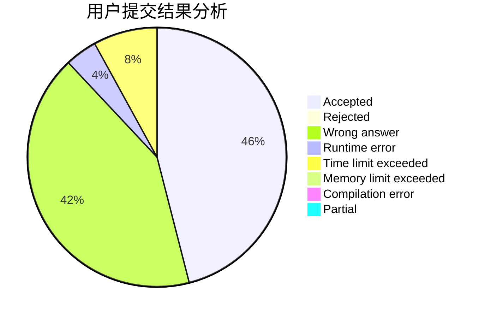
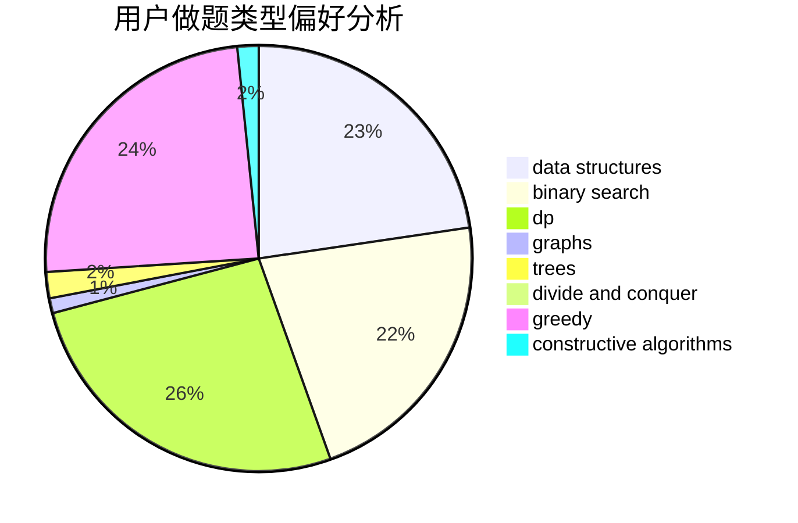
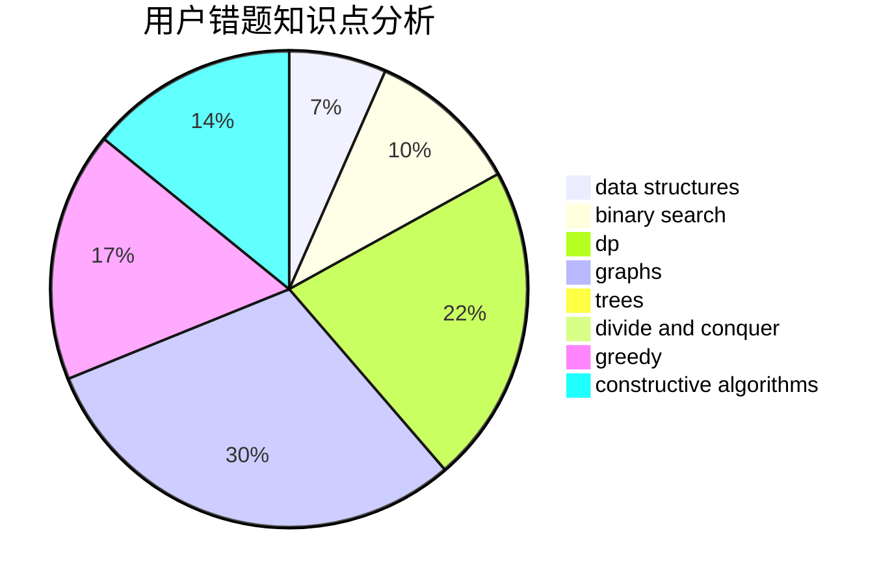

# Absinthium

<!-- tabs:start -->

#### **用户提交结果分析**

#### **用户做题类型偏好分析**

#### **用户错题知识点分析**

<!-- tabs:end -->
# 推荐题目
[1466C](https://codeforces.com/contest/1466/problem/C)		dp,
                        greedy,
                        strings		  
[1771](https://codeforces.com/contest/177/problem/1)		dsu,graphs,sortings,trees		  
[1772](https://codeforces.com/contest/177/problem/2)		dsu,graphs,sortings,trees		  
[174B](https://codeforces.com/contest/174/problem/B)		dp,
                        greedy,
                        implementation		  
[1192B](https://codeforces.com/contest/1192/problem/B)		*special problem,
                        data structures,
                        dfs and similar,
                        divide and conquer,
                        trees		  
[1227A](https://codeforces.com/contest/1227/problem/A)		math		  
[176E](https://codeforces.com/contest/176/problem/E)		data structures,
                        dfs and similar,
                        trees		  
[172A](https://codeforces.com/contest/172/problem/A)		*special problem,
                        brute force,
                        implementation		  
[1169C](https://codeforces.com/contest/1169/problem/C)		dsu,graphs,sortings,trees		  
[176B](https://codeforces.com/contest/176/problem/B)		dp		  
