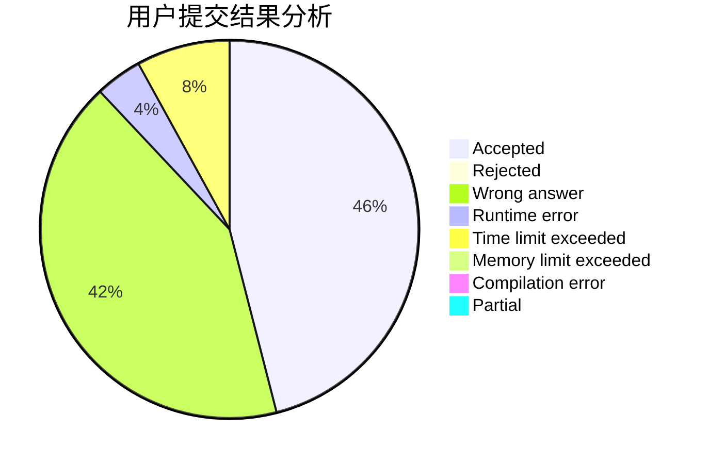
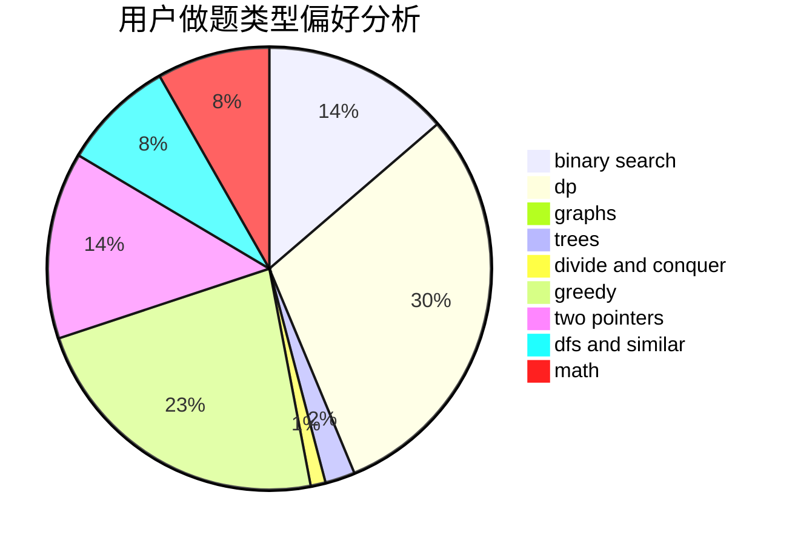

# Absinthium

<!-- tabs:start -->

#### **用户提交结果分析**

#### **用户做题类型偏好分析**

<!-- tabs:end -->
# 推荐题目
[1466C](https://codeforces.com/contest/1466/problem/C)
[1771](https://codeforces.com/contest/177/problem/1)
[1772](https://codeforces.com/contest/177/problem/2)
[174B](https://codeforces.com/contest/174/problem/B)
[1192B](https://codeforces.com/contest/1192/problem/B)
[1227A](https://codeforces.com/contest/1227/problem/A)
[176E](https://codeforces.com/contest/176/problem/E)
[172A](https://codeforces.com/contest/172/problem/A)
[1169C](https://codeforces.com/contest/1169/problem/C)
[176B](https://codeforces.com/contest/176/problem/B)
