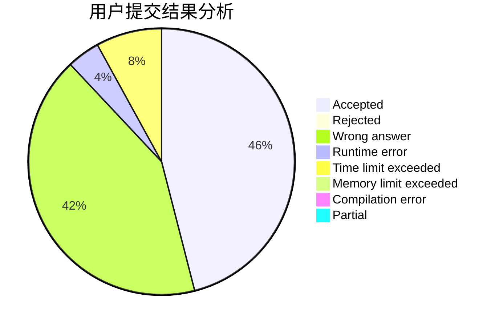
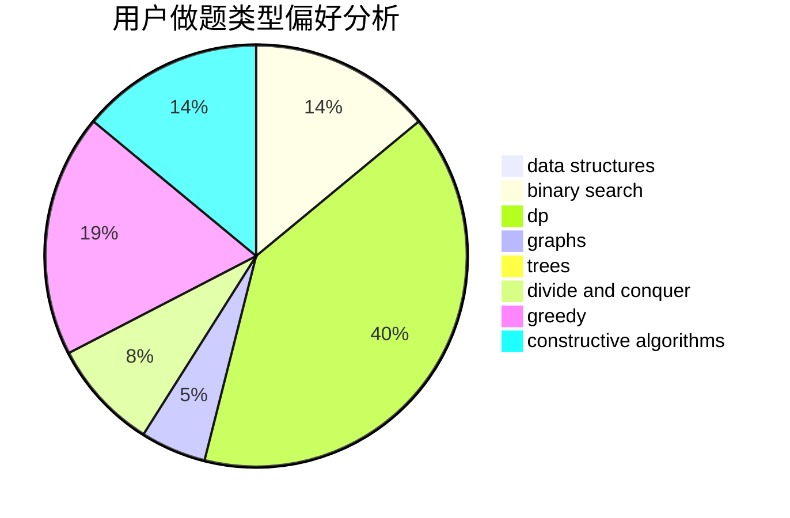
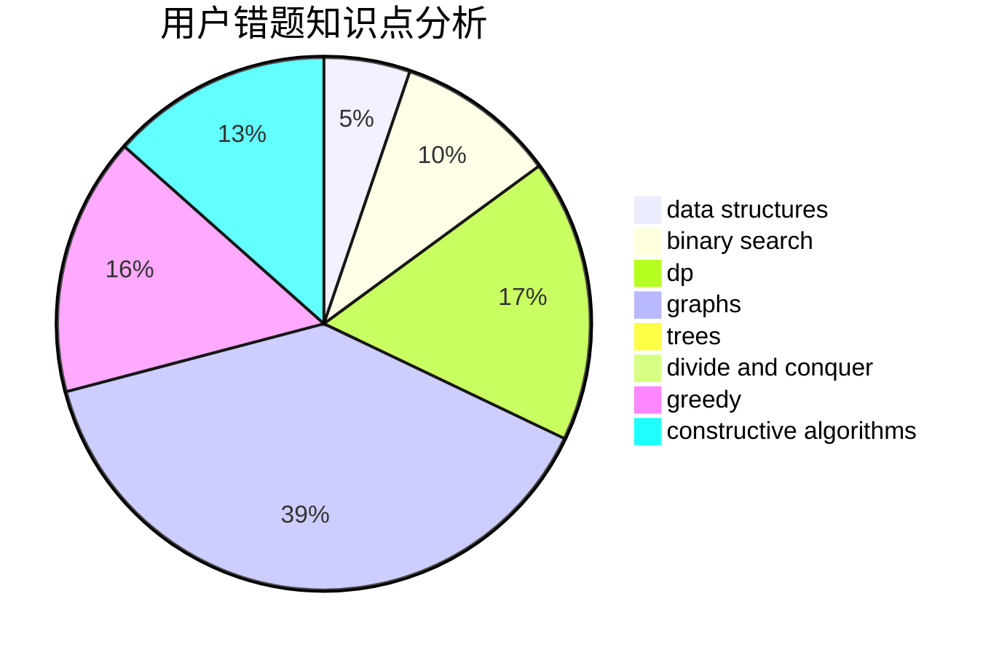

# Absinthium

<!-- tabs:start -->

#### **用户提交结果分析**

#### **用户做题类型偏好分析**

#### **用户错题知识点分析**

<!-- tabs:end -->
# 推荐题目
[1456E](https://codeforces.com/contest/1456/problem/E)		dp,
                        greedy		  
[156C](https://codeforces.com/contest/156/problem/C)		combinatorics,
                        dp		  
[156D](https://codeforces.com/contest/156/problem/D)		combinatorics,
                        graphs		  
[1513F](https://codeforces.com/contest/1513/problem/F)		brute force,
                        constructive algorithms,
                        data structures,
                        sortings		  
[1188B](https://codeforces.com/contest/1188/problem/B)		math,
                        matrices,
                        number theory,
                        two pointers		  
[121C](https://codeforces.com/contest/121/problem/C)		brute force,
                        combinatorics,
                        number theory		  
[156B](https://codeforces.com/contest/156/problem/B)		constructive algorithms,
                        data structures,
                        implementation		  
[1513B](https://codeforces.com/contest/1513/problem/B)		bitmasks,
                        combinatorics,
                        constructive algorithms,
                        math		  
[1166D](https://codeforces.com/contest/1166/problem/D)		binary search,
                        brute force,
                        greedy,
                        math		  
[154C](https://codeforces.com/contest/154/problem/C)		graphs,
                        hashing,
                        sortings		  
