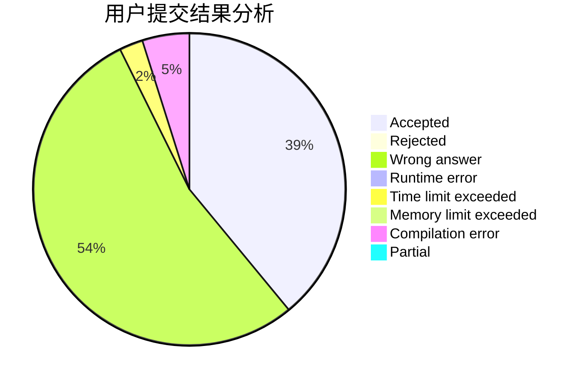
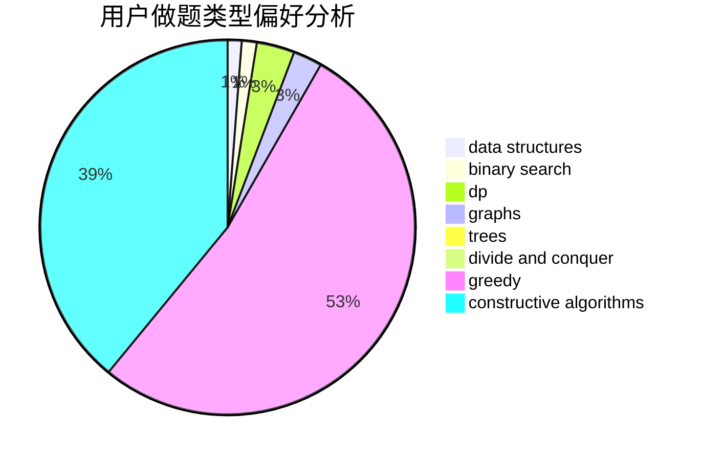
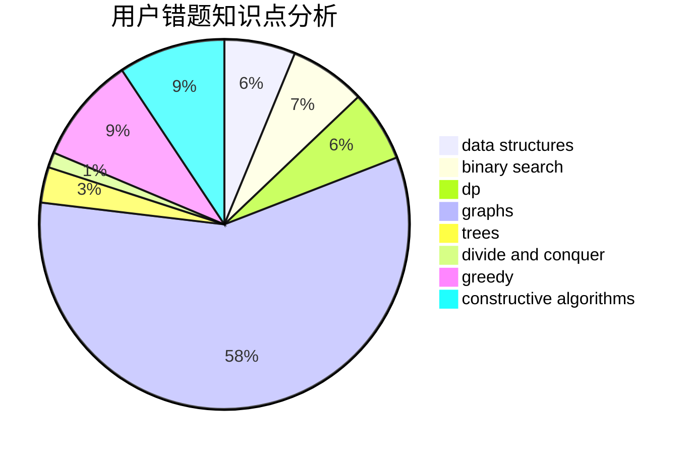

# Sunshine_HJian

<!-- tabs:start -->

#### **用户提交结果分析**

#### **用户做题类型偏好分析**

#### **用户错题知识点分析**

<!-- tabs:end -->
# 推荐题目
[825A](https://codeforces.com/contest/825/problem/A)		implementation		  
[236D](https://codeforces.com/contest/236/problem/D)		dsu,graphs,sortings,trees		  
[827E](https://codeforces.com/contest/827/problem/E)		fft,
                        math,
                        strings		  
[916A](https://codeforces.com/contest/916/problem/A)		brute force,
                        implementation,
                        math		  
[1062B](https://codeforces.com/contest/1062/problem/B)		greedy,
                        math,
                        number theory		  
[1032E](https://codeforces.com/contest/1032/problem/E)		dp,
                        math		  
[908C](https://codeforces.com/contest/908/problem/C)		brute force,
                        geometry,
                        implementation,
                        math		  
[1138F](https://codeforces.com/contest/1138/problem/F)		dsu,graphs,sortings,trees		  
[676B](https://codeforces.com/contest/676/problem/B)		implementation,
                        math,
                        math		  
[1358C](https://codeforces.com/contest/1358/problem/C)		math		  
